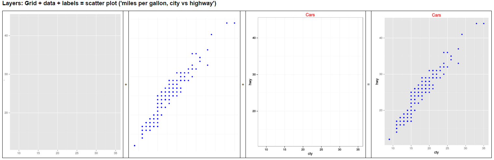
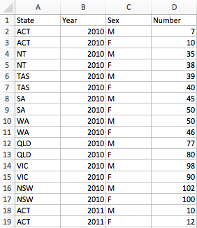
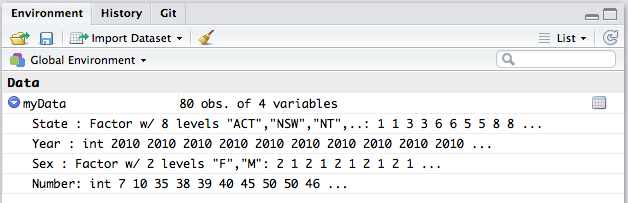
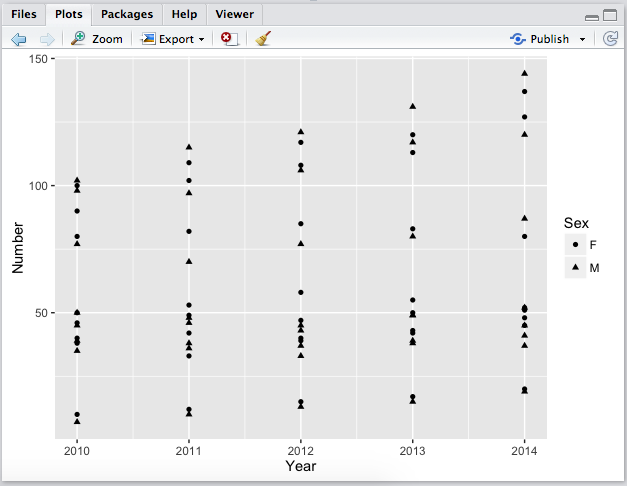
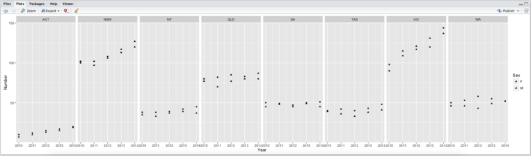
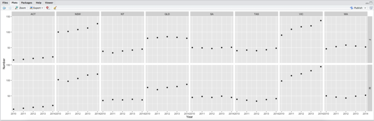
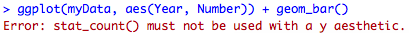
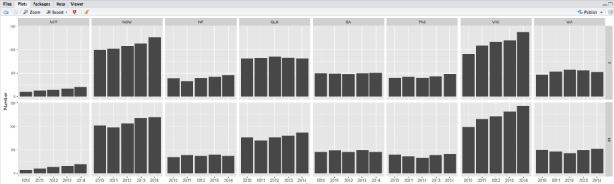
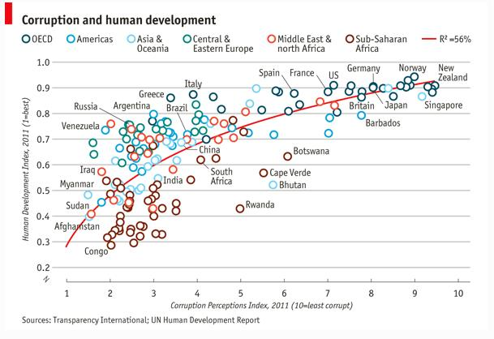

# Activity: Advanced plots with R

You have to install ggplot2 package to continue this activity.

If you do not have, follow the instructions at: [Introduction to RStudio]().

**Part 4.1**, Introducing ggplot2

**Part 4.2**, visualisation with ggplot2

**Part 4.3**, ‘Starting at the end’ shows how to use ggplot2 to produce a newsprint quality plot

## Introducing ggplot2

The library is ggplot2, the function is ggplot – watch out for that.

Based on Chapter 4.4. “Introducing ggplot2” in “Discovering Statistics Using R”, Andy Field, Jeremy Miles and Zoë Field (2012) and the ‘ggplot cheat sheet’ e.g.

[ggplot cheatsheet](https://www.rstudio.com/wp-content/uploads/2016/11/ggplot2-cheatsheet-2.1.pdf)

### The philosophy

ggplot2 is the implementation of the famous article “A Layered Grammar of Graphics” by Hadley Wickham.

It is designed to create a well-structured **statistical graphics** (by layers).

### Layers

In ggplot2, a graph is made up of a series of **layers**.

You can think of a layer as a transparency with something printed on it. That “**something**” could be

* points
* lines
* bars
* symbols (circles, squares for data points)

and also:

* legends
* axis title
* axis tick
* and etc.

To make a the final plot, these transparencies are placed on top of each other.



How to create the above figure?

Imagine you begin with a transparent sheet that has a grid and axes of the graph drawn on it (the first sub-figure).

On a second transparent sheet you have the data (the second sub-figure).

On a third transparency you have labels and a title (the third sub-figure).

To make the final graph, you put these three layers together: you start with the axes, lay the data on top of that, and finally lay the labels on top of that (the last sub-figure).

The end result is a scatter plot of ‘miles per gallon, city vs highway’. You can extend the idea of layers beyond the figure: you could imagine having a layer that contains a legend, or a regression line.

<br><br>

As can be seen, each layer contains visual objects such as bars, points, text and so on. Visual elements are known as **geoms** (short for ‘geometric objects’) in ggplot2. Therefore, when we define a layer, we have to tell R what geom we want displayed on that layer (do we want a bar, line, dot, etc.?).

### Aesthetics

These geoms also have aesthetic properties that determine what they look like and where they are plotted (do we want red bars or green ones? do we want our data point to be a triangle or a square? etc.).

These aesthetics (**aes()** for short) control the appearance of graph elements (for example, their colour, size, style and location).

Aesthetics can be defined in general for the whole plot, or individually for a specific layer. They control the appearance of elements within a geom or layer.


<mark class="yellow">***The aesthetics specify how to map from a data attribute to a visual or geometric attribute.***</mark>


### Geometric objects (geoms)

There are a variety of geom functions that determine what kind of geometric object is printed on a layer.  Here is a list of a few of the more common ones that you might use (for a full list see the ggplot2 website http://ggplot2.tidyverse.org/reference/ or you can let R tell you, see below):

* geom_bar(): creates a layer with bars representing different statistical properties.
* geom_point(): creates a layer showing the data points (as you would see on a scatterplot).
* geom_line(): creates a layer that connects data points with a straight line.
* geom_smooth(): creates a layer that contains a ‘smoother’ (i.e., a line that summarizes the data as a whole rather than connecting individual data points).
* geom_histogram(): creates a layer with a histogram on it.
* geom_boxplot(): creates a layer with a box–whisker diagram.
* geom_text(): creates a layer with text on it.
* geom_density(): creates a layer with a density plot on it.
* geom_errorbar(): creates a layer with error bars displayed on it.
* geom_hline(), geom_vline(): straight lines

Start by loading the ggplot library, use the following code:


```r
require(ggplot2) # load ggplot2 first
```
Try this: type "`geom_`" then TAB to see options.

Will this work if ggplot2 is not loaded? (But don’t run this, no point)

`geom_`

Here’s the syntax (not real code) for a ggplot:

```
myGraph <- ggplot(myData, aes(variable for x axis, variable for y axis))
```
We need to have the data first. Here, let’s look at a built-in data set `mtcars`.


```r
help(mtcars) 
```
If you do not understand something in R, try use the `help` function.

Usually, you will be lucky enough. The output will be at the **right bottom** section of RStudio.

Why not try something else.

```r
str(mtcars) 
summary(mtcars) 
```
What does all the outputs mean?
<br><br>

<mark class="big">**drat!, still not sure what a “drat” is, and “vs” ?**</mark>


stackoverflow to the rescue:
http://stackoverflow.com/questions/18617174/r-mtcars-dataset-meaning-of-vs-variable
<br><br>

Now, we use this data set and let x & y be `mpg` and `hp`.

What are the meanings of `mpg` and `hp` in this data set?


```r
myGraph <- ggplot(mtcars, aes(mpg, hp))
```
This is actually the same as, which might be more clear:

```r
myGraph <- ggplot(data = mtcars, aes(x = mpg, y = hp))
```
Nothing happened? Well, all this does is grab some data (from `mtcars`) and save some of it (`mpg`, and `hp`) in a graphic variable (`myGraph`).

Let’s see this `myGraph` by running:

```r
myGraph
```
Still nothing to see?

If you are running RStudio 1.0.136, look carefully at your **right bottom** section of RStudio (**Plots** tab).


If you cannot see this figure, it is totally all right. It is probably because of R or RStudio version issue.

Just move on. Anyway, this figure does not make any sense. It is empty. Where are the data?  

Actually we have specified the data and a “canvas” through the previous code, but we haven’t specified any chart/graph/plot.


```r
myGraph + geom_point() # so now there's a layer added
```
Or we want them to be blue.


```r
# with some colour
myGraph + geom_point(colour = "Blue") 
# store the graph in a variable
g1 <- myGraph + geom_point(colour = "Blue") 
# have to run it alone, to plot it in RStudio
g1                                          
```

## visualisation with ggplot2

Let’s do some real visualisations with ggplot2.

Here is the data of the number of staff for one company in Australia: [sample-data-for-r-plot3.txt](sample-data-for-r-plot3.txt).



（look, it is with the “row-oriented table” format）
<br><br>


### Step 1. read the data {-}


Remember to first set your working directory if you are using relative path.


```r
myData <- read.csv('sample-data-for-r-plot3.txt')
```
One thing you need to pay attention is how R will store your data.

Look at the **right top** section of RStudio.

R will try to detect the data types of your data automatically. Make sure they are stored in the right type you want.




### Step 2. first graph {-}


```r
library(ggplot2)
ggplot(myData, aes(Year, Number)) + geom_point()
```


Points again, but this is not that interesting.

You definitely want to distinguish the points by its other properties.

Add dimensions!


### Step 3. change the shape {-}


```r
ggplot(myData, aes(Year, Number)) + 
  geom_point(aes(shape = Sex))
```


Still feel messy? Add more dimensions!


### Step 4. change the color {-}


```r
ggplot(myData, aes(Year, Number)) + 
  geom_point(aes(shape = Sex, color = State))
```


Feel better? What else can we do with visual elements?

Of course, size.


```r
ggplot(myData, aes(Year, Number)) + 
  geom_point(aes(shape = Sex, color = State, size = Sex))
```


However, it does not make any sense at all…

So, do not just blindly change the parameters, make sure you understand their meaning.

Of course, trying is always encouraged!


### Step 5. Facet {-}


I still have the feeling it is too crowded.


```r
ggplot(myData, aes(Year, Number)) + 
  geom_point(aes(color = State)) +
  facet_wrap(~Sex)
```


Or the other way around:

```r
ggplot(myData, aes(Year, Number)) + 
 geom_point(aes(shape = Sex)) +
 facet_wrap(~State, nrow = 1)
```


Or the “ultimate” way:


```r
ggplot(myData, aes(Year, Number)) + 
  geom_point() +
  facet_grid(Sex~State)
```


Which do you prefer?

All data in one graph, using visual properties (shape, color, size) to distinguish them.

Or, split the data and show them in small graphs? **Why**?
<br><br>

We are not going to stop here.

Can we change it to a bar chart?

It should work with:


```r
ggplot(myData, aes(Year, Number)) + 
  geom_bar() +
  facet_grid(Sex~State)
```

But:



This is because, by default, `geom_bar` will count the records, but our `Number` column is not designed for counting.

We can change the bar chart to behave as we want.


```r
ggplot(myData, aes(Year, Number)) + 
  geom_bar(stat = "identity") +
  facet_grid(Sex~State)
```


So when you want to change your graph to a different form.

You may need to do more than just change the `geom_ part`.

Look it up for more details.


<mark class="big">**There are many more examples in the ggplot2 ‘cheat sheet’, try them now or later.**</mark>

[ggplot cheatsheet](https://www.rstudio.com/wp-content/uploads/2016/11/ggplot2-cheatsheet-2.1.pdf)

There are actually two ways to do plots with ggplot2:

* do a quick plot using the qplot() function; and
* build a plot layer by layer using the ggplot() function.

Undoubtedly the qplot() function will get you started quicker; however, the ggplot() function offers greater versatility.

Next up is a reproduction of a print quality chart used by ‘The Economist’.
<br><br>

## Starting At The End

By the end of this section you will be able to reproduce the chart like this from the Economist:



It suggests a correlation between corruption and development.

A bit more background information about the data:

The use of public office for private gain benefits a powerful few while imposing costs on large swathes of society. Transparency International’s annual Corruption Perceptions Index, published on December 1st, measures the perceived levels of public-sector graft by aggregating independent surveys from across the globe. Just four non-OECD countries make the top 25: Singapore, Barbados, Bahamas and Qatar. The bottom is formed mainly of failed states, poor African countries and nations that either were once communist (Turkmenistan) or are still run along similar lines (Venezuela, Cuba). Comparing the corruption index with the UN’s Human Development Index (a measure combining health, wealth and education), demonstrates an interesting connection. When the corruption index is between approximately 2.0 and 4.0 there appears to be little relationship with the human development index, but as it rises beyond 4.0 a stronger connection can be seen. Outliers include small but well-run poorer countries such as Bhutan and Cape Verde, while Greece and Italy stand out among the richer countries.

http://www.economist.com/blogs/dailychart/2011/12/corruption-and-development
<br><br>

Here’s the data [EconomistData](EconomistData.csv)

```r
dat <- read.csv("EconomistData.csv") 
# load data, don't ask where I got it, there may have been a bribe involved...
head(dat) # look at some of the data
```

plot it!

```r
ggplot(dat, aes(x = CPI, y = HDI)) + geom_point()
```

That’s fairly basic, add some colour & a legend

```r
# colour!
plot1 <- ggplot(dat, aes(x = CPI, y = HDI, color = Region)) 
# now we're saving the stages, and reusing them, plot1, plot2 etc.
plot1 <- plot1 + geom_point(shape = 1) 
plot1
```

Add labels

```r
labels <- c("Congo", "Sudan", "Afghanistan", "Greece", "China",
                 "India", "Rwanda", "Spain", "France", 
            "United States", "Japan", "Norway", "Singapore")
plot2 <- plot1 +
    geom_text(aes(label = Country),
           color = "black", size = 3, hjust = 1.1,
           data = dat[dat$Country %in% labels, ])
plot2
```

Add regression line

```r
plot3 <- plot2 +
   geom_smooth(aes(group = 1),
               method = "lm",
               color = "black",
               formula = y~ poly(x, 2),
               se = FALSE)
plot3
```

Tidy it up!

```r
plot4 <- plot3 + theme_bw() +
  scale_x_continuous("Corruption Perceptions Index, 2011\n(10 = least corrupt)") +
  scale_y_continuous("Human Development Index, 2011\n(1 = best)") +
  theme(legend.position = "top", legend.direction = "horizontal")
plot4
```
Your turn, fix it up a bit more, look at the far left, one country got cut off

Now add labels for Australia & NZ.

**What is SSA? MENA? fix that too**

**“East EU Cemt Asia”?**

## Now continue with the basic examples in the ggplot2 ‘cheat sheet’

https://www.rstudio.com/wp-content/uploads/2015/03/ggplot2-cheatsheet.pdf


