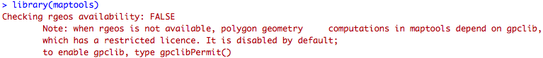

# Activity: Shape files & maps with R

### Shapefiles {-}

A shapefile, sometimes called an ESRI shapefile (aka Environmental Systems Research Institute) is a format for storing the location, shape, and attributes of geographic features. It is stored as a set of related files (about a dozen).

We require a minimum of 3 files:

* .shp — shape format; the feature geometry itself
* .shx — shape index format; a positional index of the feature geometry to allow seeking forwards and backwards quickly
* .dbf — attribute format; columnar attributes for each shape, in dBase IV format (how old is that!)

https://en.wikipedia.org/wiki/Shapefile

The files (.shp, .shx, .dbf) should all have the same prefix (e.g. NZ.shp, NZ.shx, NZ.dbf). We require 3 sets of files in this activity, you can download them from here:

[NZ](diagrams_datasets/section4/NZL_adm1)  
[World](diagrams_datasets/section4/ne_110m_land1)  
[US parks](diagrams_datasets/section4/ne_10m_parks_and_protected_lands)  

`maptools` library is one  option to load shapefiles in R.

Install the library first.

Load the library.


```r
library(maptools)
```

Look carefully at your RStudio console.

There might be an warning:

  

So, according to the prompt message, you should run


```r
gpclibPermit()
```

If it is still not work, that means you need to install another package.

Remember the other way to install a package?


```r
install.packages("gpclib")
gpclibPermit()
```

  

Load the library again, and you should be ready to use `maptools` library.

If there are errors when you try to install the `gpclib` library (mostly happened on Windows).

You should download the RTools at https://cran.r-project.org/bin/windows/Rtools/.

Install it in ***a path without any space***.

After that, you should be able to install the `gpclib` library.

Unzip your downloaded NZ shapefile and place the 3 files (NZL_adm0.shp, NZL_adm0.shx and NZL_adm0.dbf) into your **working directory**.

Now everything is ready, do not wait, just plot it:


```r
nz <- readShapeSpatial("NZL_adm0")
plot(nz)
```

Be patient, takes a bit time.

Also, the plot is a bit…unexpected.

  

Any way, move on to the **world**!

Move the 3 files (ne_110m_land.shp, ne_110m_land.shx and ne_110m_land.dbf) to your **working directory**.


```r
world <- readShapeSpatial("ne_110m_land")
plot(world)
```

Let’s plot it in another way (with ggplot).


```r
library(ggplot2)
world_shp <- readShapePoly("ne_110m_land.shp")
ggplot(
  world_shp,
  aes(
    x=long,
    y=lat,
    group=group
  )
) + 
geom_path()
```

Head into the detail of `world_shp`.

You may get confused about the stored structure.

You can use `fortify()` to transfer it to our familiar tabular format.

Note: this is **not necessary**.


```r
head(world_shp)
world_map <- fortify(world_shp) # convert into a tabular structure
head(world_ma
```

And use the tabular format to plot.

```r
ggplot(
  world_map,
  aes(
    x=long,
    y=lat,
    group=group
  )
) +
geom_path()
```

### Let’s do a shape file on a map {-}

National parks of America on top of the West coast.

From: http://blog.mollietaylor.com/2013/02/shapefiles-in-r.html

First, put the 3 files (ne_10m_parks_and_protected_lands_area.shp, 

ne_10m_parks_and_protected_lands_area.shx and 

ne_10m_parks_and_protected_lands_area.dbf) into your **working directory**.

and read them.


```r
library(ggmap) # Load the shapes and transform
library(maptools)
 
area <- readShapePoly("ne_10m_parks_and_protected_lands_area.shp")
area.points <- fortify(area) # transform
```

Now let’s have a look at how the parks distribute.

```r
# Add some colour
library(RColorBrewer)
colors <- brewer.pal(9,"BuGn")
 
# Get the underlying map, it may take a while to get (from google), patience...
mapImage <- get_map(
  location = c(lon=-118,lat =37.5),
  color = "color",
  source="google",
  maptype = "terrain",
  zoom =6
)
 
# Put the shapes on top of the map
ggmap(mapImage) +
  geom_polygon(
    aes(x=long, y=lat, group=group),
    data = area.points,
    color = colors[9],
    fill = colors[6],
    alpha =0.5
  ) +
  labs(x="Longitude", y="Latitude")
```

Step by step.


```r
# Plot the base map
plot(mapImage)
```

Then the parks without the base map.

```r
# And the parks without the map...
p <- ggplot()
# a blank
p + 
  geom_polygon(
    aes(x=long, y=lat, group=group),
    data=area.points,
    color=colors[9],
    fill=colors[6],
    alpha =0.5
  )+
  labs(x="Longitude", y="Latitude")
```

And we can stack them layer by layer.

<br><br>

We still forget something.

Remember the unexpected NZ at the beginning?

**Why does a huge shape file result in such a small plot (NZ)?**

(one theory is that there are lots of little islands, another is that there are too many sheep)

**Don’t forget to restore NZ to it’s former glory**


```r
nz <- map_data("nz")
#Prepare a map of NZ
nzmap <- ggplot(nz, aes(x = long, y = lat, group = group)) +
geom_polygon(fill = "gold", colour = "gold")
# Plot it in cartesian coordinates
# nzmap
# With correct mercator projection
nzmap + coord_map()
# With the aspect ratio approximation
# nzmap + coord_quickmap()
```

**What formats are these built-in maps, e.g. map_data(“nz”), is it a .shp?**

**How old is this ESRI format?**  
**What are some more recent alternatives?**  
**Can you open just the .shp files (and view shapes) – in R? Some other way?**  

***


