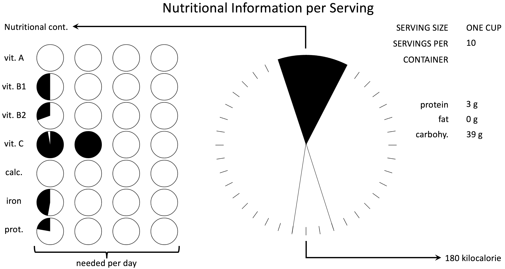

# Visual communication

Understanding the human visual system is one part of understanding how to create effective data visualisations. Another component to this is understanding human language and how humans communicate. This aspect is important when designing data visualisations for communicating what you have found to stake holders as they will subconsciously understand the data visualisation as a “communication act.”  In this topic we look at this aspect of visualisation design.

## Effective communication

Most cognitive psychologists and linguists now believe that humans have an innate instinct to learn and use spoken language. All human languages share a common “deep” structure and children who are deaf and so not exposed to spoken language will, if they are given the opportunity, spontaneously invent sign languages so that they can communicate. Amazingly although sign language is understood visually and produced using hand gestures, the same parts of the brain are used for understanding and producing sign language as are used for spoken language. Humans really want to be able to talk to one another.

When we communicate with each other there are a number of assumptions that are true for spoken language, written language, graphic novels, movies and sign language:

* *Relevance*: The information that is provided is relevant to whatever is being discussed and that neither too much or too little information will be provided.
* *Appropriate knowledge*: We tailor the communication to the listener or reader, taking into account their knowledge and also cultural expectations.
* *Directing and holding attention*: The discussion is sequential, with clear indications as to what is important and when there has been a change in topic.

[Paul Grice](https://www.ucl.ac.uk/ls/studypacks/Grice-Logic.pdf), a philosopher of language, proposed several ‘conversational maxims’:

* the maxim of quality – provide information that is true, do not say that which you know to be false or for which you lack sufficient evidence
* maxim of quantity – provide enough information as is required but not more than is required
* maxim of relevance – ensure that the information you provide is relevant
* maxim of manner – avoid obscurity, ambiguity, be brief and be orderly

These points hold equally true for the visual language of data graphics. They mean that  you need to be very clear about what message you are trying to convey when designing a data graphic for communication and who your intended audience is. It means only showing data that is relevant to that message and choosing charts and graphics that the user is familiar with, or at least ones which they can easily understand and providing titles and legends etc that explain what the graphic is about. and how to read it.  It means using visual tricks to direct attention to the important part of the graphic. The reader’s attention will be drawn to the most visually striking components of the graphic so these should be the most important parts of the message, i.e. highly salient. We have seen from the last topic how to make parts of a display pop-out. Another technique is to use annotations to direct attention. Readers expect changes in appearance from, say interaction, to be relevant and informative.

In many situations a mix of graphics and text is required in order to communicate more complex messages. Relevance, appropriate knowledge and narrative need to be considered for the overall mix, with clear visual signals guiding the reader on which are the most important elements and in what order to read them.

When designing an effective data visualisation it is crucial to take into account the limitations of the human visual system and cognitive system discussed in The human visual system. In particular you should choose visual variables and representations that facilitate

* *Discriminability*: allow the reader to easily discriminate and compare data
* *Perceptual organisation*: encourage the perceptual system to group data in meaningful ways, such as by using Gestalt principles and different channels
* *Compatibility*: The conventions used are compatible with what they represent, e.g. use line graphs for continuous data, bar charts for discrete measurements and “more” of a visual variable such as length means “more” of the underlying quantity being conveyed.
* *Capacity limitations*: take into account limitations in working memory and processing limits.

Kosslyn (2006) presents a graphic that was designed to present nutritional information to consumers on food packaging. Apparently the US seriously considered making the use of this display mandatory. Please take a look at the display and see if you can understand it.

He identifies the following problems

1. The reader is likely to think that the small circles are pie charts but in this case it is the group of 4 circles that shows the whole. This violates the assumption that the reader has appropriate knowledge.
2. The circles are arranged so that they are perceptually grouped into 4 columns instead of 7 rows when in fact the rows are the logical way to group the circles.
3. The center panel also violates the assumption of appropriate knowledge as it is a graphic that the user has almost certainly never seen before and probably hopes never to see again. While it looks like a pie chart it is not and actually consists of two separate graphics: a black wedge at the top giving the nutritional content (vitamins+minerals) and white wedge at the bottom giving the number of calories. Even though the two wedges are aligned and on the same background and so perceptually grouped together that are in fact logically independent. It is impossible to understand the scale being used for each wedge and it is exceedingly difficult to know how many tick marks the black wedge subsumes.
4. It is also very difficult to know how to read the display and which pieces of information are the most important.

In terms of the Grician maxims, the graphic violates those of manner (it is obscure) and quantity (it provides more information than is required).

## Narrative visualisations

Online interactive graphics are increasingly used by journalists  and data scientists to communicate  the patterns and trends they have found in data. Publishing to the web is made easy by tools like Tableau and with D3 it is possible to create powerful and sophisticated visualisations.  Such graphics blur the distinction between exploration and communication and data visualisation researchers and graphic designers are still exploring different ways of using interactive graphics for communicating their findings.

Good examples of these new kind of data visualisation are those being created by the New York Times. Take a look at [Budget Forecasts, Compared With Reality](https://archive.nytimes.com/www.nytimes.com/interactive/2010/02/02/us/politics/20100201-budget-porcupine-graphic.html?_r=0) from 2010. This explores quite a complex topic: budget forecasting and the reasons why it mostly goes wrong.  It uses what is essentially a slide show with interactive slides to guide the reader through the story. Linked text and visualisation along with the linear slide show make it clear in what order to read the visual elements and what is important. Interaction allows the reader to explore the data but only in a carefully controlled way.

Segel and Heer (2010) provide an overview of such _narrative visualisations_. They identified seven genres: magazine style, annotated chart, partitioned poster, flow chart, comic strip, slide show, and film/video/animation. These differ in the number of frames and the ordering of the frames. The genres can be combined. For instance, the Budget Forecasts example uses annotated graphs within a slide show format.

They  discussed the many different kinds of narrative tactics used in these visualisation, some of which are borrowed from movie making. These visual devices help the reader navigate the visualisation and to appropriately focus attention. They include highlighting to direct attention to salient parts of the display, transition guidance to help the reader move between the different elements in the visualisation without disorientation such as smooth animations, camera motion  and visual structuring that helps the reader understand the overall structure and where they are in the narrative.

The final aspect that Segel and Heer (2010) considered is the visualisation structure.  This varies in how much the author directs the story and how much freedom the reader has to explore the data to create their own interpretation. The Budget Forecast example is called an _interactive slideshow with single-frame interactivity_. In this structure the overall structure is linear but the reader can explore the data in a single side. They are also free to step backwards and forwards through the narrative. Another well-known example of this kind of visual narrative is [Gapminder Human Development, 2005](https://www.gapminder.org/downloads/human-development-trends-2005/).

Another visualisation structure is the _martini glass_. This begins with  questions, observations, or written articles to introduce the visualization but then the narrative expands to allow the reader to freely explore the data (hence the amount of exploration allowed expands like the shape of a martini glass). An interactive chart with associated text is a common example of this kind of narrative.

The final structure they identified was the _drill-down-story_. This presents a general theme but allows the reader to interactively choose different aspects to the story and drill down into the data. Interactive posters or maps often have this structure. [Comparison of Bear Markets, The New York Times, 2008](https://archive.nytimes.com/www.nytimes.com/interactive/2008/10/11/business/20081011_BEAR_MARKETS.html) is an example.

## Animation & interaction

It is easy to believe that animation is better than multiple static frames at showing changes. However, it turns out to be more complex.  Studies referenced by Ware (2009) suggest that, at least for showing how mechanical devices work, like a flushing toilet, snapshots of the key stages with careful annotations directing attention to changes and direction of movement work more effectively than animations. This is probably because: (1) the snapshots carefully direct and guide the reader’s attention, (2) it is easy for the reader to compare different steps and to move backwards and forwards between these, and (3) they encourage the viewer to “mentally animate” components between the different steps which helps deeper understanding,

As a result of these studies, visualisation designers now realise that they need to be more careful when designing animations and changes resulting from interaction. They need to carefully direct attention, use visual continuity to help the reader preserve their mental map of the visualisation, stagger changes so that not everything changes at once and use carefully designed animations to show how the elements move. These tricks are the kinds of visual narrative tactics identified by Segel and Heer.

## Summary

The design of effective visualisation for communication is  quite difficult and requires understanding the human visual system as well as conventions used in communication. The following summarises the design process:

* The key first step is to to clearly identify what message you wish to communicate and to whom.
* The second step is to decide on the genre, the narrative structure and the presentation technology.
* The third step is to design an appropriate visualisation. Do mock-ups of different designs to explore the design space. Critique the designs taking into account: relevance, appropriate knowledge, directing and holding attention, discriminability, perceptual organisation, compatibility and  human capacity limitations.
* The last step is to implement the visualisation and actually check that it is effective by testing it, if possible, with members of the target audience and refining the design

***

FURTHER READING

This topic is based on

Ware, Colin. _Information visualization: perception for design (3rd Ed.)_. Elsevier, 2013.

Kosslyn, Stephen M. _Graph design for the eye and mind_. Oxford University Press, 2006. The principles identified in human communication for good data visualisation design are based on his eight principles of effective graphics.

Segel, Edward, and Jeffrey Heer. Narrative visualization: Telling stories with data. _IEEE Transactions on Visualization and Computer Graphics_, 16, no. 6 : 1139-1148, 2010.

Further reading

* Segel & Heer, 2010.

