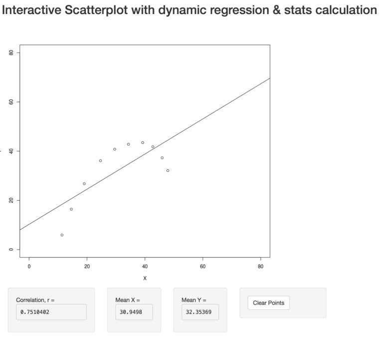
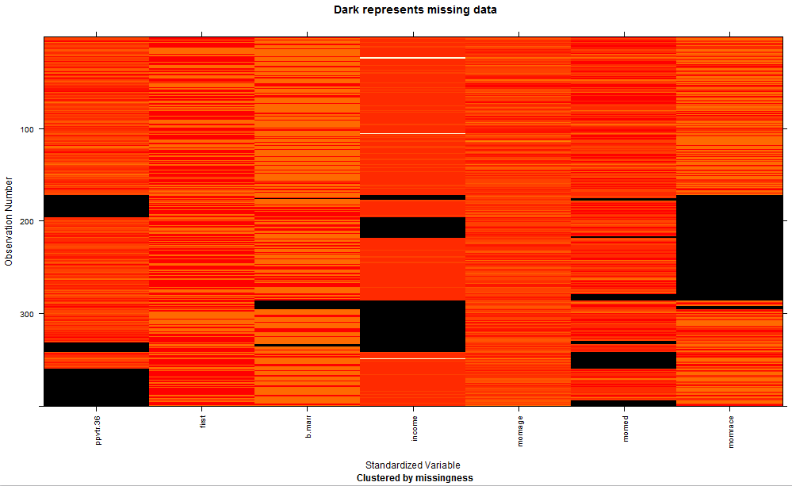
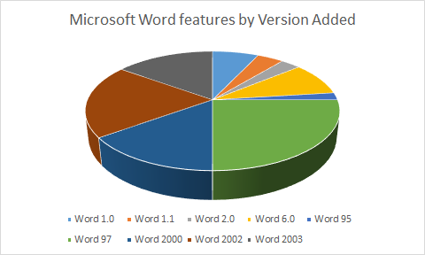
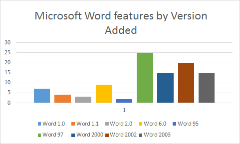

# Visual analytics and the role of data visualisation

Data visualisation is an extremely effective way of understanding your data. The combination of visualisation with statistics, data mining and other kinds of computational analytics is often called visual analytics. This term was coined by James Thomas and Kristin Cook just after the terrorist attack on the US in September 11, 2001. The original focus of visual analytics was on helping security analysts and emergency response services but it is now widely used in business intelligence and sciences for data analysis.
  
In [A Visual Analytics Agenda](http://www.purdue.edu/discoverypark/vaccine/assets/pdfs/publications/pdf/A%20Visual%20Analytics%20Agenda.pdf), visual analytics is defined by Thomas and Cook "as the science of analytical reasoning facilitated by interactive visual interfaces." It is designed to "detect the expected and discover the unexpected."

Visual analytics is all about putting the human-in-the-loop when doing data analytics. If you know exactly what you are testing for then the human is not needed and you can just run the analysis. However if you are not sure what you are looking for-which is mostly the case in data science-then visual analytics supports interactive exploration of the data:

* Visualise the data,
* make some tentative hypothesis,
* run appropriate analytics and visualise the results.
* Repeat this until you have found what you need.

One reason that visualisations are effective is that they can contains a huge amount of information. Standard statistical measures such as the mean, median, standard deviation or correlation summarise the data using just a few numbers. An information graphic potentially provides much more information about the data as it can show thousands (even million) of graphic elements each of which can use position, colour, pattern or shape to encode information about the data.

In 1973 the statistician Francis Anscombe constructed four data sets to show the importance of graphing data and also the effect of outliers on commonly used summary statistics. These sets are called the Anscombe Quartet. The x and y values in the four sets are carefully chosen so that the x-values have almost identical mean and variance, y-values have almost identical mean and variance, and they have the same linear regression with the same correlation. If you didn't look at the data more closely you would believe that they were very similar. However the moment the data is graphed it is very clear that the data sets are different and that they have very different characteristics.

Anscombe's Quartet of Data (Generated with R):

The other reason that data visualisation is effective is the human visual system. Much of our visual processing is pre-attentive and occurs in parallel. This means that with a well designed visualisation we can see patterns, anomalies, and trends very quickly-we don't have to read through the data line by line. We immediately see from the scatter plot of Anscombe's quartet how the different data sets are grouped in quite different patterns.

***

ACTIVITY

You can explore how data set groupings affect statistics such as the mean, standard deviation and correlation coefficient using this [interactive scatterplot](https://richc.shinyapps.io/ixscatter/) (made with R and Shiny).

This scatterplot allows you to add data points by clicking - you can create your own data set shapes. As you add points the regression line, correlation coefficient and means of X and Y are dynamically updated.

Add data points and observe the effect of various shapes of scatterplot on the mean of each variable and the correlation coefficient. Try and reproduce the four data set shapes of Anscombe's Quartet and also try constructing three differently shaped scatterplots that each yield a positive correlation with a coefficient value r=0.8. Explore the effect of outlying values by bunching most of the data points into a circular pattern (observe value of the correlation coefficient) - then put one point at a distance away (try various positions). Observe how the correlation coefficient is affected by just one such 'outlier'.
  

## Role of data visualisation in data science

Data visualisation is used for three main purposes in Data Science.

1. *Data checking and cleaning*. When you first get your data you should do some quick plots of the individual features to check that there are no obvious errors and to get a feel for the distribution of values.

2. *Exploration and discovery*. According to Mike Lourdes ([What is Data Science?](https://www.cloudera.com/content/dam/cloudera/Resources/PDF/What_is_Data_Science_OReilly.pdf)) Hilary Mason, one of the world's leading data scientists, says that when she gets a new data set, she starts by making a dozen or more scatter plots, trying to get a sense of what might be interesting. Visualisation reveals possible connections and patterns that can then be confirmed (or not) using other kinds of analysis. Visualisation also plays a key role in understanding any kind of spatial data.

3. *Presentation and communication of results.* The other important use of visualisation is to present the results of your analysis. This has two main purposes: (1) to help you and other modellers/analysts understand the results and (2) to communicate the results to other stakeholders.
  

## Data checking and cleaning

Whenever you first obtain some data it is a really good idea to check it. This can reveal simple entry errors like an extra 0, missing values or strange patterns in the data like 20% of the product prices are $99.99. This might be correct or it might be an error in the data.

The following is a quick check list for each attribute:

* Look at some random records
* Compute the mean, median and quartiles for the data. Look at a box plot of these.
* Determine the number of missing values and invalid values (NaNs), number of special values like 0. 
* Determine the number of distinct values and whether they really are distinct.
* Plot the frequency distribution of values. This might be with a histogram or density plot. You should play around with the choice of bin width as this smooths the data.
* Check for symmetry (skewness) and the flatness/spikiness of the distribution ('kurtosis', note platykurtic = flat distribution with low peak, leptokurtic = spikey peak around the mean).
* Look at the outliers and check whether they should be thrown away (trimmed) rounded up or down (Winsorised). This might be done, for instance, for data outside the 5th and 95th percentiles.
* Check formats for dates, that they are in comparable time zones.
* Plot latitude and longitude on a map to check they are sensible.
* Check text for strange characters or encoding

One quick way to look at your data to find missing values is using R with the 'mi' (multiple imputation) library. In the example below you can see (e.g.) income was not always recorded but age was (4th and 5th columns):

If you are using statistical tests that require a normal distribution then check that the data does appear to be normally distributed. There are statistical tests for doing this but they can be quite picky. A better approach is to actually plot the data and test for normality graphically.

There are two ways of doing this. The first is to look at a histogram or density plot of the data distribution and see if it looks like a normal distribution entered around the mean. Another way of testing for normality is to use a Q-Q plot. This is discussed more fully in [Analysis of trends and patterns in tabular data](https://www.alexandriarepository.org/module/placeholder-data-fitting/)

## Exploration and discovery

The heart of data science is exploring the data and discovering patterns and trends. Visualisation plays a core role in this process. Scatter plots, time series, data maps, tag clouds and many other kinds of graphics that you will see later in this unit allow the data scientist to get to know their data and the connections between it. As part of this process visualisation is used to understand the results of analysis such as clustering or curve fitting. Visualisation plays a complementary role to computational analysis: it is how the results of the analysis are presented to the data scientist so that they see all of the details and "confirm the expected" or see the "unexpected."

Exploration is inherently incremental. A visualisation leads to a hypothesis which leads to another visualisation to see if this is supported by the data and perhaps some confirmatory statistical testing of the hypothesis. This in turn might lead to another hypothesis. As part of this process data is fused from different sources and it may be that the process identifies that new data must be collected or found. Typical task during exploration are:

* Search for elements that satisfy certain properties, if they exist. This might be locating a known data point, filtering the data, or finding outliers.
* Identify the properties of a single data item
* Compare or rank elements
* Visually identify patterns in some subset of elements. Examples include trends, correlations, clusters or categories.
* Calculate derived properties not originally in the data. These may be data transformations, data aggregations or may be statistical properties such as regression lines or clusters

In many of the activities for this unit you will explore data and discover patterns and trends. And I leave the last word to the great mathematician John W. Tukey:

The greatest value of a picture is when it forces us to notice what we never expected to see. J.W. Tukey. Exploratory Data Analysis, 1977.

Tukey invented the box plot and according to Wikipedia he also invented the words "bit" and "software."

## Presentation of results

The other common use of visualisation in data science is for communicating the results of the analysis.

This communication might be to other analysts working on the same problem. In this case the visualisations will typically be those used in exploration and discovery, perhaps slightly cleaned up.

Much more effort needs to be put into preparing graphics and visualisations for communicating results to stakeholders who are not data scientists. These might be managers, policy makers or students in the case of educational projects or the general public in the case of journalists.

These kinds of visualisations require considerable time to prepare. They typically are used to communicate a particular message or narrative. The graphic needs to be designed to clearly communicate that message to the reader. The production values are also very high: plots and graphs produced by standard graphing packages are often touched up using graphics editing tools like Adobe Illustrator or Inkscape.

Once these presentation graphics were static, typically printed on glossy paper or shown in PowerPoint presentations. Nowadays they are often interactive and published on the Web.

When developing data visualisation for presentation don't get sucked in by trying to create a cool looking InfoGraphic. You need to carefully think about the best way to present your data and story and make sure that it communicates it effectively and does not simplify the story too much by hiding complexity.

***

ACTIVITY

Take a look at the following graphics showing feature additions to Microsoft Word. Below is a recreation of a 3D pie chart (using MS Excel, 2013), that seems to have first appeared on this Microsoft [blog](http://blogs.msdn.com/b/jensenh/archive/2006/04/04/568249.aspx) (the original is even worse, note the conflicting colours). Don't worry about the accuracy of the data, this is all about the graphic design.

Consider what is bad (or good) about this chart.
 
Now, same data, different chart (also MS Excel, 2013):

What other types of chart would be appropriate for this data?
 
There's a critique of the original pie chart [here](https://visuanalyze.wordpress.com/2013/02/05/bad_piecharts/) 

Which criticisms, if any, apply to the bar chart?

***

There is increasing sophistication in the data visualisations produced by magazines and newspapers. According to Nathan Yau the New York Times employs data visualisation experts in both its graphics department and in a group dedicated to online interactive graphics. (http://flowingdata.com/2008/12/10/what-jobs-are-there-in-data-visualization/)

## Summary

Visualisation is used for three important purposes in data science:

* initial data checking and cleaning,
* exploration and discovery, 
* and presentation of results.

Visualisation is effective because the human visual system allows parallel perception of large amounts of information. Visual analytics is the name given to the combination of interactive visualisation with statistics, data mining and other kinds of analytics.

***

FURTHER READING

Take a look at Daniel Keim's 1-hour [seminar](https://www.youtube.com/watch?v=zUgnmwszbfI) on visual analytics. He is one of the pioneers in this field and he provides a great introduction to why visualisation is indispensable in data exploration.

Nathan Yau's website and books are also well worth checking out. He is an expert in making easy to understand and interesting data visualisations. Take a look at some of his project on his [Flowing Data](http://flowingdata.com/category/projects/) website. Also look at

Visualize This: The FlowingData Guide to Design, Visualization, and Statistics. Nathan Yau. 2011

Also recommended reading is:

The chapter on "Exploring Data with Graphs" in "Discovering Statistics Using R." Andy Field, Jeremy Miles, Zoe Field. 2012

***

