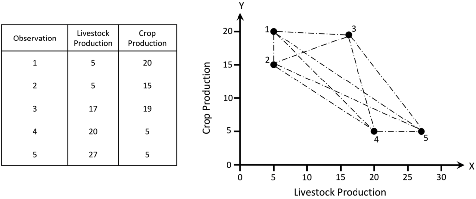
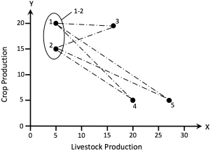

# Analysis of trends and patterns

Although scatter plots, line graphs or bar charts can be helpful for exploring and understanding data, it can be difficult to tell what the overall trend or patterns are. Analytics can help this by summarising the data. Adding data summaries or *‘smoothers‘*  can make it much, much easier to see the global patterns. Smoothing is an important way of exploring and understanding data. It can also be understood as a kind of model fitting. Another way of  summarising data is to use clustering to group similar data items.

## Simple linear regression

The simplest way of smoothing data is simply to fit a straight line to it. This is called *linear regression*. Linear regression finds a line of 'best fit' that is as close as possible to all of the points.

We can also understand linear regression as a simple kind of model fitting. Given some data points $(x_{i},y_{i})$ we want to find a linear model which allows us to predict the value of $y_{i}$ from $x_{i}$. In other words $x_{i}$ is the independent variable and $y_{i}$ is the dependent variable we are trying to predict from $x_{i}$.

Our linear model is the equation $y_{i}=(a+bx_{i})+\epsilon_{i}$ where a and b give the coefficients of the line of best fit: this is simply $y=(a+bx)$ where $a$ is the $y$ intercept and $b$ is the gradient of the line. The term equation $ϵi$ is called the residual: this is the difference between what the line predicts the value of $y_{i}$ will be and its actual value.

Linear regression finds the line (or more precisely the coefficients a and b) that best fits the data. This is found by minimising the sum of the squared residuals. Statisticians compute how well the line explains the data by computing something called $R^2$. This is the proportion of the total variation  that is explained by the model. A value near 1 is good, a value near 0 means the model explains very little.

When fitting data it is really important to plot the data and line of best fit in order to understand the residuals. Do not simply use a stats package to compute the line of best fit and $R^2$ and assume everything is fine if $R^2$ is not too close to 0. Remember Anscombe’s data quartet in which four very different data sets have the same line of best fit and same value of $R^2$. Visual analysis is required to see that the line of best fit is appropriate in the top-left data set but not in the other three data sets. In the top right the relationship is clearly not linear and a non-liner model is required while in the bottom two data sets a single outlier has skewed the line of best fit.

In fact it is a good idea to plot the residuals themselves as this really allows you to understand what the model does **not** explain. Looking at the residuals allows you to see what other things you can add to the model to better fit the data.

## Checking for normality

Another reason for graphing the residuals is that it allows you to check an assumption that underlies regression and correlation statistics: that the residuals are random normally distributed variables with mean of 0. Note it is only the residuals that need to be normally distributed, not the original values.

There are two ways of plotting data to check that it is normally distributed. The first is to look at a histogram or density plot of the data distribution and see if it looks like a normal distribution centered around the mean.

Lets look at our cricketing auction results. If we plot the histogram for the residuals then this looks like normal distribution.

Another way of testing for normality is to use a *Q-Q plot*. A Q-Q plot compares two probability distributions. It plots the quantiles of one distribution against those of the other distribution. Hence the name, Q-Q stands for quantile-quantile plot. If the points in the plot lie along the $y=x$ line then the two probability distributions are the same. If they lie along a straight line then they are the same except for scaling and translation.

To test for normality you simply plot the data distribution quantiles against those of the standard distribution. If the quartiles lie on a reasonably straight line then the data distribution is normal.

If we look at the Q-Q plot for the residuals from the cricketing example we see they fall reasonably well along a straight line so we can be reasonably confident the residuals are normally distributed.

Interpreting a QQ plot

* Perfectly normally distributed residuals will align along the identity (y=x) line.
* Short tails will veer of the line horizontally.
* Long tails will veer off the line vertically.
* *Expect some variation, even from normal residuals!*

## Data transformation

If the data (such as the residuals) are not normally distributed then there are a number of ways to handle this. One way is to use robust or non-parametric tests which do not rely on assumptions of normality. These typically rely on trimming the data to reduce the effect of outliers or simply using the relative rank of  the values, not their precise amount.

Another way is to uniformly transform the observations to remove kurtosis or skew. Some useful transformations (from Field et al, *Discovering Statistics Using R*, 2012) are

* *Log transformation* ($log(X)$). This squashes the right tail of the distribution and  can correct for positive skew and unequal variances between distributions. Be careful though as it only makes sense for positive numbers so you may need to add a constant to the data first.
* *Square root transformation* ($sqrt(X)$). This has a similar effect to the log transformation but is not so severe. Again the data must be positive.
* *Reciprocal transformation* ($1/X$). This also reduces the impact of large scores. Be careful because it reverses the ranking of scores to fix this you can use $1/(X_{max}-X)$
* *Reverse score transformation*: To overcome the effects of negative skewness you can simply reverse the scores by for instance applying the transformation $(X_{max}-X)$ and then applying one of the above transformations.

## Other kinds of curve fitting

In linear regression we fit a single straight line to the data using one variable as a predictor. There are, of course, many more complex curves and surfaces that we can fit to the dependent variables, all of which are a kind of model that allows us to predict the value of the dependent variables from the independent variables. Some of the more common include

* *Multiple (linear)* regression: in which the dependent data is explained by more than one independent variable. In this case we still fit a line to the data but it has a gradient coefficient for each of the independent variables.
* *Polynomial regression*: we can fit more complex polynomials to the data.
* *LOESS*: locally weighted polynomial regression. This fits a low-degree polynomial to a subset of the data around each data point.

Regardless of the type of curve fitted it is always useful to plot the residuals so as to better understand what the model does and does not explain.

So far we have assumed that the values of the independent values are perfectly known, or in fact that we have independent and dependent variables. If we want to treat both kinds of variables equivalently then we must use *total least squares*. In total least squares the residual measures the distance between the data point and the closest point on the fitted curve.

## Uncertainty

There is however a potential problem with simple visualisation of the line of best fit: it is difficult to understand the level of uncertainty in its predictive power. Given that the residuals are normally distributed it is possible to compute the region around the line of best fit in which the actual data values will lie with probability of say 80 or 90%.

When you can, it is important in data visualisation to visually indicate uncertainty so that the reader gets a sense of how much they can trust the data or model. If this is not done it is easy to believe that the visualisation is completely accurate: seeing is believing.

## Clustering

Another way of summarising data or seeing patterns is to use clustering. Clustering tries to group “similar” data items together. It is core part of data science and is covered in more detail in [Dependence, regression and clustering](). There are a large number of approaches to clustering, see for instance [Cluster Analysis (wikipedia)](https://en.wikipedia.org/wiki/Cluster_analysis). Clustering techniques can be categorised into

* *hard* or *soft clustering*: in hard clustering an item either belongs to a cluster or it doesn’t while in soft or fuzzy clustering an item has some likelihood of belonging to a cluster
* *strict* or *overlapping partitioning*: in strict partitioning an item belongs to exactly one cluster, while in overlapping partitioning it can belong to more than one
* *hierarchical clustering*: the clusters form a hierarchy in the sense that an item that belongs to a child cluster also belongs to the parent cluster.

There is no single best clustering algorithm and all of them have limitations. This means it is very important to visualise the results and see if the clustering is sensible, or to compare different clusterings. For instance in the following example taken from wikimedia, we see that k-means clustering gives quite a different result to EM clustering.

[K-means Clustering](https://en.wikipedia.org/wiki/K-means_clustering) iteratively computes the centroid of each cluster while the [EM (Expectation-Maximization) Algorithm](https://en.wikipedia.org/wiki/Expectation–maximization_algorithm) iteratively refines the unknown parameters of a Gaussian distribution model for the clusters and at each step computing the likelihood each item belongs to a particular cluster. In this case the EM algorithm performs better, giving a result closer to the known clustering shown on the left.

The basic steps in clustering analysis are

1. Normalise the data if necessary. The most common approach is to use [z-scores](https://en.wikipedia.org/wiki/Standard_score).
2. Decide how to measure similarity between items. In the example above we used Euclidean distance but there are many other choices.
3. Choose the clustering method and, if required, the number of clusters.
4. Visualise the clusters and try to determine if they are meaningful and if so what they mean.

## Hierarchical clustering

*Connectivity based clustering* is an intuitively simple and commonly used class of methods for clustering. These create a hierarchical cluster by iteratively joining the two most similar clusters to form a new parent cluster. Initially each item forms its own cluster. As an example consider the UPGMA (unweighted pair-group method using arithmetic averages) method applied to a hypothetical data set of 5 items with two attributes.

Initially each observation is assigned to its own cluster. To measure similarity between two clusters we use the average Euclidean distance between members of the two clusters.

The two clusters with the least average distance between them are merged to form a new cluster. In this case the observations 1 and 2 are merged to form the new cluster 1-2.

We repeat this process: next observations 4 and 5 are merged

then 3 is merged with cluster 1-2

and now the final two clusters are merged.

The result of hierarchical clustering is usually shown using a dendrogram. In this graphic a tree shows the cluster hierarchy with the position of the parent node showing how similar the two clusters are. In our example for instance it shows that clusters 1 and 2 combined with an average Euclidean distance of 5 while clusters 3 and 1-2 combined with an average distance of 12.35.

The [*cophenetic correlation coefficient*](https://en.wikipedia.org/wiki/Cophenetic_correlation) can be used to check how well the hierarchical clustering explains the data. This measures the correlation between the raw similarity between each pair of items and the similarity given in the dendrogram. For instance, in our example the raw similarity between 1 and 3 is 12.04 but the similarity in the dendrogram is 12.35 since this is the average Euclidean distance associated with the cluster 1-2-3 which is the smallest cluster containing both 1 and 3. More sophisticated analyses are also possible.

## Summary

Curve-fitting and clustering are two commonly used statistical techniques for summarising tabular data. Curve fitting smooths the data and can reveal trends while clustering groups similar items. In both cases it is important to “sanity check” the results using visualisation. It is also important to try different “smoothers” and clustering methods as there is no one best method and different methods can give quite different results.

  

