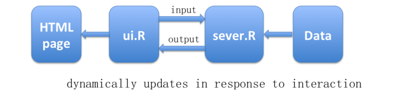
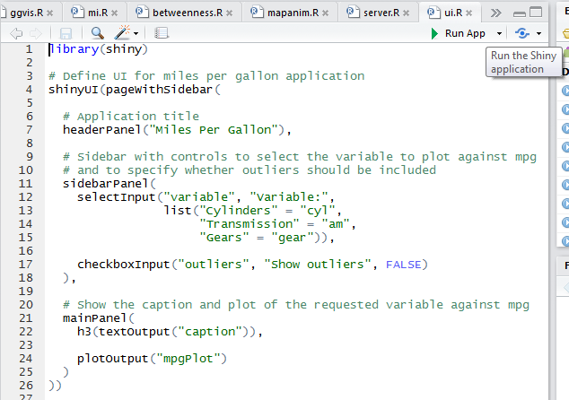

# Activity: Interactive charts with R

In this activity we will look at some of the ways that you can create interactive data visualisations with R. Unfortunately there is no one best approach. You will need to install  the relevant libraries/packages.

## Shiny

Shiny is an R package that makes it easy to build interactive web applications (apps) straight from R. If you haven’t installed the Shiny package, open RStudio. And follow the [instructions]() in the previous section to install `"shiny"` package.

It has some built in examples. Let’s try one of them:


```r
library(shiny)
runExample("01_hello")
```


You can see controls (‘Open in browser’, ‘Number of bins:’ at top), a histogram, some text and the actual code. Note that code comes in pairs, `ui.R` and `server.R`.

If you get an error message “R Session Aborted”, that’s saying you need to update your R packages.

Please run the following command in the Console of RStudio (located at left-bottom):

```r
update.packages(ask = FALSE, checkBuilt = TRUE)
```

Be patient, it may take 10-15 minutes to update the packages.

### Structure of a Shiny App

Shiny apps usually have two components (two files in the same folder):

* [`ui.R`] a user-interface script. This creates the visual elements and controls the layout and appearance of the Shiny app
* [`server.R`] a server script. This assembles inputs into outputs and provide instructions on how to build the visual objects to show with the page.

With the above built-in example, we have the UI function:


```r
# ui.R
library(shiny)
 
# Define UI for application that draws a histogram
shinyUI(fluidPage(
 
  # Application title
  titlePanel("Hello Shiny!"),
 
  # Sidebar with a slider input for the number of bins
  sidebarLayout(
    sidebarPanel(
      sliderInput("bins",
                  "Number of bins:",
                  min = 1,
                  max = 50,
                  value = 30)
    ),
 
    # Show a plot of the generated distribution
    mainPanel(
      plotOutput("distPlot")
    )
  )
))
```

This adds a titlePanel (line 8) and an interactive control panel (i.e., a sliderbar for getting user input for number of bins, line 10-18) to the user interface. It also adds an output object “distPlot” to the mainPanel (line 22).

So `ui.R` tells Shiny what to show and where to display the output objects and now we can provide instructions on how to build those objects in `server.R`. Following is the server code in the running example:

```r
# server.R
library(shiny)
 
# Define server logic required to draw a histogram
shinyServer(function(input, output) {
 
  # Expression that generates a histogram. The expression is
  # wrapped in a call to renderPlot to indicate that:
  #
  #  1) It is "reactive" and therefore should be automatically
  #     re-executed when inputs change
  #  2) Its output type is a plot
 
  output$distPlot <- renderPlot({
    x    <- faithful[, 2]  # Old Faithful Geyser data
    bins <- seq(min(x), max(x), length.out = input$bins + 1)
 
    # draw the histogram with the specified number of bins
    hist(x, breaks = bins, col = 'darkgray', border = 'white')
  })
})
```
This plots a histogram of R’s faithful dataset with a configurable number of bins (i.e., specified by user).

<mark class="big">Interaction between ui.R and server.R</mark>


**Input**: we can create a list of elements for gathering dynamic user input in the ui script. The value of the input can be used in the server function when constructing the output object. In the running example, the following code (line 12; `ui.R`), specifies an input variable “bins”.


```r
sliderInput("bins",
```

The value of “bins” gathered from the user is then used to specify the number of bins in the histogram in the server function (line 16; `server.R`)


```r
bins <- seq(min(x), max(x), length.out = input$bins + 1)
```

**Output**: We can also add output objects to the user-interface in `ui.R`.

For example, the code file below (line 22; `ui.R`) uses plotOutput to add a reactive plot to the main panel of the Shiny app pictured above.


```r
# Show a plot of the generated distribution
mainPanel(
  plotOutput("distPlot")
)
```

Notice that the function `plotOutput` takes an argument, the character string “distPlot”, this is the name of the reactive element.

Then in the server function, we tell shiny how to construct this object. In the running example, the following code (line 14-20; `server.R`) specifies the value of “distPlot”, which essentially is a histogram.


```r
output$distPlot <- renderPlot({
  x    <- faithful[, 2]  # Old Faithful Geyser data
  bins <- seq(min(x), max(x), length.out = input$bins + 1)
 
  # draw the histogram with the specified number of bins
  hist(x, breaks = bins, col = 'darkgray', border = 'white')
})
```

It is important to note that the object name you specified in `server.R` must match the reactive element name created in `ui.R`. In the script above, `output$distPlot` matches `plotOutput`(`"distPlot"`) in your `ui.R` script.

The output objects shown in the HTML page are dynamically updated in response to the user input through the interactions between the ui and server. The following figure shows the basic architecture of an Shiny app:



The Shiny [gallery](https://shiny.rstudio.com/gallery/) contains some good examples of Shiny apps, you can try their demos later.

Now it’s DIY time, here’s the UI code:


```r
# ui.R
library(shiny)
 
# Define UI for miles per gallon application
shinyUI(fluidPage( 
  
 # Application title
 headerPanel("Miles Per Gallon"),
  
 # Sidebar with controls to select the variable to plot against
 # mpg and to specify whether outliers should be included
 sidebarLayout(
   sidebarPanel(
     selectInput("variable", "Variable:", 
       c("Cylinders" = "cyl", 
         "Transmission" = "am",
         "Gears" = "gear")
     ),
  
     checkboxInput("outliers", "Show outliers", FALSE)
   ),
  
   # Show the caption and plot of the requested variable against mpg
   mainPanel(
     h3(textOutput("caption")),
     plotOutput("mpgPlot")
   )
   )
))
```

and the `server.R`


```r
# server.R
library(shiny)
library(datasets)
  
mpgData <- mtcars
mpgData$am <- factor(mpgData$am, labels = c("Automatic", "Manual"))
# Define server logic required to plot various variables against mpg
shinyServer(function(input, output) {
 # Compute the forumla text in a reactive expression since it is 
 # shared by the output$caption and output$mpgPlot expressions
 formulaText <- reactive({
 paste("mpg ~", input$variable)
 })
 # Return the formula text for printing as a caption
 output$caption <- renderText({formulaText()})
  
 # Generate a plot of the requested variable against mpg and only 
 # include outliers if requested
 output$mpgPlot <- renderPlot({
 boxplot(as.formula(formulaText()), 
 data = mpgData,
 outline = input$outliers)
 })
})
```

To run the Shiny App use the ‘> Run App’ menu (above either file, as shown below):



Launches a separate Shiny browser, you should see a boxplot and some controls. Interact!


If you have more than one shiny app then one way to manage them is with folders, e.g. the above is in a folder ‘Car’ in the working directory (use `getwd()` to see). So to run the current app use the Console command:

`runApp()`

(or use ‘> Run App’ button). To run another app (in another location) use the path, e.g.:


```r
runApp("Car")
```

### Shiny with ggplot

Save your `ui.R` & `server.R` in a folder (e.g. ‘Car’).

Copy the folder to a new one (and rename it), open it, open the `server.R` code and replace it with:


```r
# server.R
library(shiny)
library(datasets)
library(ggplot2) # load ggplot
 
# Define server logic required to plot various variables against mpg
shinyServer(function(input, output) {
  
  # Return the formula text for printing as a caption
  output$caption <- reactiveText(function() {
    paste("mpg ~", input$variable)
  })
   
  # Generate a plot of the requested variable against mpg and only 
  # include outliers if requested
  # ggplot version
   
   output$mpgPlot <- reactivePlot(function() {
     # check for the input variable
     if (input$variable == "am") {
       # am
       mpgData <- data.frame(mpg = mtcars$mpg, 
                             var = factor(mtcars[[input$variable]], 
                                          labels = c("Automatic", "Manual")))
     }
     else {
       # cyl and gear
       mpgData <- data.frame(mpg = mtcars$mpg, 
                             var = factor(mtcars[[input$variable]])
                             )
     }
 
     p <- ggplot(mpgData, aes(var, mpg)) + 
       geom_boxplot(outlier.size = ifelse(input$outliers, 2, NA)) + 
       xlab(input$variable)
     print(p)
   })
   
})
# from 
# http://web.stanford.edu/~cengel/cgi-bin/anthrospace/building-my-first-shiny-application-with-ggplot
```

Run & interact

**Optional:**

* Look for the other examples included in shiny:
    + system.file("examples", package="shiny")
* See also http://shiny.rstudio.com/gallery
* “the Shiny Tutorial” http://shiny.rstudio.com/tutorial/
* http://toddwschneider.com/posts/traveling-salesman-with-simulated-annealing-r-and-shiny/

## Other Ways

There are also a number of other ways to make interactive graphics in R. ggvis is from the makers of ggplot. It aims to make it easy to build interactive graphics for exploratory data analysis. Similar to Shiny, you will need to install ggvis package. Once installed, run the following (in a new file, name it as you want):


```r
library(ggvis)
p <- ggvis(mtcars, x = ~hp, y = ~mpg)
layer_points(p)
```

All ggvis graphics are web graphics, and need to be shown in the browser. RStudio includes a built-in browser ‘Viewer’ so it can show you the plots directly (note that it’s in the ‘Viewer’ tab, not in ‘Plots’). You can combine the two steps:


```r
layer_points(ggvis(mtcars, x = ~hp, y = ~mpg))
```

Or you can use pipes: %>%
These allow you to rewrite the previous as:


```r
mtcars %>%
  ggvis(x = ~hp, y = ~mpg) %>%
  layer_points()
```

Right, but where’s the interaction? Try this:


```r
mtcars %>% 
  ggvis(~wt, ~mpg, 
    size := input_slider(10, 100),
    opacity := input_slider(0, 1)
  ) %>% 
  layer_points()
```


<mark class="red">"Showing dynamic visualisation. Press Escape/Ctrl + C to stop."</mark>


In fact CTRL-C just makes it mad, use ESC… (AND you have to do it in the correct active window, the Console, not the Viewer). So try the controls in the Viewer then stop the process in the Console (ESC or use the STOP button).

Behind the scenes, interactive plots are built with [shiny](https://www.rstudio.com/shiny/), and you can currently only have one running at a time in a given R session. However it looks like ggvis is no longer being developed.

An alternative to Shiny is [plotly](https://www.rstudio.com/shiny/):

“Plotly was built using [Python](Yet another way to have interactive graphs in plots tab (not ‘Viewer’) in R is this:) and the [Django](https://en.wikipedia.org/wiki/Django_(web_framework)) framework, with a front end using [JavaScript](https://en.wikipedia.org/wiki/JavaScript) and the visualization library [D3.js](https://en.wikipedia.org/wiki/D3.js), [HTML](https://en.wikipedia.org/wiki/HTML) and [CSS](https://en.wikipedia.org/wiki/Cascading_Style_Sheets). Files are hosted on [Amazon S3](https://en.wikipedia.org/wiki/Amazon_S3)” – it is **well worth a look**, has APIs for R & Python, also libraries, also tools to convert plots.

Yet another way to have interactive graphs in plots tab (not ‘Viewer’) in R is this:


```r
install.packages("manipulate")
library(manipulate)
manipulate(plot(1:x), x = slider(1, 100))
manipulate(
  plot(
    cars, xlim = c(0, x.max), 
    type = type, ann = label, col=col, pch=pch, cex=cex
  ),
  x.max = slider(10, 25, step=5, initial = 25), 
  type = picker("Points" = "p", "Line" = "l", "Step" = "s"), 
  label = checkbox(TRUE, "Draw Labels"), 
  col=picker("red"="red", "green"="green", "yellow"="yellow"), 
  pch = picker("1"=1,"2"=2,"3"=3, "4"=4, "5"=5, "6"=6,"7"=7,
    "8"=8, "9"=9, "10"=10,"11"=11, "12"=12,"13"=13, "14"=14, 
    "15"=15, "16"=16, "17"=17, "18"=18,"19"=19,"20"=20, 
    "21"=21,"22"=22, "23"=23,"24"=24
  ), 
  cex=picker("1"=1,"2"=2,"3"=3, "4"=4, 
    "5"=5,"6"=6,"7"=7,"8"=8, "9"=9, "10"=10
  )
)
# pch is styles x 24
# cex is size x 10
# 3 types: point, line, bar
# 3 colours
```


