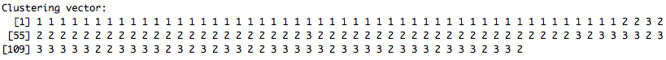

# Activity: Clustering with R

In this Activity we look at clustering and cluster visualisation in R with the iris dataset and some cricket data.

## Clustering “irises” data

let’s look at the details of this data first.

Remember the `help()`?

This data set has the length & width of **Sepal** and length & width of **Petal** and the species name.

We are going to use visualisation to cluster the data by their **Sepal** and **Petal** information.

Actually these flowers (`irises data set`) are quite famous in data circles, everyone knows there are three species (but the computer doesn’t).

Let’s get R to classify or cluster our data.

First we have to remove the answer (Species), since these have already been classified…


```r
library(ggplot2)
# the four measures of irises, width &amp;amp; length + species
head(iris)
# remove the 5th column from the dataset which contains the name of the species - 
# so there's no 'cheating'# from this point on 'irises' is our version of the 
# origianl 'iris' data, so species is unknown..
irises <- iris[-5]
# and display
head(irises)
```

Now plot the data all different ways to eyeball it. This is based on

https://cran.r-project.org/web/packages/dendextend/vignettes/Cluster_Analysis.html

Let’s have a look at how the different species will look like (still cheating).


```r
# get the species names
species_labels = iris[,5] 
# a library with nice colors, install it if you do not have
library(colorspace) 
# get a color for each record according to its specie
species_col = rev(rainbow_hcl(3))[as.numeric(species_labels)] 
```

*** 

`rainbow_hcl(3)` will get 3 colors from the `colorspace` library.  
`rev` is reverting the vector, you can try to run the code without it and see the difference.  
`as.numeric(species_labels)` will change factor to numbers.  
`species_col` stores a color for each flower.  

***

Let’s plot something, lets try a SPLOM (Scatter plot matrix)


```r
pairs(irises, col = species_col,
      lower.panel = NULL,
      cex.labels=2, pch=19, cex = 1.2)
```

A legend will make it much better.


```r
par(xpd = TRUE)
legend(x = 0.05, y = 0.4, cex = 2,
   legend = as.character(levels(species_labels)),
    fill = unique(species_col))
par(xpd = NA)
```

<mark class="big">**Setosa is clearly the odd one out, the other two overlap**</mark>


Let’s do the real clustering (no cheating).

We are going to use the irises data (without the species information).


```r
fit <- kmeans(irises, 3, nstart = 25) # 3 clusters, kinda cheating, try 2, or 4 (or 1)
fit
```

We use `kmeans` clustering algorithm to cluster the data.

Look into it if you want, do not forget the help().

In the output, the following part describes which class each record belong to.



We then add this clustering information into our data.

```r
df <- data.frame(irises)
df$cluster <- factor(fit$cluster)
```

Finally, we can plot it.


```r
ggplot(data = df, aes(
  x = Sepal.Length, y = Petal.Length, color = cluster
  )) + geom_point()
```
So the clustering algorithm (kmeans) give us 3 distinct clusters (as requested), one being more separated from the other two which also have a boundary (as you’d expect, that’s what we ask for when we cluster)

Compare this with the original data coloured by species (colours don’t match – sorry), we can see one separate group (‘setosa’)


```r
ggplot(data = iris, aes(
  x = Sepal.Length, y = Petal.Length, color = Species)
  ) + geom_point()
```

<mark class="big">Compare the two plots, how accurate is kmeans?</mark>

## Clustering “crickets” data

Try an unclassified data set, the far more famous ‘crickets’.  
Let’s build the data first.


```r
Names = c("Mike Hussey", "Aaron Finch", "Brad Hogg", "Steve Smith", 
          "George Bailey", "Mitchell Johnson", "Shaun Marsh", "Glenn Maxwell", 
          "Pat Cummins", "Mitchell Starc", "David Warner")
# and check length
#length(Names)
 
Ages = c(39,28,44,25,32,33,31,26,22,25,28)
#length(ages)
IPLSals = c(310,662,103,828,672,1340,455,1240,207,1030,1140)
```

Make a dataframe but dump names, calculating clusters using names makes no sense.


```r
crickets = data.frame(Names, Ages, IPLSals)
crickets # and display
crickets = crickets[-1]
```

Let’s use kmeans again for clustering.


```r
clusters = 2  # how many clusters?? Don't know, try 2
fit  <- kmeans(crickets, clusters, nstart = 25)
# is this data even suitable for clustering, is there enough?
fit
fit$cluster
# df <- data.frame(df)
crickets$cluster <- factor(fit$cluster)
```

Plot our result.

```r
crickets$cluster <- factor(fit$cluster)
ggplot(data = crickets, aes(x = IPLSals, y = Ages, color = cluster)) + geom_point()
```

We can also rotate it.

```r
# rotate axes
ggplot(data = crickets, aes(y = IPLSals, x = Ages, color = cluster)) + geom_point() 
```

Compare with the manually clustering with raw data `crickets`.

## Hierarchical clustering


<mark class="big">Dendrograms</mark>


(from Greek dendro “tree” and gramma “drawing”)

AKA another way to cluster

The basic method is hclust() which includes various ‘grouping’ algorithms:

* “ward.D”
* “ward.D2”
* “single”
* “complete”
* “average”
* “mcquitty”
* “median”
* “centroid”


```r
# rotate axes
# basic cluster, black & white
d <- dist(as.matrix(crickets))  # distance matrix, how close, or far apart are the data
d 
# the distance matrix, why is there no row 1? 
# there's a big distance between 1 & 6, check the data, that's the highest & lowest Sal 
# what would happen if salary was scaled (up or down) e.g $1M is 1,000,000 or 1.0
```

Let’s plot it.


```r
# apply hierarchical clustering 
hcc <- hclust(d)
# and paint
plot(hcc)                 
```

**What does ‘Height’ mean?**


```r
plot(hcc, labels = Names) # use names            
```

The four on the right are the $1M club  
Remember the list at the beginning, there are different clustering algorithms.  
Put it all together and play around them.  


```r
par(mfrow = c(2,2))
plot(hclust(d,"com"), labels = Names) 
plot(hclust(d,"av"), labels = Names) 
plot(hclust(d,"sin"), labels = Names) 
# you just have to try a mcquitty...
plot(hclust(d,"mcq"), labels = Names) 
# "ward.D",
# "ward.D2",
# "mcquitty" (= WPGMA),
# "median" (= WPGMC) or
# "centroid" (= UPGMC).
 
# what is the default?               
```

Colour?

```r
library(colorspace)
library(dendextend)
par(mfrow=c(1,1))
# get colors from thrid-party library
cols <- rainbow_hcl(3) 
hcc <- as.dendrogram(hcc)
hcc <- color_branches(hcc, 3)
plot(hcc)
```

Try “large” data.

```r
par(mfrow=c(1,1))
m_dist <- dist(iris, diag = FALSE)
#  or just "com"
m_hclust <- hclust(m_dist, method = "complete") 
plot(m_hclust)
```

Tree too big?  Chop it up, or down, this is slow, patience


```r
k = 3
cols <- rainbow_hcl(k)
dend <- as.dendrogram(m_hclust)
dend <- color_branches(dend, k = k)
 
plot(dend)
 
labels_dend <- labels(dend)
 
# cut tree to different clusters
groups <- cutree(dend, k=k, order_clusters_as_data = FALSE) 
dends <- list()
for(i in 1:k) {
  labels_to_keep <- labels_dend[i != groups]
  dends[[i]] <- prune(dend, labels_to_keep)
}
 
par(mfrow = c(1,3))
for(i in 1:k) { 
  plot(dends[[i]], 
       main = paste0("Tree number ", i))
}
```
Finally compare the cluster with the ‘truth’ using the real species names, as before **setosa** is separate


```r
d_iris <- dist(irises) # method="man" # is a bit better
hc_iris <- hclust(d_iris, method = "complete")
iris_species <- rev(levels(iris[,5]))
 
library(dendextend)
dend <- as.dendrogram(hc_iris)
# order it the closest we can to the order of the observations:
dend <- rotate(dend, 1:150)
 
# Color the branches based on the clusters:
dend <- color_branches(dend, k=3) #, groupLabels=iris_species)
 
# Manually match the labels, as much as possible, to the real 
# classification of the flowers:
labels_colors(dend) <-
   rainbow_hcl(3)[sort_levels_values(
      as.numeric(iris[,5])[order.dendrogram(dend)]
   )]
 
# We shall add the flower type to the labels:
labels(dend) <- paste(as.character(iris[,5])[order.dendrogram(dend)],
                           "(",labels(dend),")", 
                           sep = "")
# We hang the dendrogram a bit:
dend <- hang.dendrogram(dend,hang_height=0.1)
# reduce the size of the labels:
# dend <- assign_values_to_leaves_nodePar(dend, 0.5, "lab.cex")
dend <- set(dend, "labels_cex", 0.5)
# And plot:
par(mfrow=c(1,1))
plot(dend, 
     main = "Clustered Iris data set
     (the labels give the true flower species)", 
     horiz =  TRUE,  nodePar = list(cex = .007))
legend("topleft", legend = iris_species, fill = rainbow_hcl(3))
```

3) https://cran.r-project.org/web/packages/dendextend/vignettes/introduction.html
These visualizations demonstrate how the separation of the hierarchical clustering is very good with the “Setosa” species, but misses in labeling some “Versicolor” species as “Virginica”.

The hanging of the tree also helps to locate extreme observations. For example, we can see that observation “virginica (107)” is not very similar to the Versicolor species, but still, it is among them. Also, “Versicolor (71)” is located too much “within” the group of Virginica flowers.

 

If you are interested in the implementation and differences of those clustering algorithms.

Have a look at this online interactive visualisation of 3 different clustering algorithms:

https://www.alexandriarepository.org/wp-content/uploads/20160819164034/index.html

***
