# How to design a data map

Here we will look at the various decisions and steps involved in designing a data map (or *thematic* map as they are usually called by cartographers). The first question is whether you should actually be using a data map. In short, you should use a data map if the data is associated with a geographic location or region and you wish to explore or show how this affects the other attributes. Just because data has a geographic location doesn’t necessarily mean that you should show it on a data map. For instance if you are only interested in comparing sales figures for different stores in a company you would better to compare these using a bar chart. However if you are interested in seeing how the location of the store affects sales figures then you should use a data map. This might, for instance, show sales figures for the stores overlaid on a choropleth map of average income broken down by suburb.

Before you read further, take a look at some of the data maps Ben Wellington uses in his TED Talk [Making data mean more through storytelling](https://www.youtube.com/watch?v=6xsvGYIxJok) (14min).

Data maps are one of the more difficult visualisations to design: it is easy to inadvertently create a misleading data map.

## Scale and generalisation

Maps can be drawn at very different levels of scale. The scale of a map is often expressed as  a ratio of map units to Earth units. This is called the _representative_ fraction. For instance, a scale of 1:10,000 means that 1cm on the map represents 10,000cm = 100m on the earth’s surface. Map scale can be shown using a representative fraction or a graphical bar scale or even given verbally as in “1 inch to the mile.” Graphical bar scales are by far the most easily understood way of showing the scale of a map and should be included whenever the scale is relevant to understanding the data and the scale is relatively consistent over the map.

The scale of a map dictates how much detail can be shown. A _large scale_ map shows a small area in detail, while a _small scale_ map shows a large area in less detail. Spatial data sets often contain very detailed information and one part of map design is working out what is the appropriate level of detail to show in the map and then aggregating or generalising the geographic and non geographic data appropriately. For instance, imagine you wish to compare population density. On a map of the world you might show country boundaries, on a map of Australia you might show state boundaries and the capital cities.

## Coordinate system

The Earth is roughly speaking a sphere though it bulges a bit at the equator because of the centrifugal forces generated by rotation. Location on the earth’s surface is given by _latitude_ and _longitude_. The location of Melbourne is given by 37°48′49″S 144°57′47″E.

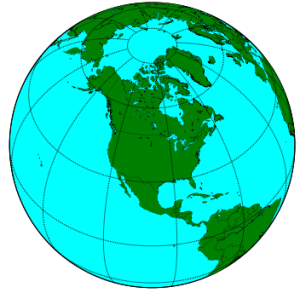

Latitude lines go from east to west and are parallel to the equator. They run from 90ON which is the North Pole to 0O which is the equator down to 90OS which is the South Pole. Longitude lines run at right angles to the latitude lines and are circles running north to south through the poles. Longitude are measured east or west from Greenwich in the UK. They range from 180OW to 0 which is Greenwich to 180OE (which is of course equal to 180OW). Probably like me you can’t remember which is which: lines of longitude  are all “long” while lines of latitude vary in size. Lines of latitude are often called parallels as they do not intersect while lines of longitude are called meridians and the meridian through Greenwich is called the Prime Meridian.

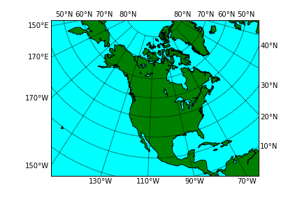

## Map projections

One of the great difficulties facing map-makers is how to faithfully show the surface of the Earth (a flattened sphere) on a flat piece of paper. A _map projection_ is the mapping between points on the surface of the Earth and the position on the two-dimensional map. You might like your map projection to avoid distorting angles, distances, area and directions. Unfortunately this is impossible: there is no 2D projection that can do this.

For maps only showing a small part of the Earth’s surface the distortions are small but for maps showing continents or the entire world the distortions are considerable. As a result dozens of different map projections have been invented. There is no single best projection: the appropriate choice depends upon the task, area covered by the map and the kind of data map. Thus, choosing the right projection is am important part of designing a data map.

Projections can be classified depending upon which property they preserve

* *Equal area (or equivalent)* projections preserve area.
* *Conformal projections* preserve angles locally,
* *Equidistant projections* preserve distance from a particular location
* *Azimuthal projections* preserve directions from a particular location, while
* *Compromise projections* ensure that area and angle distortion is “not to bad.”

The most commonly used map projection is that of Mercator. This was invented by Gerard Mercator in 1569. His map was designed to help European sailors who urgently needed nautical charts that allowed them to easily navigate  between very distant locations. His map uses a rectangular grid of meridians and parallels. For the meridians to be straight lines the horizontal scale must increase as the latitude increases/decreases moving away from the Equator since the actual distance between meridians decreases until they meet at the North and South poles.

The clever part of Mercator’s projection is to smoothly increase the vertical scale as the latitude increases so that the vertical scale always remains the same as the horizontal scale. As a result the distance between the parallels increases as you move away from the Equator even though they are equally spaced on the actual Earth itself. By linking the vertical scale with the horizontal scale Mercator ensured that regions drawn on the map locally retain their shape since the scale around any point on the map was consistent in all directions. Even better, Mercator’s projection ensured that a straight line drawn between two points on the map gives the correct bearing in which to travel between the points.

Of course this comes at a price: the scale is not consistent across the map and regions at high latitude are disproportionately large: Furthermore it is not even possible to show the North or South Pole. Nonetheless, the Mercator projection has become the standard map projection, the one that is used on most maps including those of Google and the one that most of us learn our geography from. It is because of this that many of us still think that Greenland is as big as Africa.

However, the use of the Mercator projection should not be automatic. While it is familiar, unless you need to navigate around the world it is almost certainly not the best choice of map projection. In 1989 the Committee on Map Projections of the American Cartographic Association released a resolution strongly advocating against the use of rectangular world maps including those based on Mercator’s projection because of the serious, erroneous conceptions that they create.

Table 3.2 from _Cartography: Thematic Map Design_ provides a guide to which projection to choose for different purposes and regions. A very reasonable choice for data maps of the world is to use either the _Winkel Tripel_ Projection or the _Robinson Projection_ as both are pleasing looking compromise projections that minimises area and angular distortion.  However, if you are creating a data map of the world in which area is important in interpreting the data such as when using a dot map to show total population and density then the _Mollweide Projection_ is a better choice because it is an equal area projection. For showing continent sized areas, a good choice is the _Lambert Azimuthal Equal Area Projection_ appropriately centered on the region. If you are creating a flow map for flows from a single origin and the direction and distance of flow is important, then the ideal choice is an _Azimuthal Projection_ centered on the origin appropriately scaled so that it preserves distance as well as direction from origin to destination.

It is worth emphasising  that when choosing the map projection you can also choose where to center the map and the point or line(s) for which distortion is minimised: obviously you should choose these so as to minimise distortion of the most importance areas. For smaller regions the choice of map projection is not as important as the amount of distortion is less.

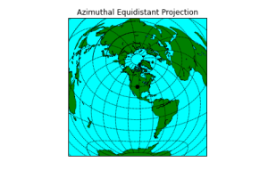
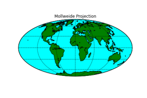
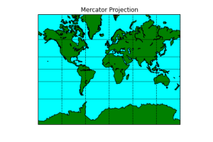
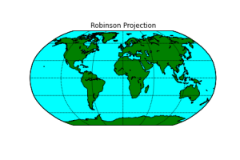
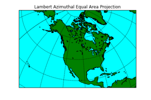

Given the problems with projection it is sometimes worth thinking about another approach: actually showing the Earth as a 3D globe. The disadvantage of this is the difficulty of navigating in 3D space and that curvature means it is impossible to see more than half the globe at once and that depth introduces difficulties in accurately comparing distances and errors. However it does have the advantage that there is no built in bias.

What you favourite map projection says about you [here](https://xkcd.com/977/)

## Choice of data map

The next choice when creating a data map is which of the different kinds of data maps to use.

### Choropleth and prism {-}

Choropleth mappings show categorical and ranked (both ordinal and quantitative) data associated with regions that have fixed boundaries.  These regions are typically political or administrative boundaries. The data value is usually represented using colour though sometimes a pattern is used and regions on the map are filled with the colour or pattern corresponding to their data value.

A prism map is a variant of a choropleth map in which height is used to show the data value. Prism maps are well suited to comparing quantitative data.

If using grey-scale it is conventional to use darker colours for higher values and lighter colours for lower values.

Choropleth maps can either plot unclassed data, in which case a continuous scale is used, e.g. from white to black, or data segregated into classes in which case distinct colours are associated with each class.  It is imperative that a legend is associated with the map, so as to allow the colour encoding to be understood.

If the area of the regions varies this can affect how the data is understood. Thus for example, if you show total population for countries, then the extent of large, populous countries such as Russia makes them visually dominate smaller, populous countries like Indonesia. Rather than showing total population it is better to show population density if you are using a choropleth map. In general it is better to show densities rather than totals with choropleth maps.

One drawback of choropleth maps is that the data value is shown uniformly throughout the enumeration area but in many cases the real distribution such as population density is not uniform across the region. _Dasymetric_ maps instead use regions, called zones, that have more uniform value. These are computed from the data or inferred from other data sources such as for instance housing density. Once the zone boundaries are computed their data is represented in the same way as in a choropleth map.

The choice of colour in a choropleth map is important. We will look at this in more detail when we study the [human visual system]().

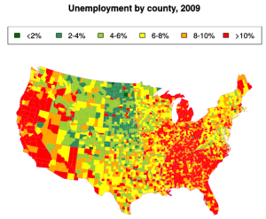

### Dot density {-}

Dot density mapping shows quantitative data associated with regions that have fixed boundaries.  Dots or some other symbol are drawn on the region in a semi-random distribution. The number of dots is  proportional to the data value.  It is important to provide a legend showing representative densities, typically low, medium and high.

The disadvantage of dot density mapping is that the reader may see patterns in the semi-random distribution that do not actually exist and that reader perception of differences in dot densities is non-linear and it is difficult to see small differences. The advantages are that it can reveal overall patterns and it is suited to multivariate  visualisation by using different colours or symbols for different values.

Dot placement should be sensitive to land use. For instance when creating a dot map of the population of councils in Melbourne it is a good idea to not place dots on parklands, rivers, lakes or the sea even though these lie within council boundaries.

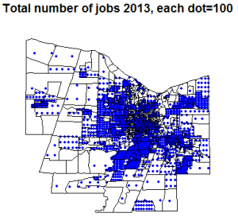

### Proportional symbol {-}

In this kind of map a symbol (such as a circle, triangle, square or pictorial icon) is used to show ordered data associated with either a region or a particular location. The size of the symbol is proportional to the data value. One kind of ordered data that it is not suitable for is interval data, that is quantitative data without a natural 0. Thus temperature should not be shown with this kind of map while population can be. This is because there is a visual implication that absence of the symbol means 0.

Care should be taken in the choice of symbol as it is for instance, harder to compare the area of two circles than that of two squares while comparing the area of two stylised airplanes is very difficult.  It is important to provide a legend showing representative sized symbols, typically 3-5 values.

Most proportional symbols vary the symbol size continuously. However, _range grading_ in which attribute data is divided into groups is also used. This has the advantage that the symbols for each group are clearly distinguishable. Range grading is the same process as class segregation in choropleth mapping.

More generally, we can associate more complex statistical graphics such as pie charts, bar charts, time series, etc with regions or locations on a map. This is one way to handle multivariate spatial data but great care needs to be used to make sure that these graphics are eligible and comparable.

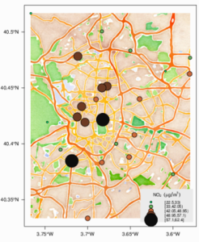

### Contour (isarithmic) & three-dimensional maps {-}

A useful metaphor for visualising quantitative data that varies continuously across space is to map it to a kind of conceptual height or elevation for each point on the map. The resulting 3D map is then visualised using standard techniques for showing elevation like contours, wire-frames, surfaces or shaded relief.

Properly speaking the contours are called _isolines_ and the resulting maps are called _isarithmic_ maps. When using contours, it is helpful to add colour tinting to clearly show the regions between each pair of contours.

Personally I like 3D maps and with the rise of cheap 3D visualisation I think their use will increase.

The main thing to be aware of is that they only make sense for data that varies continuously, not data that has abrupt changes or discontinuities. Thus they are ideal for showing temperature and possibly for showing crop yield per acre but not so good for showing the distribution of coal mines.

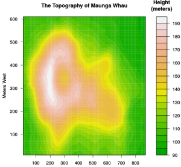

### Cartograms {-}

Cartograms are also called value-by-area maps. They are for mapping quantitative data with a natural zero, such as population or average income, to regions.

In a cartogram a spatial transformation is applied to the region boundaries so that the region area is proportional to the data value. Two forms of cartogram exist: _contiguous_ and _non-contiguous_.

In a contiguous cartogram the regions remain connected but are distorted to change their area. The transformation attempts to preserves shape as much as possible so that the regions are still recognisable.

In a non-contiguous cartogram the map is “exploded” so that there is sufficient room between the regions for them to grow in size. In this kind of map the regions preserve their shape but how they fit together is more difficult to see. In a more abstract variant the regions are replaced by a simple geometric shape such as a circle.

Cartograms require the reader to be familiar with the underlying geography. Because of the irregular shape of the regions it is difficult to compare their area so they can be difficult to understand. Thus I would not recommend their use in data exploration.

However, they can powerfully communicate information such as global health or wealth inequality to stakeholders. For lots of interesting examples take a look at [Worldmapper](http://archive.worldmapper.org).

### Flow maps {-}

Discrete flow maps show the movement of commodities such as goods or people between places.  They are also called _origin-destination (OD)_ maps.

Most commonly lines connect the origin of the flow with the destination. Arrows indicate the direction of flow while line width or sometimes colour shows the magnitude. Lines are typically bundled together and curved to reduce overlap and cluttering. Proportional symbols may be used to show the magnitude of total flow out of origins and total flow into destinations. It is important to provide a legend showing representative sized symbols and flows, typically 3-5 values.

Such maps work well when there are only a few origins or destinations but with many origins and destinations the lines cross and clutter makes it difficult to understand the underlying data. Interactive exploration or aggregation are necessary in this case.

Flow maps can also be used to show the magnitude and direction of continuous flows such as wind patterns or magnetic patterns.

Often we wish to understand how flow changes over time. Animation is often used for this. Another approach is to use a _space-time cube_, a kind of 3D discrete flow map where time is the third dimension.

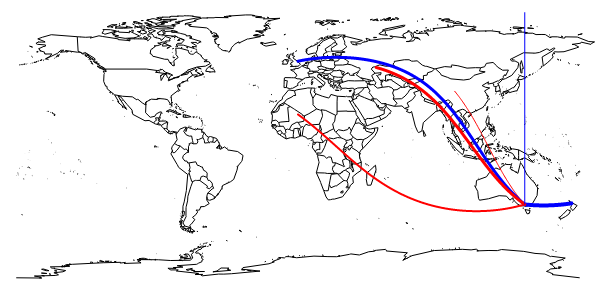

Email flow to (red) and from (blue) my secret lair (in Melbourne), including one to Santa and some spam from Africa, China & somewhere in Russia. Line thickness represents quantity. Created with R using library(maps) & library(geosphere). Note the curved ‘great circle’ lines.

## Choice of classes

One issue when using a classed choropleth map to show continuous data or range graded proportional symbols is the choice of data classes. The more classes the more complex and sometimes confusing the visualisation becomes but fewer classes can hide or misrepresent  the underlying data. When exploring data I would tend to use lots of classes while for presenting results the number of classes should be smaller and designed to show the result you wish to communicate.

A typical number of classes is 4-5 though more classes may be used for large amounts of data. Sturges suggests that the number of classes, _C_, should be $C=1+3.3×log(n)$ where n is the number of observations.

Once you have decided the number of classes then you have to decide how to partition the observations into these classes: that is the minimum and maximum value for each class. The class intervals should not overlap and should contain all observations. This is an example of a one dimensional clustering problem. Many techniques are used but among the most common are

* *Equal Interval*: Simply divide the data range into C equally sized intervals.
* *Equal Frequency*: Compute class intervals so that they have the same number of observations. Thus the intervals correspond to quantiles. If there are 4 classes then the classes correspond to the quartiles.
* *Jenks Optimisation*: This chooses the classes so as to minimise the variance within each class while maximising the variance between the classes. An iterative algorithm is used to do this.

All of these are reasonable approaches. For exploration Jenks Optimisation probably makes the most sense but it can be difficult to explain to non data scientists.

## Aggregation and clustering

A key part of data map design is to choose the level of detail in which you wish to show the spatial data.  Too much detail can overwhelm the viewer while too little detail may mean that the reader is lulled into thinking that the data is more homogeneous than it really is. In interactive visualisations the level of detail can be controlled by the user, either implicitly through zooming or explicitly by a control.

Spatial aggregation–combining data from adjacent regions to form a bigger region can be quite misleading if not done well. This is because the choice of region boundaries can greatly affect the results of aggregation. As an example the boundaries of electoral districts can change the result of elections and gerrymandering is one way in which politicians can ensure they win an election even though most people do not vote for them.

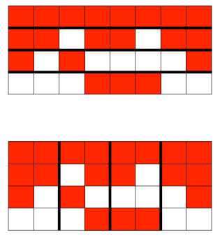

If cells are grouped horizontally rather than vertically aggregation gives a very different result.

## Spatial autocorrelation

One of the main reasons for visualising data on a map is to see whether data values are correlated with spatial location (called _spatial autocorrelation_). Spatial autocorrelation can also be tested using statistics like the [Moran coefficient](https://en.wikipedia.org/wiki/Moran%27s_I) (Moran I) or [Geary’s C](https://en.wikipedia.org/wiki/Geary%27s_C).  When exploring data it is wise to confirm the the correlation identified visually is statistically meaningful.

## Multivariate visualisation

We have focused on showing the spatial distribution of a single variable or attribute. However, in most real world applications data has many attributes and it is the interconnection between these different attributes that the data scientist is most interested in exploring. Unfortunately this is difficult as showing the data on a data map means that two visual variables (x position and y position) are already used up and other variables must be used to show different attributes.

Some approaches are to use two colours or a mix of colour and texture on a choropleth maps and more complex glyphs on proportional symbol maps. However the most common approach is to show multiple data maps side-by-side with a data map for each attribute or to overlay two data maps. Interaction allows filtering and brushing to show connection between the different attributes or to toggle between the overlays.

## Uncertainty

One of the disadvantages of visualisations and maps in particular is that they can mask uncertainty and errors in the data and encourage the viewer to have more trust in the patterns than it warrants. Good data map design should ensure that the visualisation does not install false confidence in the data or patterns.

Uncertainty arises in a number of ways: sampling uncertainty or measurement errors in attribute values and positional accuracy are the most common.

There are two main ways of showing uncertainty. _Intrinsic approaches_ tightly couple the visualisation of uncertainty with the attribute being visualised. Specialised visual variables including crispness, resolution and transparency are commonly used in intrinsic approaches. On the other hand extrinsic approaches decouple visualisation of uncertainty from visualisation of the attribute and its spatial location. Extrinsic approaches include error bars or a separate data map showing confidence levels.

## Summary

In this section we have discussed the various design decisions that need to be made when creating a data map: choice of scale, choice of map projection, choice of data map type and how to group continuous data into classes when this is required. Without considering these choices carefully it is easy to create data maps that are uninformative or even worse, misleading.

On the other hand a well designed data map is one of the best ways for exploring spatial data that we have and can be an extremely powerful way of communicating the resulting insights.

One of the most highly regarded data visualisations of all time is a data map, by Charles Minard and shows Napoleon’s march on Moscow during the 1812-13 Russian campaign ([here](https://en.wikipedia.org/wiki/Charles_Joseph_Minard#/media/File:Minard.png)). It uses a flow map style graphic to show the movement of Napoleon’s army during the march to Moscow and subsequent retreat. The thickness of the line is proportional to the number of troops. It is a sophisticated multivariate graphic showing the number of soldiers; distance traveled; temperature; troop position and relevant geographic features; direction of travel; and time taken.

***

FURTHER READING

This material was based upon

_Cartography: Thematic Map Design (6th Edition)_. Borden Dent, Jeff Torguson, Thomas Hodler. McGraw-Hill. 2009.

_Thematic cartography and geovisualization (3rd Edition)_. Terry Slocum, Robert McMaster, Fritz Kessler, Hugh Howard. Prentice hall, 2009.

Both are good introductions to the design of effective data maps.

And [Cartographic Map Projections](http://www.progonos.com/furuti/MapProj/Normal/TOC/cartTOC.html) is a good resource about projections.

