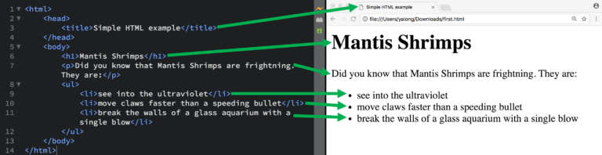
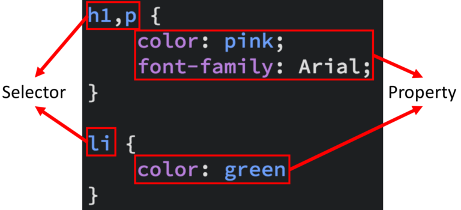
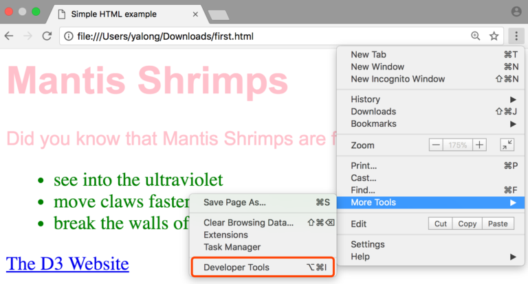
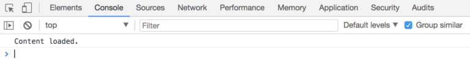

# Activity: Basic web development skills

To start coding with D3, you need to be equipped with some web developing skills, which includes HTML, CSS, SVG, DOM, Javascript.

We will start with some basic information about these first before getting to D3.

## Prepare the tools

You need a text editor to write the code. http://brackets.io/ is a good option, as it has the “live preview” function, which saves you the trouble of setting up a static server. Of course, feel free to use other text editors, like [Sublime Text](https://www.sublimetext.com).

Another option is to just use Firefox browser instead of Chrome, as the later versions of Firefox can access local files directly.

## HTML

HTML is short for Hypertext Markup Language. It is used to structure content for web browsers. HTML elements (represented by tags) are the building blocks of HTML pages. Let’s start with an example:

1. Open your text editor, create a new file using the menu (usually should located at left-top): **File -> New**.
2. Save the file as html using the menu: **File -> Save As**, let’s use the name first.html.
3. Copy and paste the following code into your text editor, and save it by using the menu: **File -> Save**.
4. If you are using Brackets, click the “**live preview**” button to look at the very first HTML page.


```html
<html>
    <head>
        <title>Simple HTML example</title>
    </head>
    <body>
        <h1>Mantis Shrimps</h1>
        <p>Did you know that Mantis Shrimps are frightning. They are:</p>
        <ul>
            <li>see into the ultraviolet</li>
            <li>move claws faster than a speeding bullet</li>
            <li>break the walls of a glass aquarium with a single blow</li>
        </ul>
    </body>
</html>
```

Now, let’s link our code to the content of the page in your browser.



Actually, in this page, we used quite a lot HTML elements:

* title -> page title
* h1 -> header with large font size, try to play around with h2, h3 and etc.
* p -> paragraph
* ul -> bullet points list
* li -> list items

There are many other HTML elements there: https://developer.mozilla.org/en-US/docs/Web/HTML/Element, you do not need to know all of them at the moment.

All HTML elements can be assigned attributes using **property/value** pairs in the opening tag.

Let look at another very useful HTML element – link(**a** element):


```html
<a href=“http://d3.js.org/“>The D3 Website</a>
```

In the **a** element, we use a **property/value** pair to define a link in the webpage：href **property**, with the **value** of http://d3.js.org/.

Try to add this to the end of the **ul** element of our first HTML page, and save the page. If you are using Brackets with “live preview”, you should notice the change once you save the file.

<br><br>

Different HTML elements have different properties, you can look up them on the previous link when you need them. All elements have the **id** and **class** properties.

The **id** property specifies a **unique** id for an HTML element (i.e., the value must be unique within a HTML document among all HTML elements).

The **class** property specifies one or more **classnames** for an element (usually used together with css which we will introduce later). Different HTML elements can be assigned the same class to present they are in the same group for css processing.

## CSS

CSS is short for Cascading Style Sheets, and is designed to describe how the contents of a web page should be presented.

At the very beginning of web, there was no CSS, but people still needed to specify the style of a web page. So they wrote everything in the HTML file with the “style” property for HTML element. This works all right for small web pages, but for complex web pages such as a website with thousands of web pages, it is very hard work to maintain all of the style properties.


So, W3C invented CSS to allow the **style** and **content** of web pages to be managed separately.

Let’s make our  HTML page a bit more colorful using our first CSS file:

1. Using **File -> New** to create a new file, and save it in the same folder with **File -> Save As**, let’s use the name first.css.
2. Copy paste the css code into your CSS file, and save it: **File -> Save**


```css
h1,p { color: pink;
    font-family: Arial;
}
li {
    color: green
}
```

3. Link your style file in your HTML page (usually within the **head** section)


```html
<html>
    <head>
        <title>Simple HTML example</title>
        <link rel="stylesheet" href="first.css">
    </head>
    <body>
        <h1>Mantis Shrimps</h1>
        <p>Did you know that Mantis Shrimps are frightning. They are:</p>
        <ul>
            <li>see into the ultraviolet</li>
            <li>move claws faster than a speeding bullet</li>
            <li>break the walls of a glass aquarium with a single blow</li>
        </ul>
        <a href=“http://d3.js.org/“>The D3 Website</a>
    </body>
</html>
```

4. Refresh your web page, you should see the result as the following image:


Now, it is the time to explain how it works.

There are two parts of a CSS rule: **selector** and **properties**.

**Selector**, basically chooses the HTML elements to operate. There are many types of selectors to help you select the HTML elements you want easily. For example:

|                |                                      |
|:---------------|:-------------------------------------|
|    Type selectors    | h1 /* selects all level 1 headings*/ |
|Descendent selectors: | p em /* selects all emphasized text in a paragraph*/  |
|    Class selectors:   |         .axis /* selects all elements with class axis*/        |
|    Class selectors:   | .axis.y /* selects all elements with class axis and class y */ | 
|     ID selectors:     |  #L1 /* selects element with ID “L1″*/     |                  


For detailed explaination of CSS selectors, please refer to http://www.w3schools.com/cssref/css_selectors.asp.

<br><br>

**Properties**, basically defines the styles of HTML elements. Different HTML elements also have different styles you can change. Usually you can play around with margin, padding, color, size, positions and etc.



There are also some existing CSS libraries to help you style your HTML more efficiently:

https://getbootstrap.com/

https://purecss.io/

In the above example, we use CSS file and HTML separately, however, there are ways to keep them in just HTML file. As the original purpose of CSS is to keep responsibility  clear for each other, we would recommend you to keep them separate. You may find many online examples with them in one HTML though as this is makes things easier to explain.

## SVG

Scalable Vector Graphics (SVG) is the web vector graphics format. It is designed to work with both HTML and CSS, and so it can be directly included in the document. You can also consider SVG as a type of HTML element.

**A SVG canvas is the container** of standard graphic primitives: **line, circle, text, ellipse, rect, path**. A more comprehensive list is at: https://developer.mozilla.org/en-US/docs/Web/SVG/Element .

**The coordinate system of SVG canvas has origin (0,0) at top left corner**, with the positive x-axis pointing towards the right, the positive y-axis pointing down, and one unit in the initial coordinate system equals one “pixel”. Following is an example SVG, where a blue rectangle overlapped with a yellow ellipse is coded into a HTML page:


```html
<!DOCTYPE html>
<html>
    <body>
        <svg width="400" height="110">
            <rect width="300" height="100" style="fill:rgb(0,0,255);stroke-width:3;stroke:rgb(0,0,0)"/>
            <ellipse cx="200" cy="80" rx="100" ry="50" style="fill:yellow;stroke:purple;stroke-width:2" />
        </svg>
    </body>
</html>
```

Some of the styles (e.g. fill, stroke, stroke-width) of SVG are assigned with the **property/value** HTML way. For more SVG styles, please refer to https://www.w3.org/TR/SVG/styling.html

## DOM

The Document Object Model (DOM) is a cross-platform and language independent API. In DOM, each bracketed tag is an element. Elements are defined as objects. Each element could have an relationship to another element, which could be expressed in human terms: parent, child, sibling, ancestor, and descendant.

It is the standard for Web browsers to parse HTML and make sense of a page content.

DOM also defines:

* ***Properties*** of all HTML elements;
* ***Methods*** to access all HTML elements; and
* ***Events*** for all HTML elements.

## Javascript

JavaScript is a scripting language widely supported by web browsers. Javascript has a full API to access the DOM, so it can dynamically operate (deleting, updating, inserting) HTML elements. It also monitors user interactions in the webpage, e.g. hovering on an element, click on an element etc.

1. Let’s create another file in the text editor, called **first.js**. Save it.
2. Link this first javascript file in our previous HTML page. Now the HTML should look like:


3. Start with a simple test, it is now time to introduce you a very important event in web development <mark class="green">**window.onload**</mark>, which fires after the whole web page is loaded, somtimes this is the time you want to start your script. Open first.js, and add the following code to the file:

```javascript
window.onload = function (){
    console.log("Content loaded.");
}
```

The Brackets editor may promote you that there are errors with the above code. However, this is because they cannot recognize the pre-defined variables in browser. The errors appear in the Console of web developer tool (we are going to introduce next) are real errors. Some of the errors in the text editor can be ignored.

4. After refresh the page, you may find nothing happened, well, that’s true on the webpage, but something happened at the backend. We need to see the backend as a programmer, if you are using Chrome with Brackets, you can open the web developer tool by:



5. Switch to the Console tab, and you should see out text there (Console is similar to <mark class="green">_print in python_</mark> and <mark class="green">_System.out.println in JAVA_</mark>, and it is one of the most important tools to debug your code):



6. Let’s try something more interesting, like hovering on the title to change the text content.


```javascript
window.onload = function (){
    // Using DOM to Find the title HTML element
    // More details available at: https://developer.mozilla.org/en-US/docs/Web/API/Document
    var titleElement = document.getElementsByTagName("h1")[0];
    
    // Change the text to FIT5147 when mouse hovering on the h1 title
    titleElement.onmouseover = function(){
        titleElement.innerHTML = "FIT5147";
    };
    
    // Change the text back to Mantis Shrimps when mouse leaves the h1 title
    titleElement.onmouseout = function(){
        titleElement.innerHTML = "Mantis Shrimps";
    };
}
```

There are only two events in the above example, there are many more events there: https://developer.mozilla.org/en-US/docs/Web/Events, web user interactions are basically based on all these events.

If you want to know more details about Javascript, the W3C school is a good start: https://www.w3schools.com/js/default.asp.

Now its time to learn D3!


