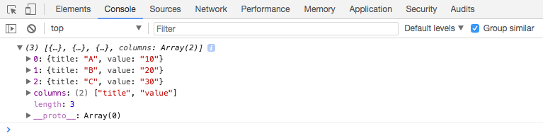

# Activity: Creating visualisations with D3

## An Introduction to D3

As we already introduced in the preceding [Activity](). D3 is a very powerful Javascript library for creating online interactive visualisations.

We would like to share the visualisations you can create with D3 again: https://github.com/mbostock/d3/wiki/Gallery and the free comprehensive [online D3 tutorial](https://alignedleft.com/tutorials/d3) by Scott Murray.

Again, you need a text editor for writing the scripts, and you need to figure out a way to access local files (more details in the previous activity).

## Creating visualisations with D3

### 2a. Drawing SVG primitives {-}

1. Create a folder to store our files, let’s name it “second”.
2. Let’s create three files: second.html, second.css, second.js.
3. We should start with the HTML file, do you still remember how to link css and javascript file in HTML?

```html
<html>
    <head>
        <title>D3 SVG Primitives</title>
        <link rel="stylesheet" href="second.css">
    </head>
    <body>
        <svg></svg>
        <script type="text/javascript" src="second.js"></script>
    </body>
</html>
```

4. Although it is difficult, now it is the time to start with D3….We should link D3 library first, to make it simple we link to the official online library (alternatively, you can download the javascript library locally and link it):
<br>

```html
<html>
    <head>
        <title>D3 SVG Primitives</title>
        <link rel="stylesheet" href="second.css">
    </head>
    <body>
        <svg></svg>
        
        <script src="https://d3js.org/d3.v4.min.js"></script>
        <script type="text/javascript" src="second.js"></script>
    </body>
</html>
```
  
  As we need to use D3 in our own script, put D3 library in front of our own script.
  
5. The preparation is ready, we could start code our own script, open second.js, we should start by creating our own SVG canvas for drawing:

```javascript
window.onload = function(){
    var svgCanvas = d3.select("svg")
        .attr("width", 960)
        .attr("height", 540);
}
```
6. Open it in the browser (if you are using bracket, open the second.html and click the live preview button)! Nothing special…Well, this is because the canvas is white by default. It is now time to play with CSS (second.css):

```css
.svgCanvas {
    border: solid 1px
}
```
  
  Here we added a solid border for the canvas, and we also need to update our Javascript code:

```javascript
window.onload = function(){
    var svgCanvas = d3.select("svg")
        .attr("width", 960)
        .attr("height", 540)
        .attr("class", "svgCanvas");
}
```
7. We should see a good looking canvas now! Let’s try to draw some primitives (basic shapes) on this canvas, first a rectangle:

```javascript
window.onload = function(){
    var svgCanvas = d3.select("svg")
        .attr("width", 960)
        .attr("height", 540)
        .attr("class", "svgCanvas");
    
    svgCanvas.append("rect")
        .attr("x", 100)
        .attr("y", 100)
        .attr("width", 100)
        .attr("height", 50);
}
```
  
  Maybe you want it to have rounded-corners:

```javascript
window.onload = function(){
    var svgCanvas = d3.select("svg")
        .attr("width", 960)
        .attr("height", 540)
        .attr("class", "svgCanvas");
    
    svgCanvas.append("rect")
        .attr("x", 100)
        .attr("y", 100)
        .attr("width", 100)
        .attr("height", 50)
        .attr("rx", 15)
        .attr("ry", 10);
}
```
  
  You can also make it blue:

```javascript
window.onload = function(){
    var svgCanvas = d3.select("svg")
        .attr("width", 960)
        .attr("height", 540)
        .attr("class", "svgCanvas");
    
    svgCanvas.append("rect")
        .attr("x", 100)
        .attr("y", 100)
        .attr("width", 100)
        .attr("height", 50)
        .attr("rx", 15)
        .attr("ry", 10)
        .attr("fill", "lightblue");
}
```
  
  Let’s add a few more shapes (there are more SVG shapes than this example, please refer to the link in the previous SVG section):

```javascript
window.onload = function(){
    var svgCanvas = d3.select("svg")
        .attr("width", 960)
        .attr("height", 540)
        .attr("class", "svgCanvas");
    
    svgCanvas.append("rect")
        .attr("x", 100)
        .attr("y", 100)
        .attr("width", 100)
        .attr("height", 50)
        .attr("rx", 15)
        .attr("ry", 10)
        .attr("fill", "lightblue");
    
    svgCanvas.append("circle")
        .attr("cx", 300)
        .attr("cy", 200)
        .attr("r", 30)
        .attr("fill", "lightgreen");
    
    svgCanvas.append("ellipse")
        .attr("cx", 300)
        .attr("cy", 400)
        .attr("rx", 30)
        .attr("ry", 60)
        .attr("fill", "lightgreen");
    
    svgCanvas.append("line")
        .attr("x1", 300)
        .attr("y1", 400)
        .attr("x2", 300)
        .attr("y2", 200)
        .attr("stroke", "black");
}
```
  
  Technically, all visualisations are made by those primitives, so once you know how to create primitives, you are already able to create all visualisations with D3.

### 2b. Creating visualisations from data {-}

D3 is actually short for _Data Driven Document_. Obviously it means Data plays an important role in creating visualisations. Let’s create a simple visualisation based on some data.

1. Create a folder to store our files, let’s name it “third”.
2. Let’s create three files:third.html, third.css, third.js.
3. Edit the third.html with:


```html
<html>
    <head>
        <title>Creating visualisations from data</title>
        <link rel="stylesheet" href="third.css">
    </head>
    <body>
        <svg></svg>
        
        <script src="https://d3js.org/d3.v4.min.js"></script>
        <script type="text/javascript" src="third.js"></script>
    </body>
</html>
```

4. Download our [data](diagrams_datasets/section5/third.csv) to the same folder.
5. Now we can start loading the data with D3, D3 provide functions to load data in variety of formats, we will use d3.csv to load our data (in third.js):


```javascript
window.onload = function(){
    d3.csv("third.csv", function(d){
        console.log(d); 
    });
}
```

  If you are using brackets, open the third.html file and click the live preview button.
  
6. We want to have a look at whether we loaded the correct data, so we print the detailed data in the console, now we can open the console to have a look (still remember the way to open developer tools in Chrome?), we should have:



  We exactly had our values.
  
7. Let’s set up our canvas and start drawing (do not to have the svgCanvas class in your CSS file):


```javascript
window.onload = function(){
    var svgCanvas = d3.select("svg")
        .attr("width", 960)
        .attr("height", 540)
        .attr("class", "svgCanvas");
    
    d3.csv("third.csv", function(d){
        console.log(d); 
        
        svgCanvas.selectAll("circle")
            .data(d).enter() // create place hodlers if the data are new
            .append("circle") // create one circle for each
            .attr("cx", function(thisElement, index){ // calculate the centres of circles 
                return 150 + index * 150;
            })
            .attr("cy", 300)
            .attr("r", function(thisElement, index){ // use the value from data to create the radius 
                return thisElement["value"];
            });
        
    });
}
```

  `selectAll(“circle”).data(d).enter()` is absolutely the magic function here. Basically it build a link between the HTML elements and the data. `selectAll` select the HTML element, and `data` link the html elements with the data. More details at: http://techtime.getharvest.com/blog/understanding-d3-selection-operations  
  
8. Let’s make it a bit more informative (still remember the way we make play around with color in the first week’s D3 activity), do not forget to link the color library we use:

```html
<html>
    <head>
        <title>Creating visualisations from data</title>
        <link rel="stylesheet" href="third.css">
    </head>
    <body>
        <svg></svg>
        
        <script src="https://d3js.org/d3.v4.min.js"></script>
        <script src="https://d3js.org/d3-scale-chromatic.v1.min.js"></script>
        <script type="text/javascript" src="third.js"></script>
    </body>
</html>
```

  Now, we can make it colorful and also with some text there.
  

```javascript
window.onload = function(){
    var svgCanvas = d3.select("svg")
        .attr("width", 960)
        .attr("height", 540)
        .attr("class", "svgCanvas");
    
    d3.csv("third.csv", function(d){
        console.log(d); 
        
        var minValue = Infinity;
        var maxValue = -1;
        d.forEach(function(thisD){
            var thisValue = thisD["value"];
            minValue = Math.min(minValue, thisValue);
            maxValue = Math.max(maxValue, thisValue);
        });
        
        var value2range = d3.scaleLinear()
            .domain([minValue, maxValue])
            .range([0.5, 1]);
        var range2color = d3.interpolateBlues;
        
        svgCanvas.selectAll("circle")
            .data(d).enter() // create place hodlers if the data are new
            .append("circle") // create one circle for each
            .attr("cx", function(thisElement, index){ // calculate the centres of circles 
                return 150 + index * 150;
            })
            .attr("cy", 300)
            .attr("r", function(thisElement, index){ // use the value from data to create the radius 
                return thisElement["value"];
            })
            .attr("fill", function(thisElement, index){
                return range2color(value2range(thisElement["value"]))
            });
        
        svgCanvas.selectAll("text")
            .data(d).enter()
            .append("text")
            .attr("x", function(thisElement, index){
                return 150 + index * 150;
            })
            .attr("y", 300 - 35)
            .attr("text-anchor", "middle")
            .text(function(thisElement, index){
                return thisElement["title"] + ": " + thisElement["value"];
            });
        
    });
}
```

9. Let’s add some interactions:

```javascript
window.onload = function(){
    var svgCanvas = d3.select("svg")
        .attr("width", 960)
        .attr("height", 540)
        .attr("class", "svgCanvas");
    
    d3.csv("third.csv", function(d){
        console.log(d); 
        
        var minValue = Infinity;
        var maxValue = -1;
        d.forEach(function(thisD){
            var thisValue = thisD["value"];
            minValue = Math.min(minValue, thisValue);
            maxValue = Math.max(maxValue, thisValue);
        });
        
        var value2range = d3.scaleLinear()
            .domain([minValue, maxValue])
            .range([0.5, 1]);
        var range2color = d3.interpolateBlues;
        
        svgCanvas.selectAll("circle")
            .data(d).enter() // create place hodlers if the data are new
            .append("circle") // create one circle for each
            // calculate the centres of circles 
            .attr("cx", function(thisElement, index){ 
                return 150 + index * 150;
            })
            .attr("cy", 300)
            // use the value from data to create the radius
            .attr("r", function(thisElement, index){  
                return thisElement["value"];
            })
            .attr("fill", function(thisElement, index){
                return range2color(value2range(thisElement["value"]))
            })
            .on("mouseover", function(thisElement, index){
                svgCanvas.selectAll("circle")
                    .attr("opacity", 0.5); // grey out all circles
                d3.select(this) // hightlight the on hovering on
                    .attr("opacity", 1);
            })
            .on("mouseout", function(thisElement, index){
              // restore all circles to normal mode
                svgCanvas.selectAll("circle") 
                    .attr("opacity", 1);
            });
        
        svgCanvas.selectAll("text")
            .data(d).enter()
            .append("text")
            .attr("x", function(thisElement, index){
                return 150 + index * 150;
            })
            .attr("y", 300 - 35)
            .attr("text-anchor", "middle")
            .text(function(thisElement, index){
                return thisElement["title"] + ": " + thisElement["value"];
            });
        
    });
}
```

### 2c. Making a grouped bar chart with D3 {-}

In theory, you should be able to create any visualisation you can imagine  with D3 now.

However, it also seems a lot of work needs to be done to create a “normal” visualisation, like a bar chart.

Actually, there are lots of help functions from D3 to help you with this process.

We will show you an example of creating bar charts with D3.

Download our [data](diagrams_datasets/section5/fourth.csv) first. To make thing easier and also as an example, we have all the files (css, javascript, html) in one file, we can name it fourth.html:


```html
<html>
    <head>
        <title>Grouped bar chart in D3</title>
        <style>
            .svgCanvas {
                border: solid 1px
            }
        </style>
    </head>
    <body>
        <svg></svg>
        
        <script src="https://d3js.org/d3.v4.min.js"></script>
        <script>
            window.onload = function(){
                // Canvas width and height
                var width = 600;
                var height = 300;
                
                // Create a SVG canvas
                var thisCanvas = d3.select("svg")
                    .attr("width", width)
                    .attr("height", height)
                    .attr("class", "svgCanvas");
                
                // We want some margin between the boundary of the canvas and the bar charts
                var margin = {top: 10, right: 20, bottom: 30, left: 50};
                width = width - margin.left - margin.right;
                height = height - margin.top - margin.bottom;
                
                // create the area to draw the bar chart
                // g is a SVG element to group multiple SVG elements
                var barChartArea = thisCanvas
                    .append("g")
                    .attr("transform", "translate(" + margin.left + "," + margin.top + ")");
                
                // Set up a helpr function to divide x axis
                var x0 = d3.scaleBand()
                    .rangeRound([0, width])
                    .paddingInner(0.2); // padding between different groups
                
                // two property for each group
                var keys = ["income", "spend"];
                // Set up a helpr function to divide x axis **within** a group
                var x1 = d3.scaleBand()
                    .padding(0.1); // padding between different properties within a group
                
                // helper function to calculate the height of each bar
                var y = d3.scaleLinear()
                    .rangeRound([height, 0]);
                
                d3.csv("fourth.csv", function(data){
                    console.log(data); 
                    
                    // for differetn groups
                    x0.domain(data.map(function(d) { return d['name']; }));
                    // for properties within a group
                    x1.domain(keys).rangeRound([0, x0.bandwidth()]);
                    // for bar height
                    y.domain([0, d3.max(data, function(d) {
                        return d3.max(keys, function(key) {
                            return parseInt(d[key]); 
                        }); 
                    })]);
                    
                    
                    barChartArea.append("g")
                        .selectAll("g")
                        .data(data)
                        .enter().append("g")
                        // create groups
                        .attr("transform", function(d) { 
                          return "translate(" + x0(d["name"]) + ",0)"; 
                          })
                        .selectAll("rect")
                        // pre-processing the data
                        .data(function(d) {
                            return keys.map(function(key) {
                                return {
                                    key: key,
                                    value: d[key],
                                    name: d["name"]
                                };
                            });
                        })
                        .enter().append("rect")
                        // start drawing bars for each property and each group
                        .attr("x", function(d) { 
                            return x1(d["key"]); 
                        })
                        .attr("y", function(d) {
                            return y(d["value"]); 
                        })
                        .attr("width", x1.bandwidth())
                        .attr("height", function(d) { return height - y(d["value"]); })
                        .attr("fill", function(d) {
                            if(d["key"] === "income")
                            {
                                return "lightgreen";
                            }
                            else if(d["key"] === "spend")
                            {
                                return "red";
                            }
                        });
                    
                    // add x axis with ticks
                    barChartArea.append("g")
                        .attr("class", "axis")
                        .attr("transform", "translate(0," + height + ")")
                        .call(d3.axisBottom(x0));
                    
                    // add y axis with ticks
                    barChartArea.append("g")
                        .attr("class", "axis")
                        .call(d3.axisLeft(y).ticks(null, "s"))
                        .append("text")
                        .attr("x", 2)
                        .attr("y", y(y.ticks().pop()) + 0.5)
                        .attr("dy", "0.32em");
                });
            }
        </script>
    </body>
</html>
```

Well, not that complicated, isn’t it.

Now, we leave you a job to add a legend for the colours and make it interactive!


