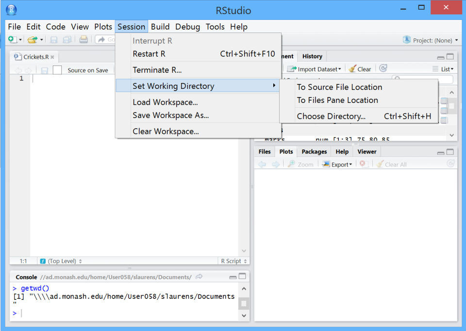
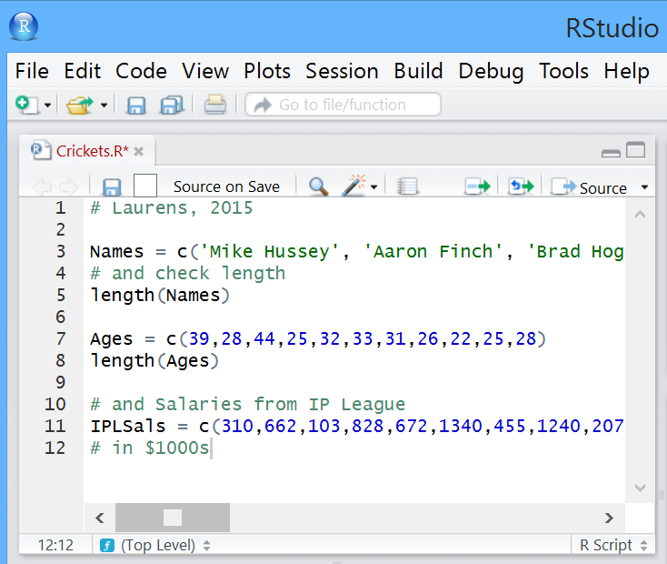
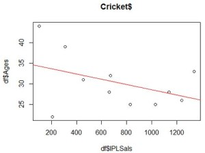

--- 
title: "Recommonded materials for R beginners"
author: "Kevin & Yalong"
date: "25/01/2019"
output: bookdown::gitbook
site: bookdown::bookdown_site
toc depth: 1
documentclass: book
---

# Introduction to RStudio {-}

If you don’t have RStudio (or R), please follow the instructions on: [Introduction to R programming]().

## Step 1: Run RStudio {-}

The four main windows in RStudio are shown below:

* top left; this is your **R script** file (currently ‘Crickets.R’, which can be saved and run, either in pieces or completely);
* bottom left; that is the **Console**, where R commands are run (currently showing getwd()), and output is shown;
* top right; that is the **Workspace and history**, you can see which data and values R has in its memory.
* bottom right; of that is where you can see Plots, install Packages, view your Files.

Working directory should be where your scripts (code files) and data files are.

* getwd() can print out your current working directory; **bottom right Files -> Go To Working Directory**

* use setwd() to change the directory you want. You can also do this by click at the **bottom right Files -> Navigate to your folder -> More -> Set As Working Directory**

<center>


</center>
<br>
Note that there are several options for coding in RStudio. You can:

1 Enter the code directly into an R script file and then run it from there (using select and C**TRL-R**), or
2. Copy and paste from the file to the Console, or
3. Write directly into the Console (then **ENTER** to run for the latter two options).

Try the last option, writing and testing your code in the Console, then when it’s working and you want to save it, copy it into the script file above the Console (which can be saved).

## Step 2: Install packages in RStudio {-}

There are two different ways to install packages in RStudio:

* Install via R Console;
    + The **Console** is located at the **bottom left** section.
    + Type in the command (replace “*packageName*” with the package you want to install, like “*ggmap*”).
    

```r
install.packages("packageName")
```

+ Press “return” key
* Install via RStudio GUI
    + Locate the “**Packages**” tab at the **bottom right** section and click.
    + Click the “Install” button and an install dialogue will pop out.
    + Write the package name in the text field and click install.
    
## Step 3: Copy and run code {-}

When dealing with data, data structures are important. R & Python have similar storage options and similar flexibility in usage.

Copy the code below to the Console and run:


```r
scores <- c(75, 80, 85) # put the data in
scores # and get the data out
```

As an example of flexibility, we can run an operation on a structure without an explicit loop:


```r
scores * 2
scores * scores
```

## Step 4: Do statistics {-}

So, let’s do some statistics. The average of 75, 80, 85 is 80? Confirm with R:


```r
mean(scores)
median(scores)
sd(scores)
```


## Step 5: Build a group of related vectors {-}

Doing more with data, instead of working with a single vector (scores), we can build a group of related vectors (Cricket):


```r
Names <- c("Mike Hussey", "Aaron Finch", "Brad Hogg", "Steve Smith", "George Bailey", "Mitchell Johnson", "Shaun Marsh", "Glenn Maxwell", "Pat Cummins", "Mitchell Starc", "David Warner")
# and check length
length(Names)
 
Ages <- c(39,28,44,25,32,33,31,26,22,25,28)
length(Ages)
```


```python
'Error: object ‘ages’ not found'
```

Oops, R is case sensitive!


```r
length(Ages)
# and Salaries in 1000s from IP League
IPLSals <- c(310,662,103,828,672,1340,455,1240,207,1030,1140)
```

So, if the above worked, and you want to save it, copy it to your script file, add a comment (e.g. name, date), and save:

<center>


</center>

## Step 6: Combine different vectors {-}

For more powerful operations, we can combine different vectors (of the same length), with different data types, into a dataframe:


```r
df <- data.frame(Names, Ages, IPLSals)
df # and display
```

**Who wants to try this?**


```r
df * scores
```

## Step 7: Perform dataframe operation {-}

Dataframe operations, display rows and columns:


```r
df[1, ]     #  row 1, all columns
df[, 1]     # column 1, all rows (or all rows, column 1)
df[2:3]     #
df[2:3, ]   # subtle difference
```

## Step 8: Determine statistics {-}

Statistics using dataframes:


```r
# so what’s the average age? Guess first, around 30?
mean(df[,2])
# or could do this:
mean(df[,"Ages"])
# or
mean(df$Ages)
# or this? mean(Ages)
```

**So what is the average IPLSal? The standard deviation? The variance?**

Try var() and sd()

## Step 9: Display data {-}

Let’s display data, adding a linear regression:


```r
plot(df$Ages ~ df$IPLSals, main = "Cricket$")  #
abline(lm(df$Ages ~ df$IPLSals), col = "red")  # equation, fits to points
```

<center>


</center>

## Step 10: Determine equation for the line {-}

Nice, but what is the equation for the line? We can do it in stages:


```r
fit <- lm(df$Ages ~ df$IPLSals)
fit
```

So the regression equation is:  age = -0.006372 x salary + 34.899143

I.e.  you can predict a player’s age from his IPL cricket salary.

**What is the predicted age for a $1M salary?**

**What is it for $0?**

## Step 11: Predict age {-}

Let’s try it the other way around, swapping the axes (i.e., swapping dependent and independent variables):


```r
fit <- lm(df$IPLSals ~ df$Ages)
fit
```

**What is the equation?**

**What is the estimated salary for a 20 year old?**


```r
# And plot it the other way round
plot(df$IPLSals ~ df$Ages, main = "Cricket$")
abline(fit, col="red")
```

## Step 12: Lay down multiple plots {-}

More plotting and scheming, you can lay down multiple plots on top of each other:


```r
sorted <- sort(Ages) # just so we can see some other data
plot(Ages, IPLSals, xlab = "Ages", col = "red" )
par(new=TRUE) # adds new plot to old; redraws axes….
plot(sorted, IPLSals, xlab = "Ages", col = "green" )
```

Or add points to a plot:


```r
plot(Ages, IPLSals, col = "blue" )
points(sorted, IPLSals, col = "red" )
```

Or you can just let R sort it out:


```r
plot(df)
```

*** 

