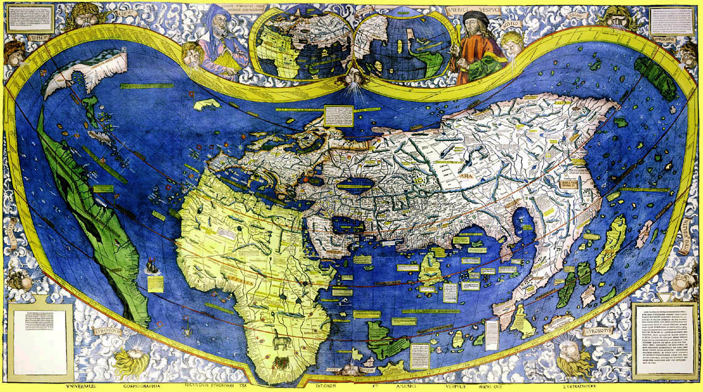

# Brief history of data visualisation

Our modern world is awash with information graphics; maps, plans, timetables, charts and diagrams. We take them for granted, tools to help us communicate and to understand the world. It has not always been like this: Very, very few information graphics are more than one thousand years old, suggesting that they were relatively rare until this time.

By understanding why information graphics and then data visualisations became commonplace we can better appreciate their role in data science and also how they may change in the future. In this module we will present a brief history of data visualisation and the main reasons for its rise. I believe there are four kinds of reasons:

1. *Improved technology for producing and presenting graphics.* Widespread use of information graphics could not have happened without paper and printing and interactive data visualisation was impossible without the computer.
2. *Changes in societal needs and attitudes to graphics.* The Scientific Revolution required scientific and medical illustrations, the Age of Exploration needed maps, the Industrial Revolution required engineering drawings and the 21st century requires interactive data visualisations.
3. *Availability of data.* Detailed maps require accurate surveys while graphs showing population or wealth distribution require census data.
4. *Invention of graphical notations and interaction techniques.* These allow the data to be shown in ways that are useful, that answer society's needs. They form a visual language.

We can break the history of data visualisation into four main periods. We look at these in turn.

## Prehistory

It is widely believed that information graphics such as schematic maps and cosmological drawings have been used in traditional hunter-gathering and subsistence farming societies for thousands of years. However the evidence for this is somewhat inconclusive as most of these were probably produced on ephemeral materials such as sand, bark or even drawn on the human body.

One hunter-gathering culture with a long tradition of using schematic maps and cosmological diagrams are the Australian aborigines. They are believed to be one of the oldest surviving cultures in the world and have inhabited Australia for more than 50,000 years. Much of their art shows connection to place and travels by dream time beings across the land. Rock paintings and engravings from the Western Desert may be the oldest known maps. These show circles representing water holes with connecting lines representing journeys between the water holes.

## Early civilisations

The first civilisations arose in Mesopotamia and the Nile Valley in Egypt around 3500BCE. These were followed by civilisations in the Indus Valley in India at about 2500BCE and in China around the Hwang-Ho (Yellow River) in about 2000BCE. Civilisations also independently emerged in the Americas, first in Mesoamerica around 500BCE and then in South America. All are believed to have arisen when population growth or a changing climate put pressure on subsistence level farmers living in river valleys or flood plains surrounded by arid land. Because the surrounding land was not suitable for farming, the only way to increase food production was by building large scale irrigation and drainage works which could dramatically improve the productivity of the arable land allowing it to support a much larger population.

In most of these early civilisations we find evidence of information graphics. While there was contact between ancient Mesopotamia and Egypt, the other civilisations had little or not contact with each other so it is likely that their use of information graphics evolved independently.

This is perhaps not very surprising; early civilisations had similar problems and so came up with similar solutions. Centralized political authority required ways to record ownership of land and its boundaries-this led to detailed maps recording property boundaries (these are called cadastral maps). The need to compute taxes and land area led to geometry and geometric diagrams; the need to plan military campaigns, towns and buildings led to plans; while the need to predict the seasons and other cyclic events led to star maps. And the need to understand one's place in the world gave rise to symbolic cosmological maps.

## Printing and paper

While some information graphics survive from prehistoric times or early civilisations they are rare. One of the main reasons for this was that it was very difficult to accurately reproduce graphics. Before the invention of printing all copies had to be done by hand. This was time consuming and extremely error prone.

During the European Renaissance this all changes. Paper and wood-block printing, which were invented in China, made their way to Europe via the Islamic world. Paper arrived in about the twelfth century soon followed by printing. At first woodblock printing was used for producing items such as tarot and playing cards. It was also used to print books though it was not well suited to this because the fine detail required for text is difficulty and time consuming to carve. Around 1440, Johannes Gensfleisch zur Laden zum Gutenberg invented the printing press and moveable metal type. This revolutionized the production of books and soon woodblock illustrations were combined with printing, allowing the production of illustrated books.

In the next five centuries there was continuous improvement in printing technologies. Copper-plate printing allowed much finer details while lithography in the late 19th century provided cheap high-quality prints with colour for the first time.

By the beginning of the twentieth century information graphics were everywhere. Educational and reference books as well popular media like newspapers and magazines contain a wide variety of charts and maps, street maps and atlases are in common use, and graphics are widely used in science, medicine, architecture and engineering as well as business and government. We now look at when these various kinds of graphics were developed.

## The rise of information graphics

Modern scientific and technical drawing techniques originated in the European Renaissance. They underpinned the emergence of modern science, medicine, engineering and architecture. Sketching is the primary tool that architects and engineers use for design, they learn their trade by looking at drawings and plans of existing buildings and machines, and use drawings and plans to communicate with the client and to specify the final design to the builders.

One of the great discoveries of the Renaissance were rules for drawing buildings and machines in linear and parallel perspective and in using measured plans and multi-view orthographic projections to precisely specify their dimensions. These were needed as architects and engineers became separate professions and craft methods of construction were replaced by a separation between design and construction.

Drawings and diagrams are equally important to modern science and medicine. These rely on scientists sharing their observations and theories. Without illustrations it would have been impossible for early scientists to share their observations of nature, of human anatomy, of the new kinds of animals and plants encountered by early European explorers, and of the new worlds visible through the telescope and microscope.

Illustrations were not only important for recording observations, they allowed scientists to communicate new experimental apparatus and designs. And for many scientists, diagrams and mental imagery were tools that allowed them to understand nature and to powerfully convey the resulting theories to other scientists.

Maps also became more important during the Renaissance. Portuguese explorers made their way down the coast of Africa, eventually finding their way around the bottom of Africa to the "Spice Islands" or Moluccas in Indonesia and Christopher Columbus made his way to America, though he persisted in thinking he had actually reached Asia.

Sailors needed accurate maps and map making techniques improved rapidly. Latitude and longitude along with accurate scales became standard. Printing allowed the general public to see maps of these new discoveries and the world's first atlas was printed in 1570.

It wasn't until the 17th and 18th centuries that charts and graphs of more abstract material became common. Before that time, tables were the usual way of showing abstract information. For instance, many of the clay tablets surviving from Ancient Mesopotamia contain tables of mathematical exercises completed by novice scribes. One can almost hear the young boys (no girls of course) groaning as they are forced to memorize the very large multiplication tables required for a numbers system built on base 20 and base 60.

One key idea in information graphics is to use location on a plane to represent 2D numerical data-the *Cartesian plane*. This generalises latitude and longitude used in maps. Rene Descarte and Pierre de Fermat independently invented the basic idea a bit after 1600. In 1686 Edmund Halley was the first to use Cartesian plots for data analysis by fitting a hyperbolic curve to air pressure vs elevation but scatter plots with curve fitting were not commonly used until the 19th century.

Often we want to overlay maps with other kinds of information. Edmund Halley also pioneered this kind of information graphic. These are called *thematic maps* by cartographers but I prefer to use Edward Tufte's name for them, *data maps*. Halley created one of the first data maps in 1686 showing wind direction and another in 1701 using isograms showing magnetic variation. Also noteworthy is a [map](http://libweb5.princeton.edu/visual_materials/maps/websites/thematic-maps/introduction/hondius-map-1610.jpg) by Jodocus Hondius from 1607 showing the distribution of religions

Cognitive studies suggest we use spatial reasoning for thinking about time. This is probably why English (and many other languages) implicitly use a spatial metaphor for time: an event occurs before or after another event. One event takes longer than another event. It is surprising therefore, how long it took before time-lines were invented. Joseph Priestly introduced them in 1769: see his [Chart of Biography](https://commons.wikimedia.org/wiki/File:PriestleyChart.gif#/media/File:PriestleyChart.gif). Before this tables were the standard way to organize temporal data: lists of kings and queens etc. William Playfair built on Priestly's ideas in 1786 and invented the [line graph](https://upload.wikimedia.org/wikipedia/commons/1/1d/1786_Playfair_-_Chart_of_import_and_exports_of_England_to_and_from_all_North_America_from_the_year_1770_to_1782.jpg), [bar chart](https://upload.wikimedia.org/wikipedia/commons/3/3f/Playfair_Barchart.gif) and [pie chart](https://upload.wikimedia.org/wikipedia/commons/6/63/Playfair-piechart.jpg).

From this time there was a fast and furious invention of different kinds of charts, diagrams and graphs for showing all kinds of data. And this hasn't stopped, there are many hundreds of different kinds of graphics. We will look at the most useful of these in the next three modules.

## Interactive data visualisation

The widespread use of information graphics in the first half of the twentieth century was made possible by the invention of paper and printing. In the middle of the twentieth century there was another invention, one that influenced data visualisation as much as paper and printing. This was, of course, the computer.

Visionaries like Ivan Sutherland saw that the computer could allow a completely different way of interacting with graphics. One in which the computer is used interactively to create new graphics. Sutherland wrote a revolutionary computer program, Sketchpad,  in the early 1960s for his PhD at MIT. Sketchpad was the first interactive graphics editor. It introduced basic algorithms and techniques from computer graphics and is the ancestor of modern day CAD systems. It also introduced a simple kind of object-oriented programming. Sutherland received the Turing Award for this research in 1988. The following video shows a early film clip of Ivan Sutherland demonstrating Sketchpad in about 1962. The commentary is by Alan Kay, another pioneer in GUI research.

<iframe width="969" height="727" src="https://www.youtube.com/embed/495nCzxM9PI" frameborder="0" allow="accelerometer; autoplay; encrypted-media; gyroscope; picture-in-picture" allowfullscreen></iframe>

Also in the 1960s Roger Tomlinson created one of the first GIS systems, the Canada Geographic Information System (CGIS).  And working at AT&T Bell labs Edward Fowlkes created an early interactive statistics package that used brushing to select outliers for removal and for linking points in multipart displays.

These systems were the first to support computer-mediated data visualisation in which the user can interactively explore and visualise data. They led to several distinct research fields:  Geographic information systems (GIS) which capture, store, manipulate, analyze, manage, and present geographic data; scientific visualisation (SciVis) which is concerned with visualising scientific data that has an inherent spatial representation; information visualisation (InfoVis) for visualising more abstract data; and CAD/CAM systems for designing buildings and machines.

Changes in computer technology are continuing to drive innovations in data visualisation. The rise of the web has meant that presentation graphics are now published on the web rather than on paper, potentially allowing the reader to interact with the graphic. And new kinds of virtual reality (VR) and augmented reality (AR) devices such as the Oculus Rift, HTC Vive or Microsoft HoloLens look set to radically transform data visualisation yet again.

## Summary

We have seen how data visualisation has been used for thousands of years. Its history has been shaped by society’s needs, availability of data and by the underlying production and presentation technologies: paper and printing, then the computer. Most of the information graphics that we take for granted today, such as topographic maps, measured plans and even scatter plots and bar charts were painstakingly developed over the last six hundred years. Their invention is one of the great achievements of the modern world.

***

FURTHER READING

If you want to find out more about the history of data visualisation take a look at Michael Friendly’s Milestones Project and his chapter on its history [http://www.datavis.ca/papers/hbook.pdf](http://www.datavis.ca/papers/hbook.pdf)

Also take a look at Edward Tufte’s great books on data visualisation. These include:

* Edward Tufte. *The Visual Display of Quantitative Information* (2nd Edition) Graphics Press. 2001.

* Edward Tufte. *Envisioning Information.* Graphics Press. 1992.

*** 
