---
output:
  pdf_document: default
  html_document: default
---
# Tools for Data Exploration and Visualisation

Data scientists use a wide variety of different tools for data exploration and visualisation. They fall into three main categories.

## Introduction

### General programming languages

There are two main programming languages used

* Probably the most widely used language for data visualisation and exploration is **R**. While I find R a difficult language to use, it has incredible libraries for data analysis and visualisation. One of the best of the graphics libraries is **ggplot2** by Hadley Wickham.

* The next most common choice is **Python**. This is a nicer language but does not have quite the choice of analysis packages. It is ideal for data wrangling and Python is often used for scrapping and fusing data, then R for exploration and visualisation.

An increasingly popular choice for creating interactive presentation graphics for the web is

* **JavaScript** with the **D3** data visualisation library.  It is not commonly used for other purposes by data scientists.

The great advantage of a programming language approach is that you can, in principle, do anything.

### Generic visual analytics tools

A number of easy to use tools for data analysis and visualisation are available. Examples include

* [SAS Visual Analytics](http://www.sas.com/en_ca/software/business-intelligence/visual-analytics.html) is a visual frontend to many of the SAS analytics tools.
* [Tableau](https://www.tableau.com) is a neasy to use visual analytics tool that is commonly used by business intelligence for interactive exploration of tabular data. It allows interactive graphics to be published on the web. It has a commercial version and a free limited offering called Tableau Public.
* [Qlik](https://www.qlik.com) is another visual analytics tool widely used in business intelligence.

### Application specific visual analytics tools

The third category of tools are systems designed for helping data analysis in a particular application area. There are many of these. As an example look at

* [National Map](https://nationalmap.gov.au) is designed to show Australian government data on top of a map of Australia

* [Scaffold Hunter](http://scaffoldhunter.sourceforge.net) is designed to analyse data in the life sciences with a focus on drug discovery.

***

FURTHER READING

Take a look at [385 Data Visualization Tools](https://keshif.me/demo/VisTools) to find out about more tools

***


## Activity: Exploring & Visualising Data with Tableau Public

### Tableau Public

One of the best Data Analysis tools according to KDnuggets is:

No.1 [Tableau Public](https://www.tableau.com/public): “Tableau democratizes visualization in an elegantly simple and intuitive tool.”
<br>
[Top 10 Data Analysis Tools for Business](https://www.kdnuggets.com/2014/06/top-10-data-analysis-tools-business.html)

The ‘Public’ in the name refers to the promotion of online sharing of visualisations (in fact the only way you can save them, see: https://public.tableau.com/s/gallery). 

Which may be why there’s a free version of the software available, download and install:
https://public.tableau.com/s/download

(Tableau Desktop is available for educational users if anyone is interested, and you can save your visulisations locally with it).

### A. Worksheets and Dashboards

#### Step 1. Get data ready {-}

Download and examine the data “[Cultural-Exchange-International-Program-LA-Dept-of-Cultural-Affairs.xlsx](diagrams/Cultural-Exchange-International-Program-LA-Dept-of-Cultural-Affairs1.xlsx)” here:

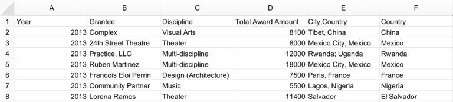

<br>

The data is already in “**row-oriented tables**” format. Which means, in this data file:

* Each row is a entity (or an object, or a record)
* Each column is a property of this entity (or this object, or this record)

Usually, this is the preferred format for most tools and data processing languages (like R).

However, you cannot expect all data are in this perfect format. If it is not the case, do Data wrangling!

More information about file format can be found at: [Tableau Help: Tips for Working with Your Data](https://onlinehelp.tableau.com/current/pro/desktop/en-us/data_tips.htm).

#### Step 2. Load data into Tableau {-}

Open Tableau Public (TP), there are two ways to load the data:

* at the left top click “**Excel**” and navigate to the file you just downloaded.

* Just drag your file and drop it into Tableau Public window.


#### Step 3.  Data Source View {-}

TP will try to determine your **data types** automatically, the common types are:

* \# => numbers
* Abc => text (strings)
* An earth symbol => geographic/locations

Usually this automatic process works fine, but please remember to check that the data type inferred by TP is exactly the data type you want, sometime TP will make mistakes.

The most common mistake is that TP will sometimes treat longitude and latitude numbers as #, but we usually want them be treated as geographic type.

To change the type, just click the **symbol (#, Abc, Earth symbol and etc.)**.

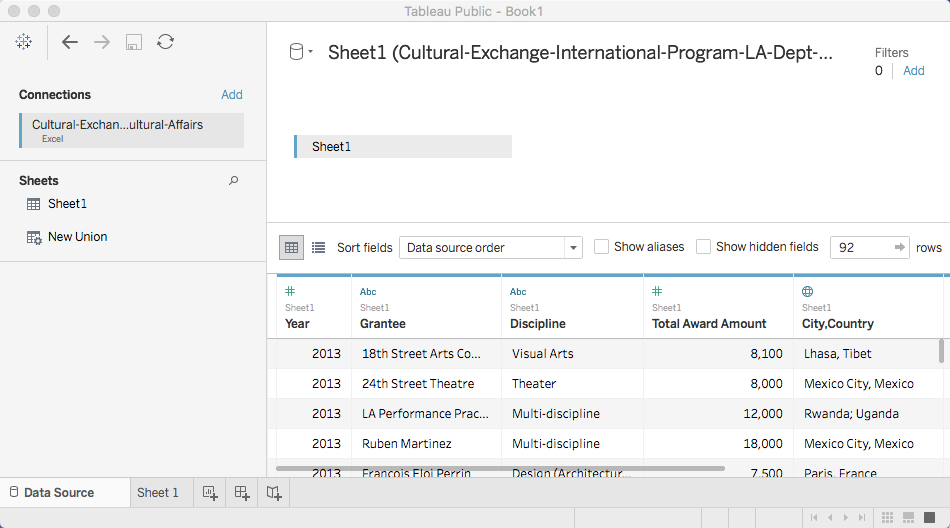

#### Step 4. Create worksheet {-}

Go to worksheet by clicking on <mark class="red">‘Sheet 1’</mark> (at bottom of display, as shown below)

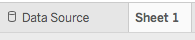

to see the TP interface:

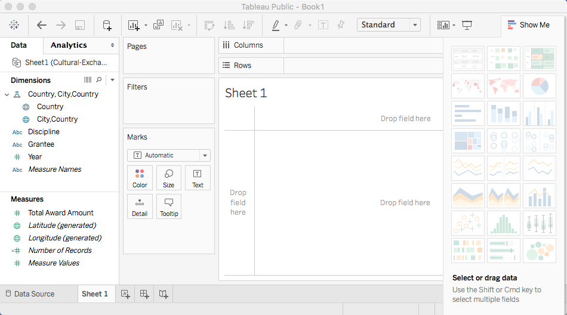

Shown on the left, data has been split into

* **Dimensions**; by default, Tableau treats any field containing qualitative, categorical information as a dimension;
* **Measures**;  and any field containing numeric (quantitative) information as a measure.

This modular treatment of information – that is to say, the treatment of individual data fields as independent components instead of an interdependent table – enables us to pick and choose what specific pieces of data we want to visualise against one another. 

Shown in the middle, top down, are ‘**Pages**’ ‘**Filters**’ and ‘**Marks**’ and then ‘**Columns**’ & ‘**Rowsm**’ then a ‘**Drop field here**’ table (you can drop fields on all of these middle controls):

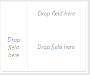


#### Step 5. Create Visualisations {-}

For our first visualisation, we will create a simple horizontal bar graph measuring City/Country against the Total Award Amounts granted to the artists from said locations.

* Drag ‘City,Country’ from **Dimensions** and drop it to **Rows**
* Drag ‘Total Award Amount’ from **Measures** and drop it to **Columns**
* Maybe also try to switch Rows and Columns

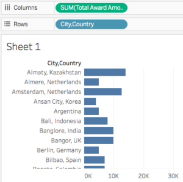

#### Step 6 {-}

Try sorting by using the control attached to ‘‘Total Award Amount’ on the axis.

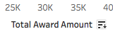


#### Step 7 {-}

Imagine we wanted to see what individual grant amounts compose the Total Award Amount for each Country/Region. To achieve this, we would want to differentiate between “Grantees”. 

The “Marks” functions will allow you to insert further detail into your visualization.  Click and drag your “Grantee” dimension into the “Marks” table beneath the icons (as below). Your visualization should now feature individual segments, which you can click for details about all the dimensions and measures you have worked into your visualization (you can see for example that Cuba has two segments).

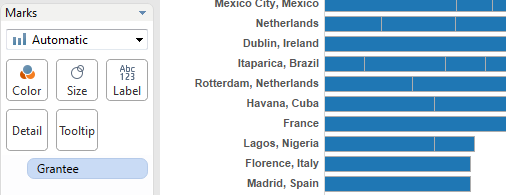

**Who were the two recipients in Havana, Cuba and how much?**

**(Notice the SUM(Total Award Amount) above, how about other measures, try max, min, total, mean..?)**

#### Step 8. One more dimension {-}

We can add another dimension, e.g. ‘Discipline’ but let’s distinguish it somehow (colour!).
Drag ‘Discipline’ onto ‘Colour’:

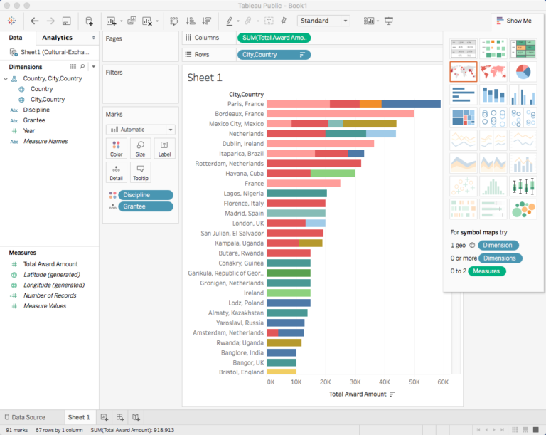


**Which Discipline was granted the most, the least?**
<br>
**Which countries got funding for film?**

#### Step 9. Change colors {-}

Don’t like those colours? By clicking the “Color” in the “Marks” window, you can customize the color palette, adjusting to the distribution of information present in your visualization.

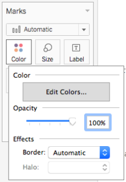

Then ‘Edit colors’

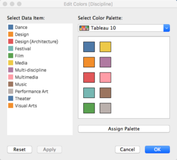

#### Step 10. Filtering {-}

Filter by year. Drag ‘Year’ onto ‘Filters’ to see:

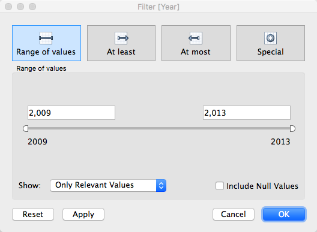

<br>
And ‘OK’ to select all (2009 to 2013). Now all this data is wrapped up and ready to go, let’s try a geographical view.

#### Step 11. Map {-}

Start a new sheet, the icon to the right of ‘Sheet1’ below

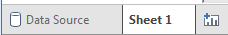

Drag and drop ‘Country’ onto the table below ‘Rows’ (use the larger of the ‘Drop field here’ cells):

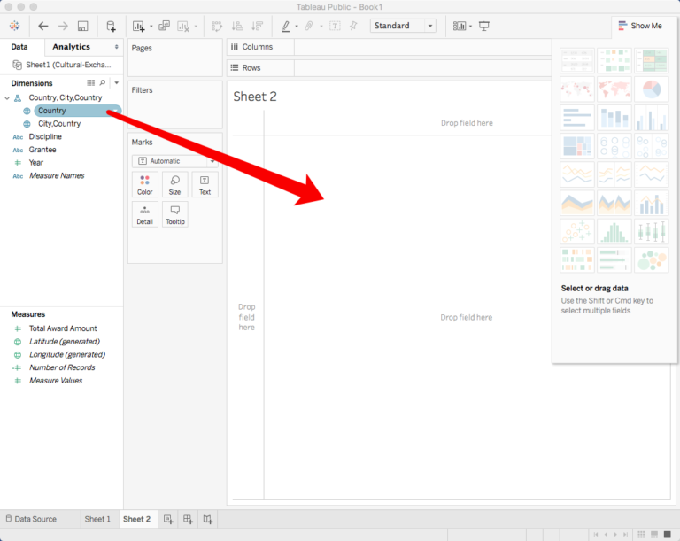

=>

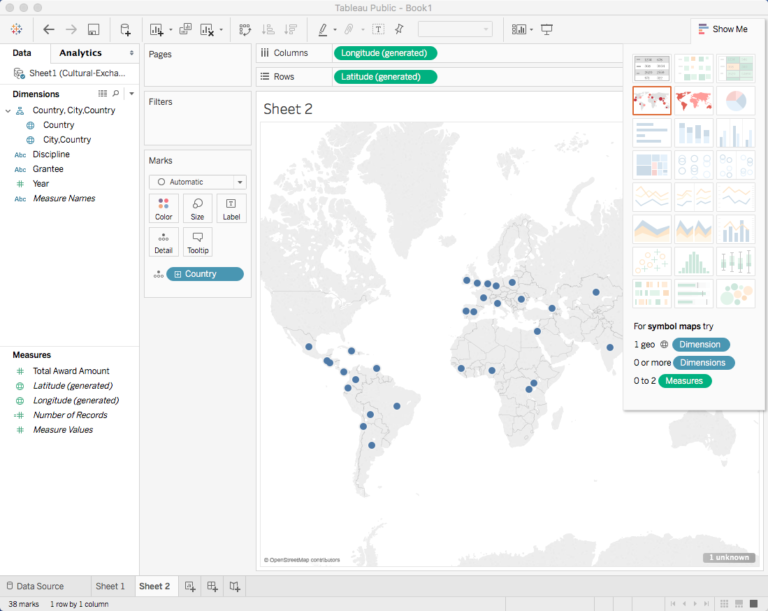

<br>
This launches a map, change it from a symbol map to a **filled map** using the ‘Show me’ dialog at right, drag ‘Country’ onto ‘Label’ also:

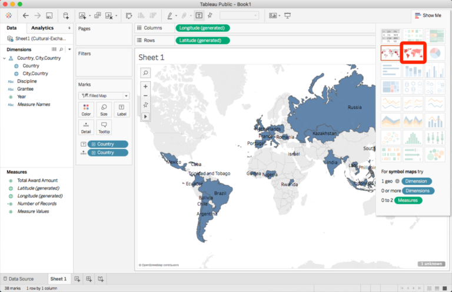


Now look for the measures labeled ‘Latitude’ and ‘Longitude’
<br>
**What does ‘generated’ mean?**

#### Step 12. Color the map {-}

Drag ‘Total Award Amount’ onto ‘Color’ (the default colour range is gradient green, change it if you hate green!):

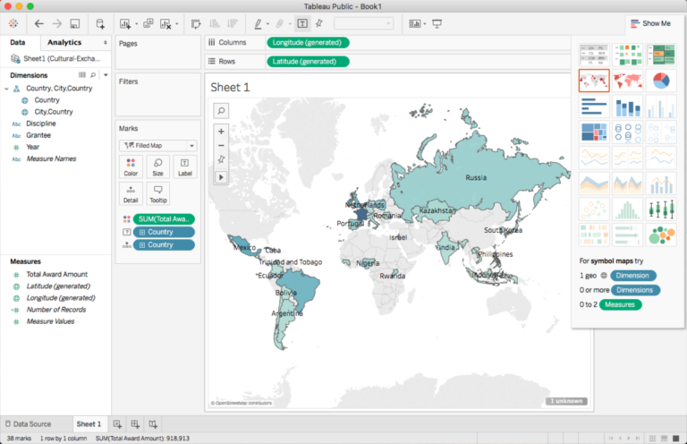

<br>
#### Step 13. Combine work sheets into a dashborad {-}

Combining sheets in a ‘New Dashboard’ (icon below)

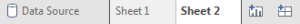


Drag from top left to ‘Drop sheets here’

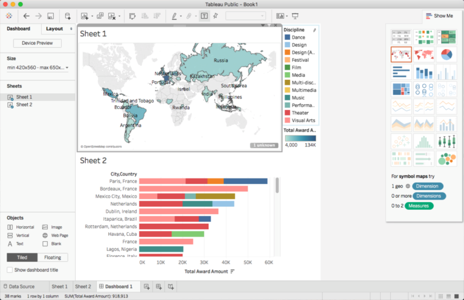


Optional: Share (if you have a tableau account).
(based on http://dh101.humanities.ucla.edu/wp-content/uploads/2014/09/Tableau_Public_Tutorial.pdf)

### B. Fuse tables

Sometimes (actually most of the time), the data is not stored in a single file.

For example, one file stores the ***state name*** and ***state population*** in Australia; another file stores the ***state name*** and ***state population density*** in Australia.

You want to explore the relationship between ***population*** and ***population density*** across different ***states*** in Australia.

For this very simple example, you could simply open Excel and copy and paste.

However, for real, large data, it takes ages to do so, as you have to link them correctly record (row) by record (row).

TP provides the functionality to fuse multiple data sets by linking records (rows) through the “linking property” you specify for each data set.

Now we are going to introduce the procedures.

Download the example data sets, they are ‘[Shape of US Congressional District Boundaries, 110th Congress](diagrams/Shape-of-US-Congressional-District-Boundaries-110th-Congress.csv)‘ and ‘[Household heating by Congressional District – 2008](diagrams/Household-heating-by-Congressional-District-2008.csv)‘.

#### Step 1. Load the first data set {-}

Open TP first.

Drag the first data set “Shape-of-US-Congressional-District-Boundaries-110th-Congress.csv” and drop it into the TP windows.

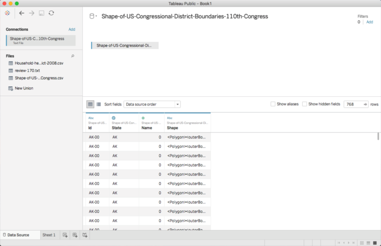


#### Step 2. Load the second data set {-}

Drag the second data set “Household-heating-by-Congressional-District-2008.csv” and drop it into the previous TP windows.

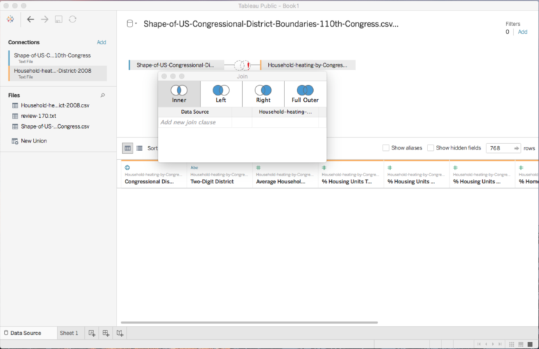


#### Step 3. Configure the fuse {-}

You need to specify the way you want to fuse the data sets.

* left data: first data set, Shape-of-US-Congressional-District-Boundaries-110th-Congress.csv and

* right data: second data set, Household-heating-by-Congressional-District-2008.csv

The 4 different ways to fuse are (TP shows them with visulisations – Venn diagram!):

* Inner, only fuse the rows (with the specified property) where the same value exists in both the left data and right data, drop the rows where the value only exists in one side.

* Left, fuse the rows (with the specified property) that exist in the left data, and drop the row if it is in the right data but not in the left data.

* Right, fuse the rows (with the specified property) that exist in the right data, and drop the rows if it is in the left data but not in the right data.

* Full order, fuse the rows (with the specified property) that exist in either side.

<br><br>

You also need to specify the linking properties for each side. In this case, let’s choose

* “***id***” for the left
* “***Two-Digital District***” for the right

And “inner” model to fuse.

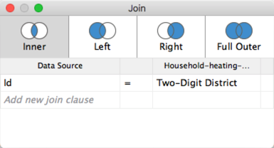

The fused table is shown in the “data view”.

Close the above window.

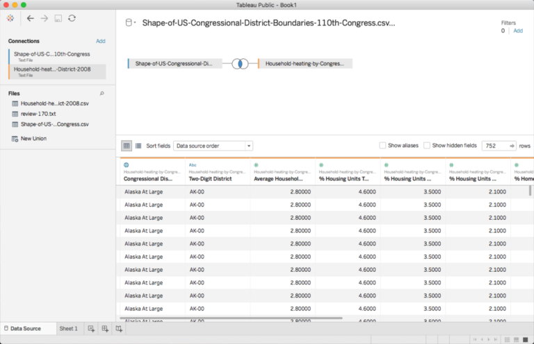

And now you can create your “sheet” and use properties from both table to implement your visulisations!

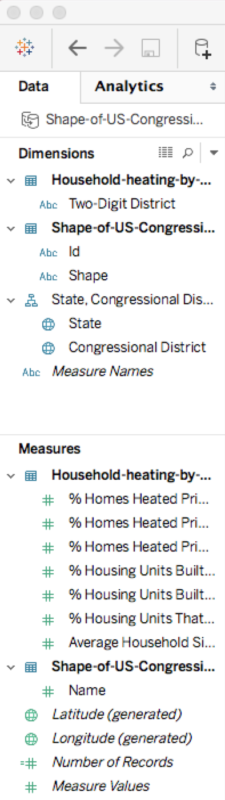

**Try different fuse models, and how many rows you can get in each way?**

### C. Choropleth Map

Choropleth map is a map with regions filled by different colors representing different properties.

One use case is using different color to present different type.

Another is using gradient color to present quantitative data.

You will learn more details in  [Module 3 of FIT5147](https://www.alexandriarepository.org/syllabus/making-sense-of-spatial-data/).

#### Step 1. Data always go first {-}

Download the data from [Household-heating-by-State-2008.csv](diagrams/Household-heating-by-State-2008.csv) and “drag & drop”.

Make sure “State” column is marked as “geographic/locations”.

#### Step 2. Create the map {-}

Create a new “Sheet”, and drag “States” to the center.

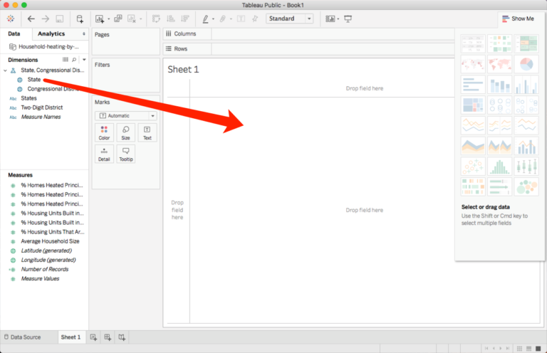

If you can see your map os US, congratulations! And you might choose to go to **Step 3** directly.

If your map cannot be generated properly, or you are looking at Australia, do not panic. This is not your fault, but TP has done something wrong.

Let’s fix it. Click on the top toolbar: **Map => Edit Locations**

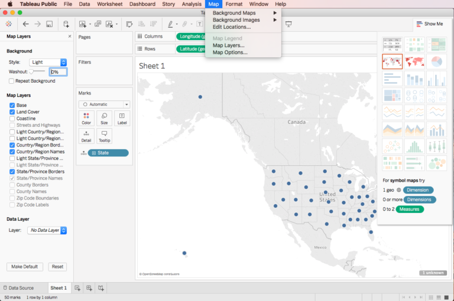

You should look at the following window:

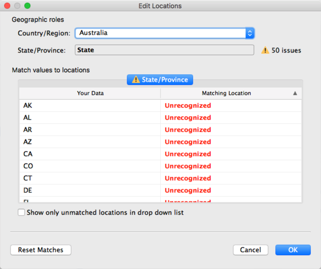

TP locate all your data into Australia……Maybe it is because of the self-locate service on your machine.

Anyway, change it to “United States” and press “OK”.

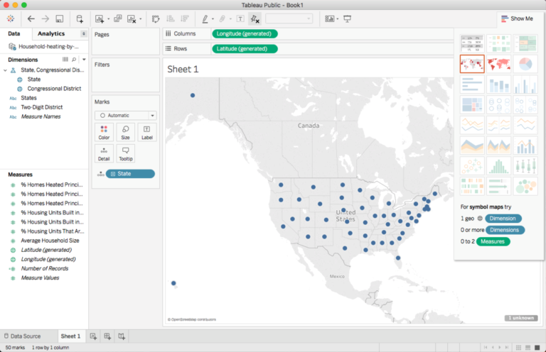


#### Step 3. Color the map {-}

Drag “% Housing Units That Are Mobile Homes” to “Color” in “Marks” section.

Rename it if you think this name is so long…

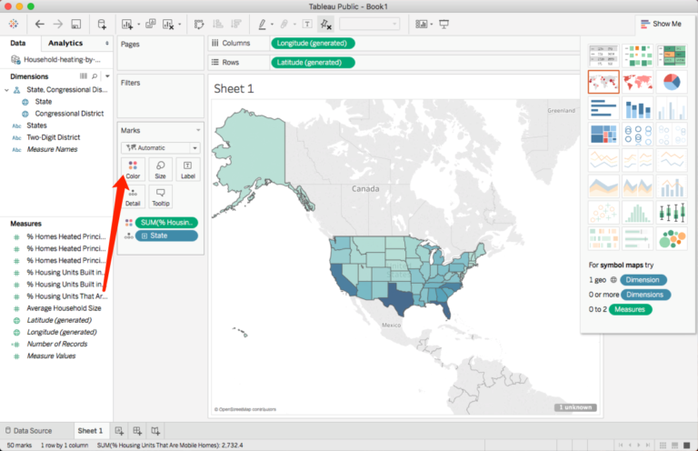


#### Step 4. More map options {-}

Click the top toolbar: **Map => Map Layers**

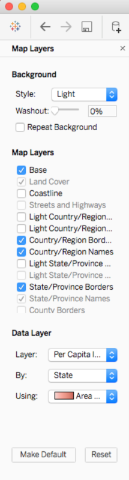

Try different options, what do they mean?

You can even add a colored data layer! You may want to remove your previous color first.

Where does the data come from?

<br><br>

Remember the “generated”? Investigate what can/cannot be generated?

<br><br>

Now its time to move on and see how to do this in R.

<br><br>

***


## Activity: Exploring & Visualising Data using R

### Data on Maps with R

You will need R and RStudio, you will also need to install the following libraries (and dependencies):

* ggmap

* ggplot2

* maps

If you are not sure how to do this and want to explore some basic knowledge about R.

**DO TAKE A LOOK AT:**

* [Introduction to RStudio](https://www.alexandriarepository.org/module/activity-introduction-to-rstudio-yalong/)

* Introduction to R programming 

* [Torfs & Brauer’s “A (Very) Short Introduction to R” [pdf]](https://cran.r-project.org/doc/contrib/Torfs+Brauer-Short-R-Intro.pdf)

#### Step 1 {-}
Run RStudio, install libraries, try the following code (copy, paste, run):


```r
library(ggmap) 
library(ggplot2) 
library(maps) 
# or you can try e.g. require(maps) 
# map("usa") 
map('state') # not necessary, just checking we can draw a map
```

You should see a basic map of the US states:

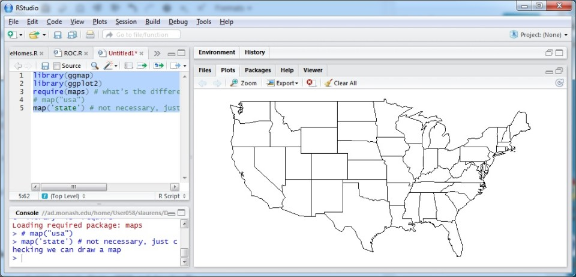
<br>

If an error appear as “Plot region too large”.

You just need to adjust the **right bottom** section of RStudio larger.

#### Step 2 Read the modified data file (state names & codes have been added). {-}

Download the file at [Household-heating-by-State-2008.csv](diagrams/Household-heating-by-State-2008.csv), and put it in your working directory.


```r
data <- read.csv("Household-heating-by-State-2008.csv", header=T) 
head(data) 
names(data) 
```

#### Step 3 Names are a bit much, simplify the one we’re interested in: {-}


```r
names(data)[4] <- "MobileHomes"
names(data)
```

#### Step 4 Now group the Mobile Home data by State, calculating the average: {-}


```r
ag <- aggregate(MobileHomes ~ States, FUN = mean, data = data)
```

Look at the paprameters of aggregate.

* `MobileHomes ~ States` means group the Mobile Home data by State

* `FUN = mean` means calculate their averages,

**How many states should there be?**


```r
head(ag) 
dim(ag)
```

Not going to worry about the first ‘#N/A’ state for now, delete it if you like

#### Step 5 Get map data (built-in map data in ggplot2 package) {-}


```r
m.usa <- map_data("state") # we want the states 
head(m.usa) 
dim(m.usa) # more info than we need
```

#### Step 6 Force our states to lowercase to match the map, keep also one column of data {-}


```r
df <- data.frame(
  region = tolower(ag$States), 
  MobileHomes = ag$MobileHomes,
  stringsAsFactors = F
) 
dim(df)
opts_chunk$set(tidy.opts=list(width.cutoff=60),tidy=TRUE)
```

**50 states?**

#### Step 7 Now plot it on the map (look at all those layers…) {-}


```r
# Create a empty canvas
ggplot(df, aes(map_id = region)) +   
  # draw the grid
  expand_limits(x = m.usa$long, y = m.usa$lat) +    
  # draw a us map, fill = MobileHomes means color the map according to MobileHomes property
  geom_map(aes(fill = MobileHomes), map = m.usa) +  
  # fix the ratio of the x and y axises, to match a map
  coord_map()                                       
```

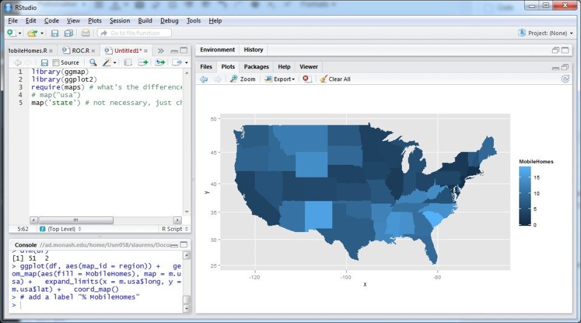
<br><br>

**QUESTION**: Compare R with Tableau Public for data visualisation – **which do you prefer and why?** Consider also the data wrangling to prepare and process the data.


***


## Activity: Exploring & Visualising Data with D3'

In this activity, you are going to use D3 to build a choropleth map.

Do not worry, it will be easier than you expect…

### Introduction

[D3](). (**Data-Driven Documents**) is a HTML5/SVG + JavaScript based data visualisation toolkit. It allows you to create dynamic and interactive data visualisation that can be viewed in a  web browser. D3 is a JavaScript library. JavaScript is a programming language for web pages. It is used to create web pages from dynamic content and change them in response to user interaction. Along with HTML and CSS it is one of the pillars of modern web page design.

D3 has its origins in [Protovis](https://ieeexplore.ieee.org/document/5290720/). D3 is extremely powerful and allows you to create almost any kind of visualisation you can imagine. You can have a look at some of the examples:
https://github.com/mbostock/d3/wiki/Gallery

If you look at the code you can see that this power comes at a price: D3 is quite complicated and relies on several different concepts. However, in this activity, we are not going to dive into all the details. Instead, you can have some hands-on experience of using D3. Later in the unit you will learn more about D3. Or if you cant wait there is  a free comprehensive online tutorials of D3:

[D3 Tutorials by Scott Murray](http://alignedleft.com/tutorials/d3)

If you are unfamiliar with JavaScript you might like to look at the W3C tutorial on JavaScript https://www.w3schools.com/js/

### Preparation

* Download the [map file](diagrams/us-states.txt). 
<br>
This file contains the details of maps of different states in USA. Basically, it keeps the records of geographic shapes, like lines, points and etc.
<br>
(optional) Check out http://geojson.org/ for more details.

* Download the [data](diagrams/MobileHomes.csv)
<br>
License: CC Attribution 4.0 International (CC BY 4.0)
<br><br>
To be consistent, we are going to use the same data we used in our R activity.
D3 (or even JavaScript) is not the ideal tool for data processing, so here we use the aggregated data which was calculated by the <mark class="green">aggregate</mark> function in R.

* Set up a static web server
<br>
For security reason, browsers cannot access local files directly, so a static web server needs to be set up to allow our D3 script to load data. The **easiest way** to do this is to download
<br>
http://brackets.io/. This is a free text editor with live preview feature which runs a static web server at the back end.  However you can use your favourite text editor and skip this step if you already know how to set up a static web server.
<br>
(Optional)If you prefer to launch a static server, you can do this with:
   
    + Install Python (on Windows, Python should be installed by default for most Linux and Mac OS)
    + Adding Python to your system path (on Windows)
    + Use a terminal (command line) to enter your project directory/folder (with cd command)
    + Running the command:
    <br>
    (for python 2) python -m SimpleHTTPServer 8000
    <br>
    (for python 3) python -m http.server 8000
    + Then you can open http://localhost:8000/ in your browser to access your D3 visualisations.
    
### Set up an HTML page

Using the menu <mark class="green">File -> New</mark> to create an empty file, save it to the folder you keep all the data you downloaded, with the name us-map.html (of course change the name if you do not like it).

Let’s create a basic HTML page with:


```html
<!DOCTYPE html>
<html>
    <head>
        <title>US Mobile Homes choropleth map</title>
    </head>
    <body>
        <svg></svg>
    </body>
</html>
```

If you are using Brackets, click the “lightning” icon on the right to view this very new webpage.

As expected, you will see a blank page, however, if you are careful enough you can find the text on the tab of the browser is “US Mobile Homes choropleth map”.

### Initialise svg canvas

We need a canvas to draw our visualisation.

Luckily, we already defined our <mark class="green">svg</mark> element in the HTML. (SVG is the HTML5 standard for vector graphics)

We will take advantage of D3’s

* <mark class="green">selection</mark> function to access the svg element
* <mark class="green">attr</mark> function to modify the attributes of the svg element, and
* <mark class="green">style</mark> function to modify the style of the svg element

First, we need to reference D3 library in our webpage, add


```javascript
<script src="https://d3js.org/d3.v4.min.js"></script>
```

to the body section of our HTML.

Create another script section for our own JavaScript code, and initialise the svg element. The whole HTML should look like:


```html
<!DOCTYPE html>
<html>
    <head>
        <title>US Mobile Homes choropleth map</title>
    </head>
    <body>
        <svg></svg>
        
        <script src="https://d3js.org/d3.v4.min.js"></script>
        
        <script>
            var width = 960;
            var height = 500;
            
            var svg = d3.select("svg")
                .attr("width", width)
                .attr("height", height)
                .style("border", "1px solid");
        </script>
    </body>
</html>
```

Refresh the webpage in your browser: you should now see our canvas.

Of course, if you are experienced with web development, you know this process could be done without javascript and you could simply write the SVG code

Here we want to demonstrate some basic functions of D3.

### Reading data

We will take advantage of D3’s request functions to load data. (Optional) More details at: https://github.com/d3/d3/blob/master/API.md#requests-d3-request

We can use <mark class="green">d3.json</mark> and <mark class="green">d3.csv</mark> function to load our map and data respectively.


```html
<!DOCTYPE html>
<html>
    <head>
        <title>US Mobile Homes choropleth map</title>
    </head>
    <body>
        <svg></svg>
        
        <script src="https://d3js.org/d3.v4.min.js"></script>
        
        <script>
            var width = 960;
            var height = 500;
            
            var svg = d3.select("svg")
                .attr("width", width)
                .attr("height", height)
                .style("border", "1px solid");
            
            d3.json("us-states.txt", function(mapData){
                d3.csv("MobileHomes.csv", function(data) {
                    
                });
            });
        </script>
    </body>
</html>
```
### Draw the map

Let’s focus on the map first.

The map file is in GeoJson format and contains pure geographic information.

To draw a map, we need to convert the geographic information (latitude, longitude) to 2D coordinates for the screen $(x, y)$.

This process is called _map projection_, you will learn (a lot) more details in the future in this unit.

D3 provides lots of different map projections! Probably the most comprehensive collection available in Javascript.  (Optional) https://github.com/d3/d3-geo-projection

We use the following code to define the map projection we are going to use later.


```javascript
// Map projection
var projection = d3.geoAlbersUsa()
  // move the center of the map to the center of our canvas
  .translate([width / 2, height / 2]) 
  // scale things down so see entire US
  .scale([1000]); 
  
// Define path generator
// path generator that will convert GeoJSON to SVG paths
var path = d3.geoPath() 
  // tell path generator to use the previous map projection
  .projection(projection); 
```

After this, drawing the map is extremely easy:


```javascript
var states = svg.selectAll("path")
  // bind the geographic data to svg elements
  .data(mapData.features) 
  // create one "path" svg element for each datum
  .enter().append("path") 
  // using the map projection to convert geographic information to screen coordinates
  .attr("d", path) 
  // change the style properties for the svg 
  .style("stroke", "black") 
  .style("stroke-width", "1")
  .style("fill", "white");
```

Now, refresh your webpage, say hello to the US Map.

<br><br>

If you cannot see anything, probably it is again a trick about working directory.

Please use the menu on the top with “**File => Open Folder**” and choose the directory you kept all your files.

Then try the “lightning” button again.

### Color the map

We need a bit data processing first.

To make the color of different states proportional to its value, we need to know:

* the value for each state
* the min and max value among all states

This can be achieved by:


```javascript
var country2value = {};
var minValue = Infinity;
var maxValue = -1;
data.forEach(function(d){
    var thisValue = d["MobileHomes"];
    country2value[d["States"]] = thisValue;
    
    minValue = Math.min(minValue, thisValue);
    maxValue = Math.max(maxValue, thisValue);
});
```

We also need a color mapping to map the values to colors.

One good possible option is to use the <mark class="green">d3-scale-chromatic</mark> library. 
<br>
(Optional) https://github.com/d3/d3-scale-chromatic

Let’s reference this library first:


```html
<script src="https://d3js.org/d3-scale-chromatic.v1.min.js"></script>
```

Here, to make choropleth map for comparing values, we want to map the  continuous values to <mark class="green">Sequential</mark> colors.

This kind of color mapping accepts parameters of numbers from 0 to 1 and mapping them to related colors.

Usually light colors stand for small values, and dark ones for large values.

Two mappings need to be created:

* map values to the range of 0-1
* map the above outputs to colors


```javascript
var value2range = d3.scaleLinear()
    .domain([minValue, maxValue])
    .range([0, 1])
var range2color = d3.interpolateBlues;
```

Thanks for your patience, now it is the time to finish with just a few more line of code.


```javascript
states.style("fill", function(d){
    return range2color(value2range(country2value[d.properties.name]));
});
```

<br><br>

The whole web page should look like:


```javascript
<!DOCTYPE html>
<html>
    <head>
        <title>US Mobile Homes choropleth map</title>
    </head>
    <body>
        <svg></svg>
        
        <script src="https://d3js.org/d3.v4.min.js"></script>
        <script src="https://d3js.org/d3-scale-chromatic.v1.min.js"></script>
        
        <script>
            var width = 960;
            var height = 500;
            
            var svg = d3.select("svg")
                .attr("width", width)
                .attr("height", height)
                .style("border", "1px solid");
            
             // Map projection
            var projection = d3.geoAlbersUsa()
              // move the center of the map to the center of our canvas
              .translate([width / 2, height / 2]) 
              // scale things down so see entire US
              .scale([1000]); 
            
            // Define path generator
            // path generator that will convert GeoJSON to SVG paths
            var path = d3.geoPath() 
              // tell path generator to use the previous map projection
              .projection(projection); 
                
            
            d3.json("us-states.txt", function(mapData){
               
                var states = svg.selectAll("path")
                  // bind the geographic data to svg elements
                  .data(mapData.features) 
                  // create one "path" svg element for each datum
                  .enter().append("path") 
                  // using the map projection to convert geographic 
                  // information to screen coordinates
                  .attr("d", path) 
                  // change the style properties for the svg 
                  .style("stroke", "black") 
                  .style("stroke-width", "1")
                  .style("fill", "white");
                
                d3.csv("MobileHomes.csv", function(data) {
                    
                    var country2value = {};
                    var minValue = Infinity;
                    var maxValue = -1;
                    data.forEach(function(d){
                        var thisValue = d["MobileHomes"];
                        country2value[d["States"]] = thisValue;
                        
                        minValue = Math.min(minValue, thisValue);
                        maxValue = Math.max(maxValue, thisValue);
                    });
                    
                    var value2range = d3.scaleLinear()
                        .domain([minValue, maxValue])
                        .range([0, 1])
                    
                    var range2color = d3.interpolateBlues;
                    
                    states.style("fill", function(d){
                        return range2color(
                          value2range(country2value[d.properties.name])
                        );
                    });
                });
            });
        </script>
    </body>
</html>
```

<br><br>

**QUESTION**: Compare D3 with R and Tableau Public for data visualisation – which do you prefer and why?

***


