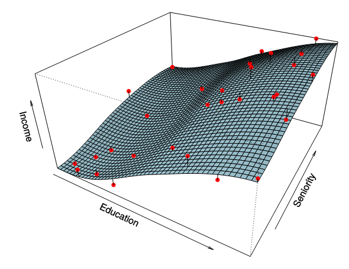
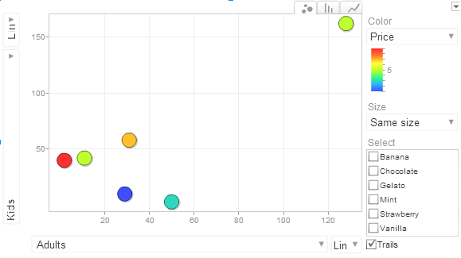
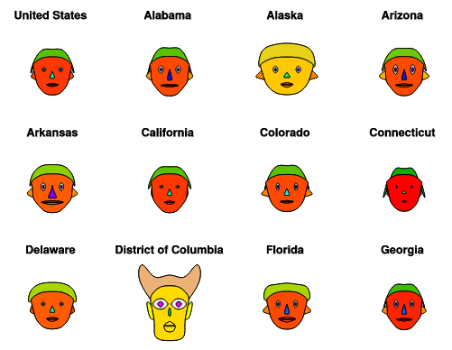
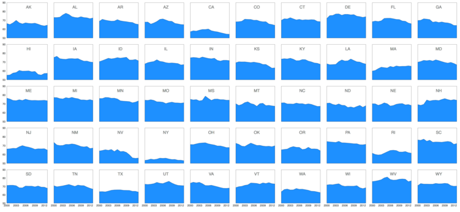
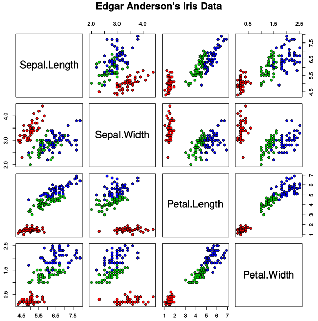
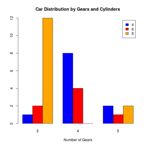
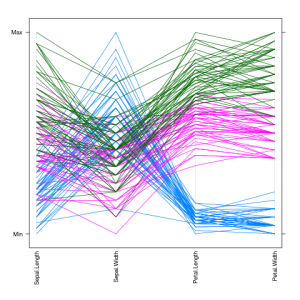
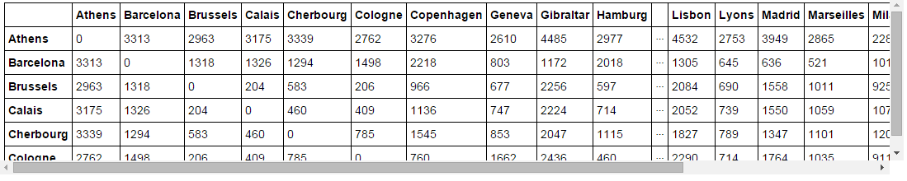
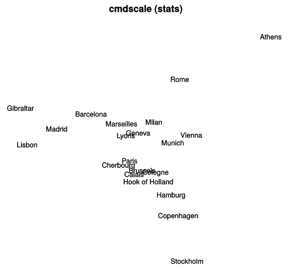
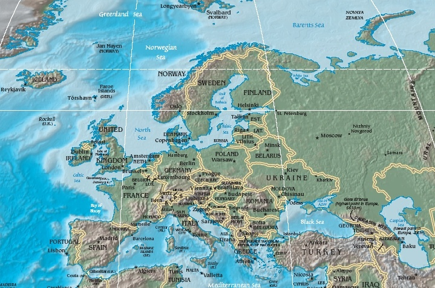

# Visualising tabular data

## Basic statistical graphics

A wide variety of simple statistical graphics are used to show two-dimensional tabular data. These graphics show data distributions and counts of a single attribute or how one attribute changes with respect to another, including time. Such graphics show only the values of a single attribute or the relationship between two attributes. We provide a brief review of the most common.

With tabular data it is common for there to be a *key* (aka *factor*), this is an independent attribute that acts as an index into the data while a dependent attribute is called a *value*. Key attributes can be categorical or ordinal and may be hierarchically organised. The different values for key attributes are usually called *levels*. Value attributes can be any kind of attribute: categorical, ordinal or quantitative. The most common graphics are as follows:

* *Scatter* plots are one of the most widely used statistical graphics. They show two quantitative value variables and can reveal linear or curvilinear relationships between the variables, correlations between the variables and the presence of extreme values (outliers).
* *Bar charts* and *polar area charts* show a quantitative value for a key. Bar charts are easier to read.
* *Pie charts* or a *normalised stacked bar chart* show relative contribution of parts to a whole. In general pie charts and other radial layouts are harder to read than rectilinear layouts.
* *Line charts* or *dot charts* show one quantitative value for an ordered key attribute. Line charts are used if it makes sense to interpolate between the values. Commonly used to show time varying data.
* *Histograms* (like a bar chart) and *density plots* (like a line chart) are commonly used to show the frequency of data values for a single attribute.
* *Box-and-whisker plots* or *violin plots* provide a compact summary of a frequency distribution.
* *Heat maps* are commonly used to show a single value attribute with two keys. The rows or columns can be reordered and clustered so that keys with similar data values are adjacent.
* *Tree maps* can be used to show quantitative data for hierarchically organised keys.

## Multivariate data

In most real-word data science applications, tabular data is *multivariate*: it has more than two attributes, often many more. So the question is, how can we show more than two attributes on a two- (or at most three-dimensional) surface. Edward Tufte calls this the problem of leaving *flatland*. Fortunately, many ingenious graphics for showing multivariate data have been invented and are an important part of the data scientist’s visualisation repertoire.

## Showing 3D

The easiest case is when we add only a single dimension to our problem and wish to visualise the values of three variables. In this case we can use techniques developed in [scientific visualisation](https://en.wikipedia.org/wiki/Scientific_visualization) for showing  physical objects such as buildings, crystals or living creatures or the behaviour of fluids, fields or gasses in our three-dimensional world.

One way is to show contours of a third variable on a 2D surface – contours:

.](diagrams_datasets/section2/Plot_contour.png)

Another is to extend common 2D graphics with a third dimension and use 3D graphics formats like WebGL to present the resulting 3D objects, point clouds or surfaces in 3D. It is common to plot data points in a 3D scatter plot and show fitted curves using wire mesh surfaces for example.

We can also use animation to show the extra dimension, showing how the two dimensional graphic changes at different points in time. This makes most sense when the extra dimension to be visualised is actually time.

And of course any of the following more general techniques for multivariate visualisation can be used for the particular case of three variables.

## Additional visual attributes

Graphs and charts are made up of different kinds of geometric objects: points, lines, and polygons. These have a location, a shape, i.e a point might be a cross or a circle, a polygon or a bar, a size or sizes and visual but non-spatial features such as colour, texture, shadow, line thickness and style, fill colour, blurring etc. And some of these features such as colour or texture can be broken down even further. For instance hue, saturation and brightness are independent attributes of colour.

This plethora of spatial and visual features can be used to encode multiple data attributes. Thus while a graph is at first sight two dimensional in fact it is really multidimensional because of these additional attributes.

However, while this can be very useful, the resulting graphics can be difficult to understand, it may be difficult to perceive the relationship between different attributes and care must be taken when choosing how to map data attributes on to the spatial and visual features as different features are suited to encoding different kinds of data.

  

One of the more unusual ways to show multivariate data was devised by Herman Chernoff. Part of the human visual system is specialised for human face recognition. Having a specialised component for this makes evolutionary sense because it is important to be able to quickly recognise the face of a person approaching with a spear in their hand so that you know whether you should give them a hug or start running. Chernoff invented the use of little cartoon faces, now called *Chernoff faces*, whose features such as the shape, size of ears, nose, eyes, colour and angle of eyes and mouth can each encode a separate data attribute. Personally I find them cute but quite difficult to read. See the following for examples of some of the states and some of the keys to reading or decoding:

**Chernoff faces, crime by state**

(who want’s to live in DC? It’s not a state anyway, just a district, maybe that’s why they’re angry)

e.g.  
"height of face" = "murder"  
"height of mouth" = "aggravated_assault"  
"width of mouth" = "burglary"  
"height of eyes" = "motor_vehicle_theft"  

## Multiple charts

One approach to dealing with multivariate data is simply to use multiple graphics.  One of the most  common ways is to choose one of the variables and for each  value of this variable (or selected values if there are too many) create a chart  and then place the resulting charts in a grid, column or row using a common scale so that you can easily compare values between the charts. Tufte calls these *small multiples*. Each chart shows a slice or cross section through the data.

Another common way is to use a *scatter plot matrix* or *SPLOM*. As its name suggests, this is an array of 2-D scatter plots.  There is a row and column for each dimension and the entry for *row x* and *column y* shows the scatter plot of the $(x,y)$ values.  This kind of chart is sometimes called a *draftsman’s display* because it shows orthogonal projections of the multidimensional data that are analogous to the multi-view orthogonal plans consisting of the ground plan, facades and elevations used by architects and engineers.

A related approach is to use a *coordinated display* comprising multiple simple charts which may be of different kinds.  Each  shows a different aspect of the data and these are placed together in a large display. User interaction techniques such as *brushing* and *filtering* allow the viewer to understand how the data attributes in each chart are linked together.  For instance when the user hovers over a point in one chart, all elements corresponding to the same data point will be highlighted in the other charts.

## Overlay graphic elements

Another approach is to create a multi-dimensional graphic by essentially overlaying or juxtaposing the graphic elements from several two dimensional graphics to form a single chart. This is similar to small multiples but rather than creating a grid of charts, with one chart for each value of some selected variable,  the salient graphic elements from these different charts are combined to form a single chart.

*Compound* and *stacked* bar charts are good examples. Compound bar charts juxtapose the bars from simple bar charts by placing them side by side while stacked bar charts place them on top of each other. And for the record stacked bar charts are better than compound bar charts if comparing the total is important while compound bar charts are better if you wish to compare the size of the different values. Paired bar charts are another special example of a  juxtaposed bar chart .

*Multidimensional tables*, *area plots* and *multi-line graphs*, and *doughnut charts* are the multidimensional equivalents of simple table, line graphs and pie charts. *Stream graphs* are similar to area plots but aren’t stacked on a common baseline. Like pie charts, doughnut charts should be avoided.

## Parallel coordinates

Yet another approach is to use *parallel coordinates*. Here a sequence of equally spaced vertical lines, one for each dimension, provides the axes for the data. A data point is plotted on these axes by plotting a point on each axis corresponding to the value of the data point’s attribute for that dimension and connecting adjacent points by straight lines. Parallel coordinates has the great advantage over the more common Cartesian coordinates that it naturally scales to any number of dimensions.

The crossings of lines between the axes can reveal correlations. If two adjacent attributes are positively correlated then the line segments between them will not cross but if they are negatively correlated they will cross.

One thing to be aware of is that the order of the axes matters, thus when exploring data you need to look at parallel coordinates for different orderings so that, for instance, each pair of dimensions have been placed next to each other in at least one of the plots.

*Spider diagrams* are a radial version of parallel coordinates. Like most circular plots, I am yet to be convinced of their usefulness.

## Dimension reduction

The final approach is to reduce the dimension of the data by projecting the multidimensional data on to two or three dimensions. There are two common ways of doing this.

One way is called *Multidimensional scaling* or *MDS*. Here the idea is to find a location for each data point in 2D space  so that points that have similar values for their attributes are close together and those that have dissimilar values are further apart. The visualisation therefore clusters data points that are similar together.

If $x$ and $y$ are two data points and $x’$ and $y’$ are their position in the 2D plot, then multidimensional scaling tries to make $dist(x’,y’)$ as close as possible to $dist(x,y)$ where $dist(u,v)$ is the distance between two points in either 2D or n-dimensional space. Usually it is not possible to make these distances exactly equal and so multidimensional scaling will find a position that tries to minimise the overall difference between the distances.

For instance if we have 4 data points with 4 attributes:  $(0,0,0,1)$, $(0,0,1,0)$, $(0,1,0,0)$, $(1,0,0,0)$ then the Euclidean distance between each pair of points is $\sqrt{2}$ (if we add the distance between corresponding attributes) but there is no way to place $4$ points on a piece of paper so that they are equidistant: the best is to place them in a square pattern.

The other common way of reducing dimensions is *principal component analysis* or *PCA*. This approach finds orthogonal dimensions on which to project the data points that in some sense best explains the variance in the data. More exactly, if you are projecting on to two dimensions PCA first finds the line $L1$ for which the variance is greatest when the data is projected on to it and then the line $L2$ that is orthogonal to $L1$  and which maximises the remaining variance. The data is plotted on a scatter plot where the x and y values are the projection of each point on to $L1$ and $L2$. While PCA sounds difficult to compute, in fact it is readily computed using an eigenvalue decomposition of the data covariance or correlation matrix. See [wikipedia](https://en.wikipedia.org/wiki/Principal_component_analysis) for more details if you are interested and there’s an example of PCA using the Iris data set [here](https://tgmstat.wordpress.com/tag/dimensionality-reduction/)

A third approach which is conceptually similar to MDS is *self-organising maps* (SOMs). This is a type of neural network. It is not as widely used as MDS or PCA.

### Multidimensional scaling example

In R there is a dataset called ‘Eurodist’ which is driving distances between 21 European cities (in km, excluding London because you can’t drive there and they still measure in miles anyway…).

Some of the data is shown below:

After MDS (using ‘cmdscale’), we now have a representation of all 21 dimensions of data in a 

Which you can compare with an actual map of Europe, Athens (Greece) is a long way (by road) from most of our 21 other European cities, Brussels (for example) is fairly central. Also because MDS doesn’t really understand geography the position is like a distorted mirror of the original positions.

## Summary

In this module we have reviewed the basic statistical graphics and then looked at a wide variety of different graphics that have been invented to show multivariate data. While the resulting graphics are invaluable for understanding multidimensional data they require some skill in interpreting and so must be used carefully.

***

FURTHER READING

Please take a look at the graphics used to visualise multivariate medical data in the video by Agustin Calatroni [Visualizing Multivariate Data: Turning Information Into Understanding](https://www.youtube.com/watch?v=a9RTHU-0qTY). Its quite long (1hr 26m) so you can skip some of it.

And please read

Chapter 7 of *Visualization Analysis and Design*. Munzner, Tamara. CRC Press, 2014.

