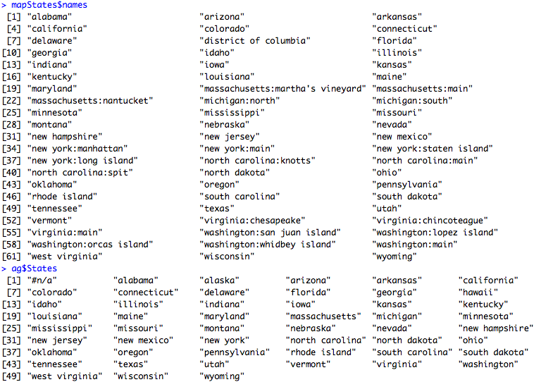

# Activity: Leaflet with R

## Introduction

Leaflet is an open-source JavaScript library for **interactive** maps.

A basic interactive map (pan & zoom & markers & etc…) can be created very easily with `leaflet`.

The `leaflet` R package allows you to use Leaflet interactive maps in R in an easy way.

We start by installing the package “`leaflet`“.

Let’s start mapping….

The very first map with leaflet.


```r
m <- leaflet() %>% 
  setView(lng = 145.0431, lat = -37.8773, zoom = 15) %>% 
  addTiles()
m
```

If there is an error of cannot find “httpuv” library, please install it and run the code again.

There is a very “modern” way to use leaflet with the %>% operation.

The basic idea is to use **the result of the** ***previous function*** as **the first parameter of the** ***next function***.

Check [magrittr pipe operator](https://github.com/tidyverse/magrittr) for details.

Or we can do it in the old fashioned way:


```r
m <- leaflet() 
m <- setView(m, lng = 145.0431, lat = -37.8773, zoom = 15)
m <- addTiles(m)
m
```

You may already notice, the map is plotted in the “Viewer” tab instead of the normal “Plots” tab.

This is because the leaflet R package is still using the leaflet javascript package and the “Viewer” tab is basically a small web browser.

You can also customise your tile.


```r
m %>% addProviderTiles("Stamen.Toner")
```

use `help(addProviderTiles)` to check other available tiles.

## Marker 

The data is ready for you in: [vet_schools_in_victoria](diagrams_datasets/section6/vet_schools_in_victoria.txt).

Load it as usual and have a look.


```r
library(leaflet)
data <- read.csv("vet_schools_in_victoria.txt")
head(data)
```

This data set is very large.

Let’s place the first 30 records on the map first.


```r
leaflet(data = data[1:30, ]) %>% addTiles() %>%
  addMarkers(~longitude, ~latitude, popup = ~as.character(location)) 
```

Click on the markers, find out what’s the text about.

Try the whole data set.


```r
leaflet(data = data) %>% addTiles() %>%
  addMarkers(~longitude, ~latitude, popup = ~as.character(location)) 
```

That’s terrible…

But our map is interactive, we should be able to cluster the data and allow the user to zoom into the details.


```r
leaflet(data = data) %>% addTiles() %>%
  addMarkers(
    ~longitude, 
    ~latitude, 
    popup = ~as.character(location),
    clusterOptions = markerClusterOptions()
  )
```

## Choropleth Map

Download our familiar data set again: [Household-heating-by-State-2008.csv](diagrams_datasets/section6/Household-heating-by-State-2008.csv).

Let’s pre-process the data as usual.

```r
data <- read.csv("Household-heating-by-State-2008.csv", header=T) 
names(data)[4] <- "MobileHomes"
ag <- aggregate(MobileHomes ~ States, FUN = mean, data = data)
ag$States <- tolower(ag$States)
```

Let’s prepare the map data and link the two data sets.

```r
library(maps)
mapStates <- map("state", fill = TRUE, plot = FALSE)
# find the related rate for each state
rates <- ag$MobileHomes[match(mapStates$names, ag$States)] 
```

Now, it is time to use `leaflet`.

```r
library(leaflet)
cpal <- colorNumeric("Blues", rates) # prepare the color mapping
leaflet(mapStates) %>% # create a blank canvas
  addTiles() %>% # add tile
  addPolygons( # draw polygons on top of the base map (tile)
    stroke = FALSE, 
    smoothFactor = 0.2, 
    fillOpacity = 1,
    color = ~cpal(rates) # use the rate of each state to find the correct color
  ) 
```

You may also notice some parts are not colored.

Let’s check out why.

```r
mapStates$names
ag$States
```



As you can see, “washington” is split into different parts in `mapState`, and so the strings do not match.

**Data processing** again.

```r
# split the string with : as seperator
spliteNames <- strsplit(mapStates$names, ":") 
# get first part of the origin string;
# e.g. get washington from washington:san juan island
firstPartNames <- lapply(spliteNames, function(x) x[1])  
rates <- ag$MobileHomes[match(firstPartNames, ag$States)]
```

Now plot again.

```r
cpal <- colorNumeric("Blues", rates) # prepare the color mapping
leaflet(mapStates) %>% # create a blank canvas
  addTiles() %>% # add tile
  addPolygons( # draw polygons on top of the base map (tile)
    stroke = FALSE, 
    smoothFactor = 0.2, 
    fillOpacity = 1,
    color = ~cpal(rates) # use the rate of each state to find the correct color
  )
```

Compare it with creating choropleth map in **R** using in previous activities, **Google Fusion Table** and **Tableau**. Which one do you prefer and **WHY**?

Here, we are using the built-in map data `map("state", fill = TRUE, plot = FALSE)`, if you cannot find your map data in the built-in maps, `leaflet` can also handle shapefiles.

You will need `rgdal` library to read your shapefile and it is available at: [World shape file](diagrams_datasets/section6/ne_50m_admin_0_countries.zip).

Unzip it and put the very important 3 files (ne_50m_admin_0_countries.shp & shx & dbf) into your working directory.

Also we need the data for colors. Here we provide [the GPD data for countries](diagrams_datasets/section6/WorldGDP.txt).

Reading the data first, there are different ways to load the data.

If you cannot read the map, it is because of different file path system on different operating systems.

Have a try with the other way.


```r
library(rgdal)
world_map <- readOGR("ne_50m_admin_0_countries.shp")
gdp_data <- read.csv("WorldGDP.txt")
```

OR


```r
world_map <- readOGR(".", "ne_50m_admin_0_countries")
```

<br><br>

Match the gdp to each country.

```r
rates <- gdp_data$GDP[match(world_map$admin, gdp_data$Name)]
```

Create the map

```r
library(leaflet)
qpal <- colorQuantile("Blues", rates, 12) # prepare the color mapping
 
leaflet(world_map) %>% # create a blank canvas
  addTiles() %>% # add tile
  addPolygons( # draw polygons on top of the base map (tile)
    stroke = FALSE, 
    smoothFactor = 0.2, 
    fillOpacity = 1,
    color = ~qpal(rates) # use the rate of each state to find the correct color
  )
```

If you read carefully enough, you may find two different functions are used for color mapping.

* colorQuantile
* colorNumeric

Investigate what’s the difference between them.

<br><br>

There is also some mismatching…

The reason might be the same as our previous US one, can you fix it?

Also be careful with your own data!

## Work with Shiny

`Leaflet` can also integrate into your Shiny app easily.

Here, we are also introducing a new way to write a Shiny app, with all the code in one file.


```r
library(shiny)
library(leaflet)
 
ui <- fluidPage(
  # create map canvas on the page
  leafletOutput("mymap"), 
  # create a button, and bind it to the recalc event
  actionButton("recalc", "New points") 
)
 
server <- function(input, output, session) {
  # event handle, in this case for click event
  points <- eventReactive(input$recalc, { 
    # calculate normal distribution random points around Melbourne
    cbind(rnorm(40) * 3 + 145.0431, rnorm(40) -37.8773) 
  }, ignoreNULL = FALSE)
   
  output$mymap <- renderLeaflet({ # create leaflet map
    leaflet() %>% 
      addTiles() %>%
      # use the random generated points as markers on the map
      addMarkers(data = points()) 
  })
}
 
shinyApp(ui, server)
```

Create a new file and paste the above code to your RStudio (and understand it!).

Create a new file and paste the above code to your RStudio (and understand it!).

More details on the integration with Shiny is available at: https://rstudio.github.io/leaflet/shiny.html (the D section is also based on this material).


***

