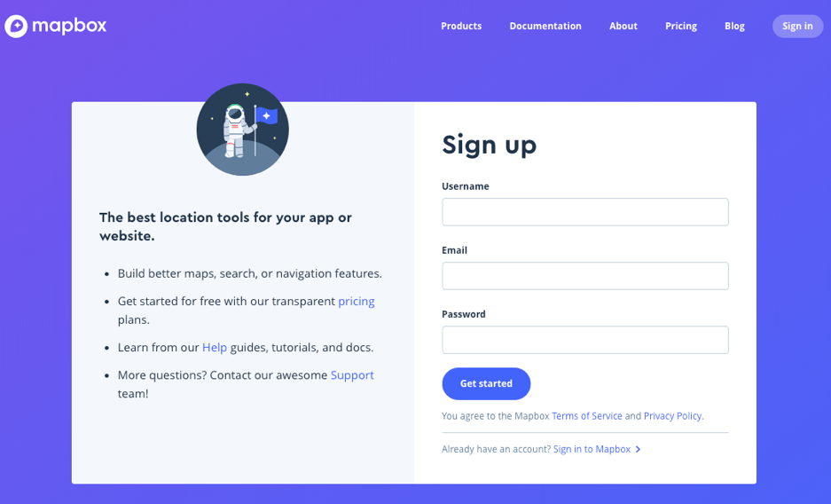
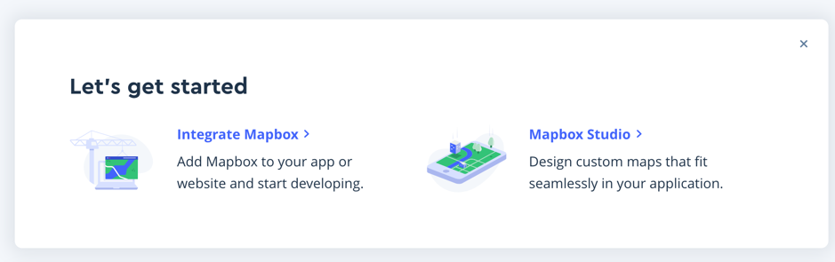
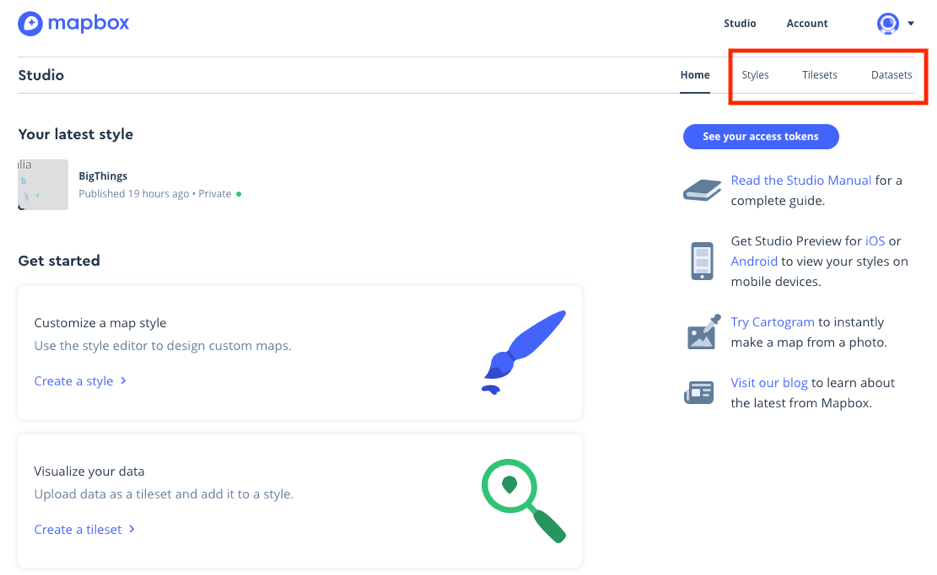
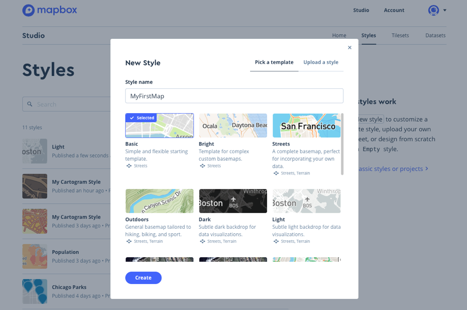
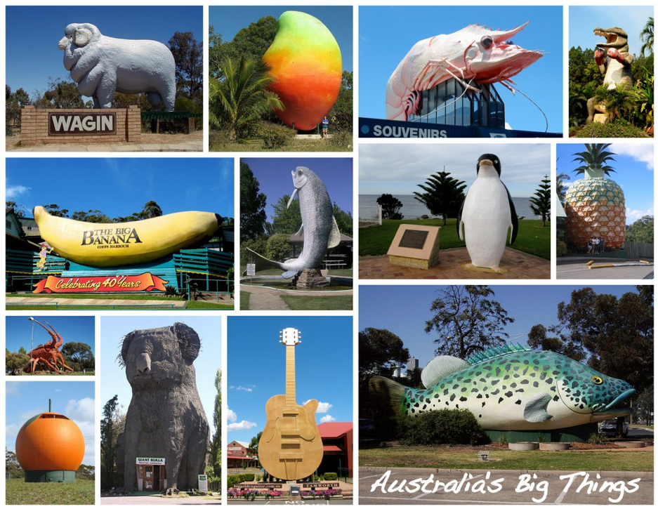
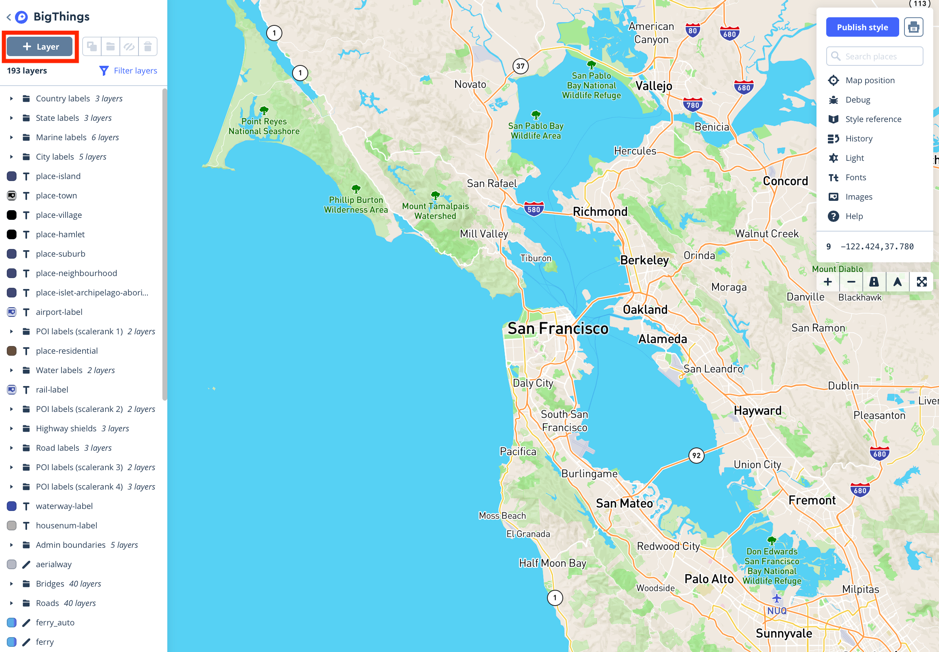
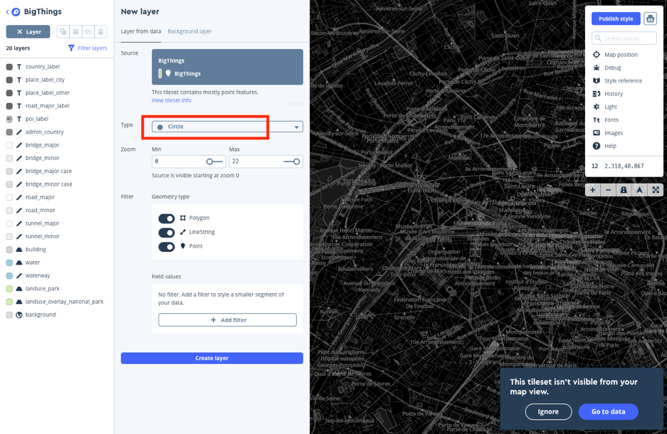
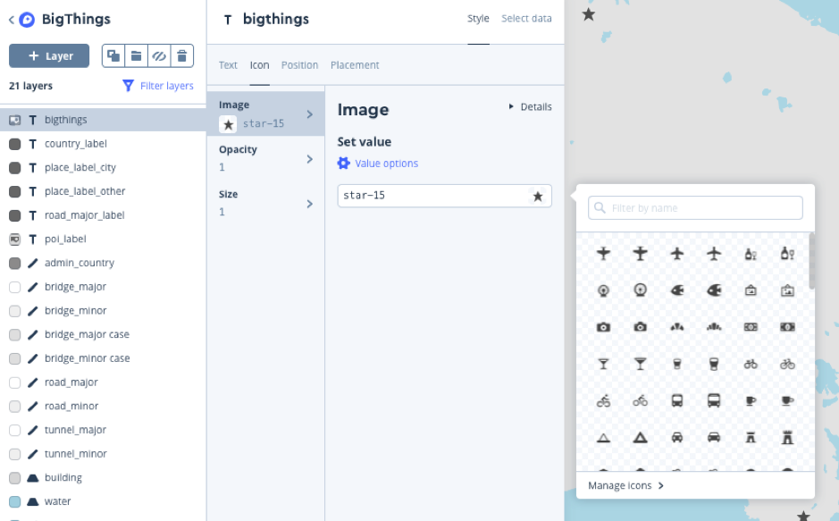
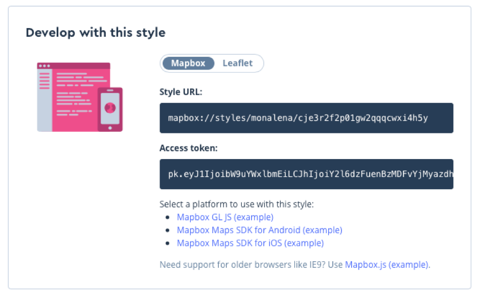

# Activity: Introduction to Mapbox 

## What is MapBox?

Founded only in 2010, Mapbox (https://www.mapbox.com) has quickly become the go-to place for custom designed maps. It is currently used in mobile and web applications like snapchat, lonely planet or airbnb. Building on open data sources like OpenStreetMap and NASA it offers an easy way to create highly customised maps to present your geospatial datasets. Via an access token Mapbox maps can be integrated into a webpage (explained here) but also in [public tableau](https://docs.mapbox.com/help/tutorials/tableau-integration/), [R applications (with leaflet)](https://rpubs.com/walkerke/rstudio-mapbox) or, since February 2018, into [Jupiter notebooks](https://github.com/mapbox/mapboxgl-jupyter).

## What do I need to do?

In order to use Mapbox you have to sign up. The Pay-as-you-go plan includes 50,000 free views of your web application as well as 5GB dataset storage and 50GB tileset storage, which is way beyond what we are going to do in our exercises. You then have access to Mapbox studio, where you can load default maps or customize maps to fit to your application. You can also load geospatial datasets to add markers. With a bit of Javascript, namely the Mapbox GL JS library, you can add interactivity to your maps. In the following exercises, we will first customize a map in two ways, then work with a dataset and finally include a map in a webpage. Note that while Mapbox studio runs in your browser in order to follow along with that last part of this tutorial you need to have a code editor (e.g. [atom](https://atom.io) or [brackets](https://atom.io)) installed.

## How do I sign up?

* Go to the Mapbox webpage: https://www.mapbox.com
* Click on ‘Get started for free’
* On the new page, sign up
<br>

* Once you’re done you will see this image:
<br>

* Click on the ‘Mapbox Studio’ link to get to your home page.
* You’re now ready to create beautiful maps!

## Mapbox Studio Intro

You are now on your home page of Mapbox Studio. Should you have already signed up before the tutorial and you are now logging on you probably first landed on your Account page. You can switch to Studio on the top left. In the submenu on the top right, you can switch to Styles, Tilesets and Datasets. It is time to find out how Mapbox Studio works!



Under the **Datasets** tab you can upload your own datasets. A dataset is an editable collection of GeoJSON features. It can be either a csv or a GeoJSON file which has to contain the geographical coordinates of your data points. You can also create a new dataset, edit your data and add or delete points. The uploaded dataset needs to be exported into a tileset so it can be used as a layer on a map. We will explore the datasets tab more in Exercise 2a.
<br><br>

Under the **Tilesets** tab you have access to some default tilesets but once you turn your own datasets into tilesets they will also be stored here. A tileset is a collection of raster or vector data broken up into a uniform grid of square tiles at 22 pre-set zoom levels. They are the main mechanism to determine map views (panning and zooming). We will be using the tilesets tab in Exercise 2b.
<br><br>

The **Styles** tab is where most of the magic happens. A style is simply a JSON object that contains all the rules for what features to draw on the web page and how to draw them. Each layer you add to a style in the Mapbox Studio style editor is added to this JSON object via the Styles API when you save and subsequently passed to the browser when the map is requested. Once created, you can keep your style hosted with Mapbox to serve to your map or you can download the JSON object as a document.

So, with styles you can control almost everything about the map and change details like the fonts, colors and icons. On a somewhat more technical level a map style consists of

* **sources**: links to all of the data that will be styled on the map. When creating a style with the Mapbox Studio style editor, sources are raster and vector tilesets in your Mapbox account
* **sprites**: a link to all of the images and icons that are used in the style
* **glyphs**: a link to all of the fonts that are used in the style
* **layers**: a list of rules for how the data in sources should be displayed on the map

Enough theory for now. Let’s get cracking

## Exercises

### 5.1a Create a customized map {-}

* Switch to the Styles tab and click ‘New style’. You have a number of templates to choose from. Choose ‘Basic’, call it ‘MyFirstMap’ and click ‘Create’.
<br>

* The Styles editor opens automatically. The Map shows the center of Paris. Zoom out to see a world view.
* On the left you see the list of the layers used in this style. Let’s change a few properties!
* Click the ‘water’ layer. In the color tab, click on the hex value (in the textbox under Set Value). Use the color picker to make the ocean a bit darker. Copy the value, click on the ‘waterway’ layer and change the color to the same hue.
* Click on the ‘background’ layer and again use the color picker to change the color to a light orange.
* To change the color of parks and national parks click ‘Filter layers’ and choose ‘Filter by value’, then ‘Colors’. Choose the light green color (#d2edae). This filters down to the two layers ‘landuse_park’ and ‘landuse_overlay_national_park’. Using Shift-Key, choose both. Change the color to a nice sappy green. Remove the filter.
* So much for the colors. Go ahead and change the color of the countries outlines (admin_country), roads (road_major and road_minor) or buildings if you want to.
* Now let’s change the country labels. Zoom out until you see the labels of countries and some major cities.
* Go to the ‘country_label’ layer and switch the Font to ‘Open Sans Extrabold’.
* Go to the Transform property and switch from Tt to T.
* Try changing other properties like the letter spacing, line height or halo.
* In Mapbox maps can also be styled according to the zoom level. This way the contrast between colors can be set different at high zoom levels and low zoom levels and the transition can be fluid. Go back to ‘background’. This time, go to ‘Color’ > ‘Value options’ > ‘Set value by zoom’.  You’ll see that the entire zoom range (0-22) is set to your color.
* Click on the color where Zoom level is set to 0 and choose a darker hue.
* Add another stop. By default, the new level is set to 19. Change it to 10. Change the color to a medium hue between the others (or be adventurous and switch to an entirely different color). Zoom in and out to see the effect.
* If you haven’t changed the buildings yet they might now look a little bland. Add a zoom to go with your other style changes. Note that buildings only show up at zoom level 15 or higher so you need to take that into account.
* Once you’re happy with your design you can save your map creation. Click ‘Publish Style’ at the top right corner.
* Use the slider (blue dot with arrows) to compare the default map with your own stylish map. Isn’t it beautiful!
* Click publish. Congratulations! You just saved your first map. Find it in the Styles section of Mapbox Studio.

### 5.1b Create a customized map using Cartogram {-}

Mapbox offers an easy and fun way to fit a map to the color values of a logo or image.

* Go to the Home tab. From the list on the right side, click ‘Try Cartogram’. Click on the ‘center’ icon (on the top right) and allow Mapbox to automatically zoom to your current location.
* Download the [seal image](diagrams_datasets/section7/Seal.jpeg). Drag it onto the image on the bottom left corner of the browser.
* Pretty brownish. Switch from ‘Colorful’ to ‘Light’ and ‘Dark’. Not much better. Needs some customizing!
* Switch to ‘Custom’. On the seal image drag around the circles for water, land, building, label and road until you’re happy with the map.
* Click on ‘Saved style!’ to get back to Mapbox studio where your new style is waiting for you.
* Additional: Try your own image.
* Additional: Discuss why cartogram is not a good name for this service.

### 5.2a Work with your data {-}

Australia is big. And things are big in Australia. You could even say that big things are a thing here. It is estimated that there are about 150 ‘Big things’ to be seen on Australian roads.



Let’s use my personal Top Ten for the next exercise:

* Download the dataset [BigThings.txt](diagrams_datasets/section7/BigThings.txt) (**Please change the file name to “BigThings.geojson”**).
* In Mapbox studio go to the Datasets tab and click ‘New dataset’, then ‘Upload’
* Drop the **BigThings.geojson** into the panel and confirm, then create (keep the name)
* Click at the data you just created

Now we can start editing:

* Let’s add another data point to the set. One pretty big thing is still missing from the map, Australia’s biggest rock. On the top right, type ‘Uluru’ into the search box, then select ‘Uluru, Uluru-Kata Tjuta National Park, Northern Territory, Australia’.
* On the top left, click the first tab ‘Draw a point’.
* Bring the cross hair over ‘Uluru (Ayers Rock)’ and click. A yellow dot appears. You have added a data point.
* Now add some properties. Click ‘+ Add property’, then name the field ‘title’ and the value ‘Uluru’. Note that fields are case sensitive and you have to enter ‘title’ in lower case letters (otherwise your tooltips will not work properly later).
* Add a second property, name the field ‘description’ and the value ‘A giant rock’
* Then save the changes (by clicking the “Save” button on the right top).

<br><br>

You’ve just saved a point to a map without downloading and installing special GIS software that might not even run on your system (ArcGIS only runs on Windows). How fantastic is that!

<br><br>

In this exercise we will only set a point, but note that you can also draw a line or a polygon and mark up maps just as you need it. Under ‘search dataset’ you can navigate your data points and access and change the properties you have set again. You can also export your work as a geojson file to use somewhere else.

### 5.2b Add the data points to your custom map {-}

* Now click ‘Export’ to export your data as a tileset. This can take a little while and the notification pop up will tell you when the new tileset is uploaded.
* You can directly click on the ‘BigThings’ tileset in notifications but you will also find it in your tilesets tab.
* To bring your new tileset onto a map you have to create a new map first and then add a new layer with the tileset as a source.
* Switch to Styles tab, click ‘New Style’, call the new style ‘BigThings’ and choose ‘Streets’. Create the style.
<br>

* Now click the ‘+ Layer’ button. Then, next to ‘Source’, click into the field to select your ‘BigThings’ tileset (you might need to scroll down a bit).
* The new style shows up on a dark map by default.
<br>

* The data points are shown as Type > Circle. That works, but we will change it to ‘Symbol’ so we can add an icon later. Create the layer.
* Voila! You’ve just added your own data points to the map. They show as a new layer on top of all other layers on the list to the left.
* Now pan and zoom to Australia. The data points are not showing on the map yet! That’s because we switched to a text field. Let’s add an icon to mark our big things.
* If you’re not there already, click the ‘bigthings’ layer and go to ‘Style’. If you created your map with circles you can still switch to ‘Symbol’ on the ‘Select data’ tab.
* Go to the second tab ‘Icon’ > ‘Image’ and click into the text box (under ‘Value’ options).
<br>

* Note that if you click ‘Manage Icons’ you can upload your own markers in SVG format.
* As before, click ‘Publish style’, use the slider to compare your work, then press ‘Publish’.
* In the next pop up window, go to ‘Share, develop, and use your style’.
* You are now back in the Styles tab. When you scroll down a little under ‘Develop with this style’ you can see a Style URL and an Access token. We will need both of them to make your map interactive in the browser in the next part.
<br>


### 5.2c Make your pointers interactive {-}
In this final part of the exercise you will

* show your map in a browser window
* add tooltips to your map so it will display some information when a marker is clicked

For this part, we will use a text editor to add some information to a HTML file. We will give you a proper introduction to HTML, CSS and Javascript in a later tutorial so for now just follow along with this exercise.

* Install a code editor if you haven’t one on your machine already. I like atom, but any editor will do. Of course, you can also use an IDE like webstorm should you be familiar with one.
* Download the [mapbox-activity-index.html](diagrams_datasets/section7/mapbox-activity-index.html) file.
* Open it in your editor.
* Now copy your access token from the Styles tab in Mapbox. You can also always find your access token on your Account page.

In your text editor, replace the String (in bold) in the line

mapboxgl.accessToken = '<mark class="yellow">pk.eyJ1IjoibW9uYWxlbmEiLCJhIjoiY2l6dzFuenBzMDFvYjMyazdhcWMwd2dsMCJ9.xlKLbnrGSgAjxHLOM6JbVw</mark>';

with your own access token

* Then copy your style URL (from the drop-down menu to the right of your style) and also replace the string ‘<mark class="yellow">your-style-URL-here</mark>’ in the line


```javascript
style: 'your-style-URL-here' // replace this with your style URL
```
* Save the file and double click to open it in a browser. You should now see the map with your markers (sometimes it takes a bit of time to load).

Let’s add our tooltips.

* In your editor, add the following code right above the </script> tag
* and replace the string ‘<mark class="yellow">layer-name-here</mark>’ with the name this layer has in your styles editor (if you followed along with this exercise it is probably ‘<mark class="yellow">bigthings</mark>’).


```javascript
map.on('click', function(e) {
  var features = map.queryRenderedFeatures(e.point, {
    layers: ['layer-name-here'] // replace this with the name of the layer
  });
  if (!features.length) {
    return;
  }
  var feature = features[0];
  var popup = new mapboxgl.Popup({ offset: [0, -15] })
    .setLngLat(feature.geometry.coordinates)
    .setHTML('<h3>' + feature.properties.title + 
               '</h3><p>' + 
               feature.properties.description + 
               '</p>')
    .setLngLat(feature.geometry.coordinates)
    .addTo(map);
});
```
* We are using a couple of different mapbox GL JS functions here.
    + The on-click function listens for a click event
    + The queryRenderedFeatures method generates a list of all points and their associated properties
    + The mapboxgl.Popup method is used to create the tooltip
* Save and refresh your browser.
* **Click** on a marker. Tooltips!

<br><br>

This is but a brief introduction to Mapbox and there are many more things you can do with it. If you want to find out more you could

* Work through this 2-part tutorial on [how to create a choropleth map](https://www.mapbox.com/help/choropleth-studio-gl-pt-1/).
* Consult the [Mapbox GL JS manual](https://docs.mapbox.com/mapbox-gl-js/example/simple-map/) for more advanced browser display options.


