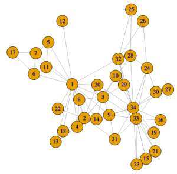
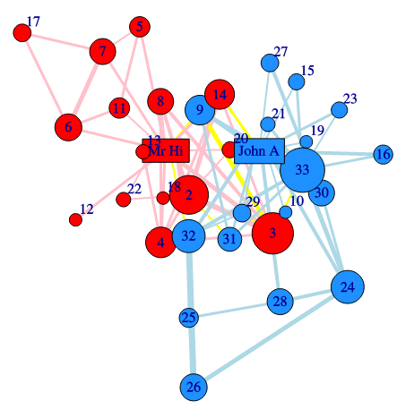
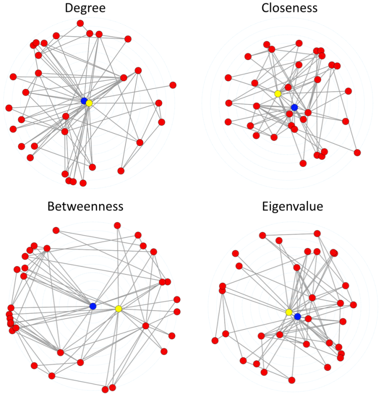
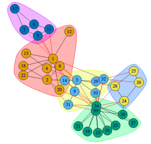
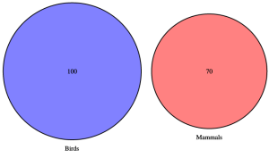
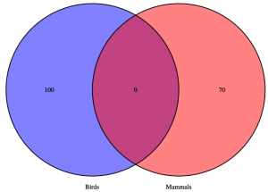
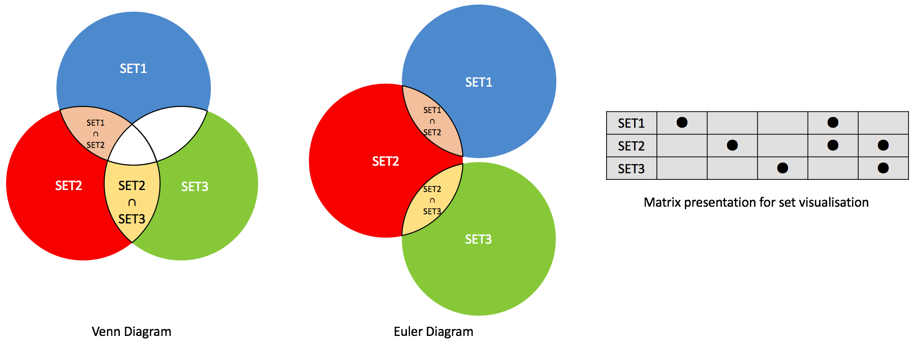

# Network analysis and visualisation

Networks are well-suited to modelling abstract relationships between entities. _Social networks_ (or _sociograms_) are one of the best known kinds of networks,  these model communities and show the strength of connection between different people in the community. Networks are also common in software engineering where they are used to show the structure of software or its execution,  and in the life sciences where they are used to model processes, for instance metabolic pathways.

Please take a look at the TED Talk by Nicholas Christakis on the [The hidden influence of social networks](https://www.ted.com/talks/nicholas_christakis_the_hidden_influence_of_social_networks?language=en) (21 min) to see great examples of social network analysis and visualisation.

Our running example in this topic will be the “karate club network” of Zachary. This shows the amount of social interaction between members of a karate club during the time the club split into two clubs because of differences between one of the head teachers and the administrator.

And here is the network laid out to show the two factions (Mr Hi, ‘1’ and John A, ’34’) with connections within factions shown in red or blue and  inter-faction connections in yellow. The width of each edge is proportional to the strength of interaction and the size of the vertex is proportional to the total width of the edges entering it. (from: https://github.com/kolaczyk/sand)

Networks are becoming a much more common way of organising data because of the rise of  graph databases such as [Neo4j](https://en.wikipedia.org/wiki/Neo4j). While traditional relational databases support tabular data, graph databases support networks. Graph databases have the advantage that they scale up to larger data sets and are less rigid allowing data to be stored in more ad hoc relationships which can evolve over time.

## Some terminology

Networks are formalised as  multivariate graphs or networks. These have _nodes_ (also called _vertices_) which correspond to entities such as people or businesses, _edges_ (sometimes called arcs) which connect two nodes and which represent a relationship such as “is-an-employee” and _attributes_ or _properties_ of either nodes or edges such as “years-employed” or “age.” The edges are said to be _weighted_ if they have a strength or magnitude.

A network is _dynamic_ if it changes over time.

The network is _directed_ if the edges have a direction: a diagram showing  the inheritance relationship between classes in C++ or Java code is an example of a directed network. The karate club is an example of an undirected network.

The _neighbours_ of a node are the nodes that are connected to it by a single edge. A path between two nodes is a sequence of edges between the two of them.  It is the _shortest path_ if it has the least length. The length of the shortest path between two nodes is the (_graph-theoretic_) _distance_ between them. In a social network this is called the _degree of separation_. The _diameter_ of a network is the longest shortest path between any two nodes in the network. Two nodes are _connected_ if there is a path between them, otherwise they are _unconnected_. A path is _directed_ if the edges in it are directed and flow from the start to the end of the path.

One apparent limitation of a network is that it can only represent binary relations. A network in which edges can connect more than two edges is called a _hyper graph_ and the edges are called _hyper edges_. However, it turns out that for most practical purposes hyper graphs are unnecessary as they can be modelled using a standard binary edge network by introducing a new node corresponding to each hyper edge and linking this node to each of the original nodes connected by the hyper edge using a binary edge.

## Network visualisation

The most popular way of representing a network is using a _node-link diagram_ like that showing the karate club social network. These place the nodes on the drawing canvas and use lines between them to represent edges. The edges are typically drawn as straight lines but can be curved edges, have multiple straight-line segments,  or be drawn using only horizontal and vertical segments in the style of a electrical circuit.

Creating a good node-link diagram is not easy. Edges should not cross nodes and a good diagram should try and reduce edge crossings, have straight edges, have roughly uniform edge length, show symmetry and the graph structure. Unfortunately these criteria conflict so there is a trade-off between them. Furthermore, even optimising one of the criteria such as reducing edge crossings is an NP hard problem so automatic network layout is computationally a very hard problem.

Fortunately many different layout algorithms have been developed for node-link diagrams. The most common approach are the so-called _force directed approaches_. Many are loosely based on a physical model of the network in which the nodes are spheres that repel each other and the edges are springs with a natural length that connect the spheres. The layout is found by using optimisation to find a placement for the nodes that minimises the total energy in the physical model. Closely related are _multi-dimensional scaling (MDS)_ based approaches. In this approach the distance between each pair of nodes is set to be the graph theoretic distance between them: thus if they are neighbours the distance is 1. If there are $N$ nodes then this gives a distance between all of the nodes in $N$ dimensional space. To find the network drawing MDS techniques are used to project this space onto two dimension so as find the placement that best preserves this graph theoretic distance. The Kamada-Kawai algorithm is an MDS approach that uses a force directed algorithm to find the positions. It was used for the above layouts.

Force-directed and MDS-based approaches place the nodes anywhere in the plane. Other drawing styles restrict the placement options. In a _chord diagram_ the nodes are placed on the perimeter of a circle and connected by internal curved edges while in an _arc diagram_ the nodes are placed on a line but also connected by curved edges.

In the case of networks with directed edges it is common to use some kind of _layered diagram_ in which the edges are aligned in bands and edges that (generally) flow from left-to-right or from top-to-bottom. A variant are _radial network diagrams_ in which the edges radiate outwards from a central node and the layers are concentric circles.

Representing networks using some kind of node-link diagram is by far the most popular way of showing the network. Node-link diagrams have the advantage that most people are familiar with them and for small networks they support many of the abstract tasks that are important for network data such as finding paths between nodes or understanding the structure. However for larger networks, particularly for networks that are dense in the sense that they have lots of edges, edge crossings and general edge clutter make it difficult to understand the network structure and to distinguish edges. While techniques like edge-bundling or grouping nodes with common edges in so-called power graphs reduces this clutter, after a certain network size and node density, node link diagrams are very difficult to understand.

An alternative visualisation which has the advantage of scaling to larger networks is the _adjacency matrix_ representation. If there are $N$ nodes than the matrix is N x N and the entry in cell $(i,j)$ if there is an edge from node $i$ to node $j$.  Of course for undirected networks the matrix will be symmetric so only one of the diagonal halves needs to be shown.

For the adjacency matrix representation to be effective the rows and columns should be reordered so as to place connected nodes next to each other and to try and create rectangular “blobs.”  To preserve the reader’s orientation the row and column ordering should be consistent. With this representation tightly connected clusters can be seen as “blobs” down the diagonal. The disadvantage of the adjacency matrix representation is that, at least for small graphs, it does not show the overall structure as clearly, it is difficult to find paths between nodes, and it is unfamiliar to most people. On the other hand it has the great advantage that edge clutter is completely removed.

## Network analytics

There are a number of common statistical measurements for characterising the structure of the network and the importance of nodes and edges.

One fundamental measure is the $degree$ of a node. This is the number of edges incident to the node  (or equivalently the number of neighbours). We can plot the distribution of the node degree. In the case of weighted graphs, node degree is generalised to $node strength$ which is the sum of the weights of the incident edges.

The frequency of node degree can give insight into the underlying graph. _Scale-free networks_ are a common kind of network in which the degree distributions follows a power law. In other words the number of nodes having degree k in the network is proportional to $k^{−λ}$ where $λ$ is typically between 2 and 3. The network of citations between scientific papers forms a scale free network, with some papers being massively cited.
 
Another interesting class of networks are the so called _small-world networks_. In these networks the average distance between two nodes grows logarithmically in the size of the network rather than linearly. Social networks are often claimed to be small-world networks as almost everyone has friend or a friend of friend in common. Many small-world networks are scale-free.

#### Centrality {-}
A major focus in network analytics is to measure the importance or _centrality_ of a node n. There are a variety of approaches:

* The simplest measure is the _degree_ of n: the higher the degree the more important $n$ is.
* _Closeness centrality_ captures the idea that a node $n$ is central if it is close to many other nodes: this measure varies inversely with the total of the node’s graph theoretic distance to all other nodes in the graph.
* _Betweenness centrality_ summarises the extent to which the node $n$ lies between the other nodes: it is based on counting the number of shortest paths that pass through $n$.
* Status or rank centrality is based on the assumption that a node is more important if it has important neighbours. These are found using eigenvalues and eigenvectors.

If you are exploring node centrality it is common to use a node-link diagram in which nodes are placed radially with the nodes of most centrality at the center.

We can also consider the centrality of an edge $e$. Here the most obvious measure is _betweenness centrality_: this is the number of shortest paths that pass through $e$.

#### Network cohesion {-}

Another major focus in network analytics is _network cohesion_. This basically investigates how tightly connected the graph is.

* One approach is to measure the number of highly connected sub-graphs. A _clique_ is a subset of nodes for which there is an edge between each pair of nodes in the subset while a _bi-clique_ is two subsets of nodes such that every node in each subset has an edge to the nodes in the other subset. One network analytic measures the number of different sized cliques and bi-cliques in the network. Closely related is the _k-core_: a subset of nodes in which each node has at least $k$ edges to other nodes in the subset.
* *Density* captures the frequency of actual edges compared with the total number of edges. The density of a subgraph is $\frac{M}{N*(N-1)/2}$ where $M$ is the number of edges and $N$ the number of nodes.
* The _clustering coefficient_ measures the frequency in which  sub-graphs with 3 connected nodes are actually cliques, i.e. there is an edge between all 3 nodes.
* *Vertex* and *edge connectivity* measure how many nodes or edges need to be removed from a connected network before it is disconnected.

#### Assortative mixing {-}

Assortative mixing looks at how the attributes of a node affect the kinds of node it is linked to. For instance, in a social network this might reveal that gender affects friendship and that men are more likely to be friends with men and women with women. If the nodes can be divided into $K$ categories based on their attribute values then assortative mixing computes the assortativity coefficient for each pair of categories. This ranges between $-1$ and $1$. It is $0$ if the category does not affect the frequency of edges and $1$ if edges only occur between these two categories.

#### Graph clustering and partitioning {-}

The final focus in network analytics is how to cluster the nodes in a graph. This is also called _community detection_. The aim is to partition the graph into subgraphs so that each subgraph is highly connected while the subgraphs are loosely connected.

* *Hierarchical clustering* techniques can be used for this. One approach is to identify small highly connected subgraphs and then repeatedly merge the most highly connected subgraphs. This produces a hierarchy of nested partitions for which a dendrogram can show the hierarchy and the “connectedness”  between sub-components.
* *Spectral partitioning* uses eigenvalues to recursively split the graph into smaller components.

Clustering plays an important role when exploring networks but the results should always be visualised to see if they make sense and also if analysis of the attributes etc can help to explain the partitioning.

The “karate club network” with clustering. From: http://igraph.org/r/doc/communities.html

## Trees and hierarchies

_Trees_ are a common kind of network in which there are no cycles, i.e. there is at most one path between each pair of nodes. If the edges are directed then the tree is called a _hierarchy_, In a true hierarchy for each node $n$ there is at most one node $m$ with an edge from m to $n.m$ is called the parent of $n$. An organisation structure is often a hierarchy as is the subclass relationship when multiple inheritance is not allowed.

There are a number of quite different ways of drawing hierarchies. These rely on different visual or spatial relationships for showing the parent relationship. One of the most common ways is to use an indented list: file directories are often shown like this.

One example of a layered tree that we have met throughout this unit is the [dendrogram](https://en.wikipedia.org/wiki/Dendrogram). They are widely used to show similarity between hierarchical clusters with the vertical distance between parent and child proportional to their difference. [Cladograms](https://en.wikipedia.org/wiki/Cladogram) are very similar to dendrograms but show the evolutionary history of related species.

However using lines to show the parent relationship  is not the only possible visual metaphor. Icicle plots and sunburst plots use adjacent overlap to indicate the parent relationship while tree maps use spatial containment. Tree maps are widely used to show hierarchically organised quantitative data, with the size of the rectangle being proportional to the data value. While they are visually appealing we have found that using an indented list with an associated bar chart also works quite well and is easier to navigate around.

Containment is commonly combined with node-link representations when showing networks whose nodes have a hierarchical structure. This structure might be given or inferred by network clustering.

## Flow diagrams

Networks are also used to show flow and processes. [Flow diagrams](https://en.wikipedia.org/wiki/Flow_diagram) show the steps or events in a process. An example of flow diagrams are flow charts. These were once widely used to show flow of control in algorithms and business processes.

Another kind of flow diagram is the Sankey diagram which shows the amount of flow between different processes using variable width arrows or lines where the width is proportional to the amount of flow. They are similar to flow maps except that flow is between abstract entities rather than geographic locations.

One problem with Sankey diagrams and other flow diagrams is that, like all node link diagrams, for large dense networks the diagram becomes cluttered and confusing because of edge crossings and overlap. In such cases matrix representations may be a better approach. Recent research in this area has investigated matrix representations like MatrixWave for showing abstract flow and MapTrix for showing flow between geographic locations.

## Set visualisation

An important class of abstract relationships are based on set containment. Specialised kinds of diagrams have been developed to show the relationship between sets and their union and intersection. The best known are Venn and Euler diagrams. These use spatial containment to represent set containment.

Venn diagrams differ from Euler diagrams in that the diagram must contain all possible set intersections, with shading showing which intersections are empty. Euler diagrams do not show empty set intersections. In proportional area Euler diagrams the size of the regions is proportional to the data quantity, such as number of members or probability. These are used in medicine.

Proportional area Euler diagram with no intersection (100:70)

Like node-link representations for networks Venn and Euler diagrams are intuitively easy to understand and allow small data sets to be readily understood. However once the number of sets increases they are difficult to draw and become extremely difficult to understand. Again a more abstract matrix representation provides a scalable alternative but one that is unfamiliar to most people. This matrix representation is the _linear diagram_. There is a row for each set and a column for each non-empty intersection of sets. The column width can be set to the size of this intersection.

Here are the same 3 sets drawn using these three different representations.

## Summary

In this topic we have investigated the main kinds of visualisations for showing abstract data such as networks, hierarchies, control and process flow as well as set relationships. Most of these visualisations rely on using some kind of visual or spatial metaphor for the abstract relationship. For instance node-link diagrams using a line to show two entities are connected while Euler diagrams use spatial containment to show set containment.

The use of such visual and spatial metaphors means that the visual representations are intuitive and easy to understand. However these metaphors may not scale well to larger data sets. For larger data sets matrix based representations like the adjacency matrix for networks are often better. Their main disadvantage is that they are unfamiliar to most readers.

We have also looked at clustering and common statistical measures such as centrality and cohesion for understanding networks. These are an important part of the data scientist’s toolbag. Originally developed for social networks they are useful in understanding the rich and complex interrelationships between more abstract data.

***

FURTHER READING

Take a look at the TED Talk by Manuel Lima. [A visual history of human knowledge](https://www.ted.com/talks/manuel_lima_a_visual_history_of_human_knowledge) on the history of tree and network visualisation which contains some really beautiful visualisations.

This topic is based upon

Eric D. Kolaczyk and Gábor Csárdi. _Statistical Analysis of Network Data with R_. Springer 2014

Kerren, Andreas, Helen C. Purchase, and Matthew O. Ward (Eds). _Multivariate Network Visualization_. Springer International Publishing, 2014.

Ward, Matthew O., Georges Grinstein, and Daniel Keim. Chapter 9 of _Interactive data visualization: foundations, techniques, and applications (2nd Ed)_. CRC Press, 2015.

Munzner, Tamara. Chapter 9 of _Visualization Analysis and Design_. CRC Press, 2014.

