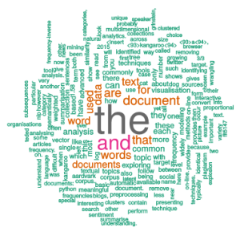
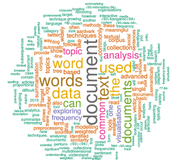
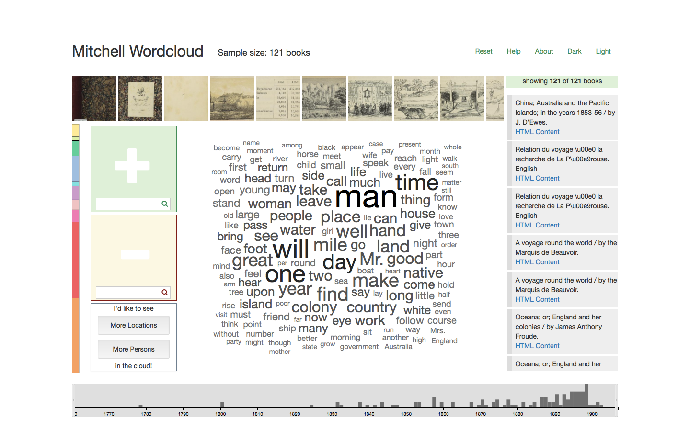

# Exploring text and document collections

Text analysis and mining is an increasingly important part of the data scientists job. The good news is that there is a lot of easily accessible data.  Social media is one of the fastest growing data sources in the world. The first tweet was sent in March 2006 and by late 2015 about 500 million tweets a day are being sent. As well as twitter feeds, blogs, email, wikis, on-line news articles, web pages are ever growing sources of on-line text. The other big reason for the explosion in textual data is that libraries, governments and organisations are digitising their archives and placing the content on-line. There is now a mind boggling amount of really interesting textual data available on-line.

Please look at Jer Thorp’s TedEd talk on [Visualizing the world’s Twitter data](https://ed.ted.com/lessons/mapping-the-world-with-twitter-jer-thorp) (6 min) to see some of the potential.

Now the bad news. Virtually all text is designed to be read by a human, not understood by a computer. Text is complex and only partially structured. This makes data analysis difficult and typically requires significant data wrangling before the analysis can start.

Because of the complexity of text wrangling and text mining we cannot hope to fully cover this subject here. We provide only a brief introduction to the most commonly used methods and techniques. However we do give references to more advanced treatments.

## Preprocessing

When you read text in there are a number of basic preprocessing steps that you will probably need to do

* remove punctuation
* remove numbers
* convert to lower (or upper) case
* expand contractions like “it’s”
* remove “stop words.” These are common words that have little meaning and include “a”, “the”, “and” and so on.
* recognise compound words like “New Zealand” or “data science” and mark these to be treated as a single word
* stem words by removing common word endings such as “s” or “ed” or “ing.”

More advanced preprocessing will perform spelling correction and slang replacement.

## Exploring single documents

The most basic analysis is to count the frequency of terms in the document by which we mean those words left after stemming and removing stop words and contractions.

All the usual visualisations can be used to show term frequency. One common visualisation that is unique to text is to generate a _word_ or _tag cloud_. These show the term itself with a size proportional  to its frequency and are an oddly compelling way of summarising a document.

Another visualisation used to explore words in a single document is the word tree. The visualisation is centered on a target word chosen by the viewer. On the right side of the target words are arranged in a tree rooted on the target. The tree shows the most common sequences of words that follow the target word in the document. The first level shows the words that immediately follow the target with size proportional to how often they follow it. The next level shows the words that commonly follow these subsequences of two words and so on. A tree on the left can similarly be used to show the common word subsequences that precede the target.

Natural language Processing (NLP) techniques can be used to convert unstructured text into more structured data suitable for more advanced analytics.

_Sentiment analysis_ aims to extract the attitude of the speaker or writer to the topic they are writing about. Generally this is classified as being positive, negative or neutral. Sentiment analysis is widely used by companies to track how they and their products are being written about in on-line reviews and social media.

_Named entity recognition (NER)_ identifies the words in the text that refer to proper names such as places, organisations or people and which category the name is in.

_Automatic summarisation_ can be used to get the gist of an article across in a few sentences or paragraphs. Extraction based methods do this by identifying the most important words, phrases and sentences in the document and presenting these in the summary. Abstraction based summarisation methods rely on more advanced NLP to perform a semantic analysis of the document and then summarise this abstract understanding. Search engines like Google use automatic summarisation when presenting search results.

## Exploring a document corpus

Often there is a collection of documents to understand. Such corpuses can be huge. One common task is to try and understand which documents in the corpus are _similar_. An extreme form of document similarity is when the documents contain near identical chunks of text. Fast algorithms for detecting shared sentences and paragraphs have been developed for _plagiarism detection_.

Apart from the special case of plagiarism detection the most widely used techniques for measuring document similarity  are based on computing a vector of weighted word frequencies for each document. The same set of words is used across the document corpus.  The distance between the document vectors gives the similarity between the two documents: 0 means they have an identical vector. One very common way to compute the weighted word frequency for word w in a particular document is using $tf-idf$ which stands for term frequency-inverse document frequency. This is defined to be $ft-idf(w) = tf(w) * \log(\frac{N}{df(w)})$ where $tf(w)$ is the frequency of w in the document, $N$ is the total number of documents and $df(w)$ is the number of documents that contain w. Thus the number of occurrences of a word w is weighted by how unusual the word is in the collection. This captures the intuition that less common words provide a better way of distinguishing between documents.

As an example consider the vector based on the words “cat”, “dog”, “aardvark”, “kangaroo” and that these have the following frequencies in three documents:

| Document | cat | dog | aardvark | kangaroo |
|:--------:|:---:|:---:|:--------:|:--------:|
|     A    |  3  |  4  |     0    |     0    |
|     B    |  2  |  3  |     3    |     0    |
|     C    |  1  |  0  |     0    |     1    |

The inverse document frequency for each word is

| Document |       cat       |         dog        |    aardvark    |    kangaroo   |
|:--------:|:---------------:|:------------------:|:--------------:|:-------------:|
|    idf   | $0 = \log(3/3)$ | $0.58 = \log(3/2)$ | $1.58 = \log3$ | $1.58 =\log3$ |

and so the vector for each document is

| Document | cat |  dog | aardvark | kangaroo |
|:--------:|:---:|:----:|:--------:|:--------:|
|     A    |  0  | 0.44 |     0    |     0    |
|     B    |  0  | 1.74 |   4.74   |     0    |
|     C    |  0  |   0  |     0    |   1.58   |

Note how the word “cat” has been effectively ignored because it occurs in all documents in the collection while the less common words “aardvark” and “kangaroo” are highly weighted.

The weighted term frequency vector provides a multidimensional quantitative description for each document and the techniques we have previously discussed for exploring and analysing multidimensional tabular data can be used to understand the document corpus. Most common is to use clustering techniques to group documents or to use dimension reducing techniques like MDS or SOMs to visualise the collection space.

_Topic modelling_ is another common technique for exploring a document corpus. The basic approach is to go through all of the documents in the corpus and identify clusters of words that frequently occur close to each other. These clusters are called topics and the assumption is that they have some semantically meaningful connection with each other. A technique called _Latent Dirichlet Analysis_ is used to do this.  Once the topics are identified the data scientist can check that they do form semantically reasonable categories, give each topic a meaningful name if they like, and then analyse the document corpus by identifying the topics that each document covers. Documents can then be clustered or visualised based on topic similarity.

Blei  (2012) gives an example of topics that were identified from articles in the Science journal. One topic contained the words “computer”, “models”, “information”, “data”, “computers”, “system”, “network”, “systems”, “model”, “parallel”, “methods”, “networks”, “software.” This collection of words was identified purely on the grounds that they commonly occur near each other, yet it is clear they are semantically related and belong to a meaningful category that a human might label as “computing.”

Topic modelling is also used to look at dynamically changing document corpuses. It can reveal how the choice of topics evolves over time. A [stream graph](https://en.wikipedia.org/wiki/Streamgraph) is often used to show these changes.

Document summarisation is also used with collections of documents and can, for instance, be used to summarise all of the documents about a particular topic.

## Explorative Interfaces

One interesting application of interactive data visualisation is for providing on-line interfaces to  digital document collections that move beyond traditional Boolean search. Such interfaces should provide an overview of the collection and entice members of the general public to explore the collection, allowing serendipitous discoveries.

In a recent Masters project Monika Schwarz designed such an on-line interface for the David Scott Mitchell collection of the State Library of New South Wales. A central word cloud shows the most prominent words of the collection. Words from the cloud can be dragged into containers to make a positive or negative selection. The title list to the right shows a ranked list of titles based on the selection criteria and also offers preview word clouds for individual books and access to the digitised book. The image line on top shows the images from the ranked list or an individual book. The time line at the bottom shows the publication years of the books while the bar to the left uses the Dewey classification system to provide orientation within a collection. All the elements of the application are manipulable and linked providing an engaging responsive  experience.

## Text analysis tools

There are a wide variety of tools available for text analysis. Unfortunately there is no single best tool as the tools typically only offer only a subset of more advanced text analysis like topic modelling or automatic summarisation. Here is a very partial list:

* Both R and Python have libraries for text analysis. The most widely used R library is [tm](https://cran.r-project.org/web/packages/tm/vignettes/tm.pdf) and in Python it is the powerful Natural Language Toolkit ([NTLK](http://www.nltk.org)).
* SAS Visual Analytics and Tableau both provide simple text analytics.
* The Java-based [Stanford NLP tools](https://nlp.stanford.edu/software/) are widely used.
* There are also a variety of specialised commercial tools.

## Conclusion

Text from social media, blogs, newspaper articles and other online documents provides an amazing source of data for the data scientist. By analysing twitter feeds they can see what are the hot new topics. However textual documents are one of the most difficult kinds of data sources to work with. Here we have only scratched the surface and you are encouraged to go and read more.

*** 

FURTHER READING

An interesting place to start is the [Text Visualisation Browser](http://textvis.lnu.se) which provides an interactive visualisation tool for exploring the collection of papers about text visualisation techniques.

Also see

Ward, Matthew O., Georges Grinstein, and Daniel Keim. Chapter 10 of _Interactive data visualization: foundations, techniques, and applications (2nd Ed)_. CRC Press, 2015.

You can read more about topic modelling in

Blei, David M. Probabilistic topic models. _Communications of the ACM 55(4 )(2012): 77-84_. Available from http://www.cs.princeton.edu/%7Eblei/papers/Blei2012.pdf

***

