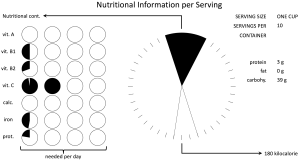

# Activity: Effective graphic design

The phrase ‘effective graphic design’ begs the question ‘effective for whom and for what?’.

Any graphic design must:

* Be usable by the user given her or his knowledge and abilities. Most people will be able to comprehend a common graphic such as a line graph or a table of data. However other forms of representation such as set diagrams (e.g. Euler’s circles) are unfamiliar to many people, moreover some forms of representation are highly domain-specific e.g. [cladograms](https://en.wikipedia.org/wiki/Cladogram) are pretty much exclusive to biology and are only familiar to specialists.
* Be suited to the task the user needs to perform with the representation. There are many kinds of tasks – a user might be searching, comparing, spotting an intermittent event (vigilance), seeing trends, making inferences or deductions, discovering, [assembling furniture](https://www.tc.columbia.edu/faculty/bt2158/faculty-profile/files/plesforvisualization_Revealingandinstantiating.PDF) (e.g. Chapter 3 of Munster, also [Amar & Stasko, 2004](http://www.cs.kent.edu/~jmaletic/cs63903/papers/Amar04.pdf); [Wehrend & Lewis, 1990](https://dl.acm.org/citation.cfm?id=949553)).

So lets go back to the proposed nutritional display graphic

What I want you to do is think about

1. Who is going to be using this graphic and what is their background?
2. For what task(s) are they going to look at the graphic and what is the context?

Now based on the material you have read

1. Come up with  three or four alternative designs which you think are better. One should be black-and-white, the others can use colour. You may want to use the [Five Design Sheet methodology]().
2. Evaluate the quality of these designs in terms of the principles given in Effective Communication and the perceptual and cognitive characteristics given in The Human Visual System. Rank them.

***

FURTHER READING

Munzner, T. (2014) Visualisation, analysis and design. CRC Press

[Hegarty, M. (2011) The cognitive science of visual-spatial displays: Implication for design. Topics in Cognitive Science, 3, 446-474.](http://onlinelibrary.wiley.com.ezproxy.lib.monash.edu.au/doi/10.1111/j.1756-8765.2011.01150.x/abstract)

Kosslyn, Stephen M. _Graph design for the eye and mind_. Oxford University Press, 2006.

