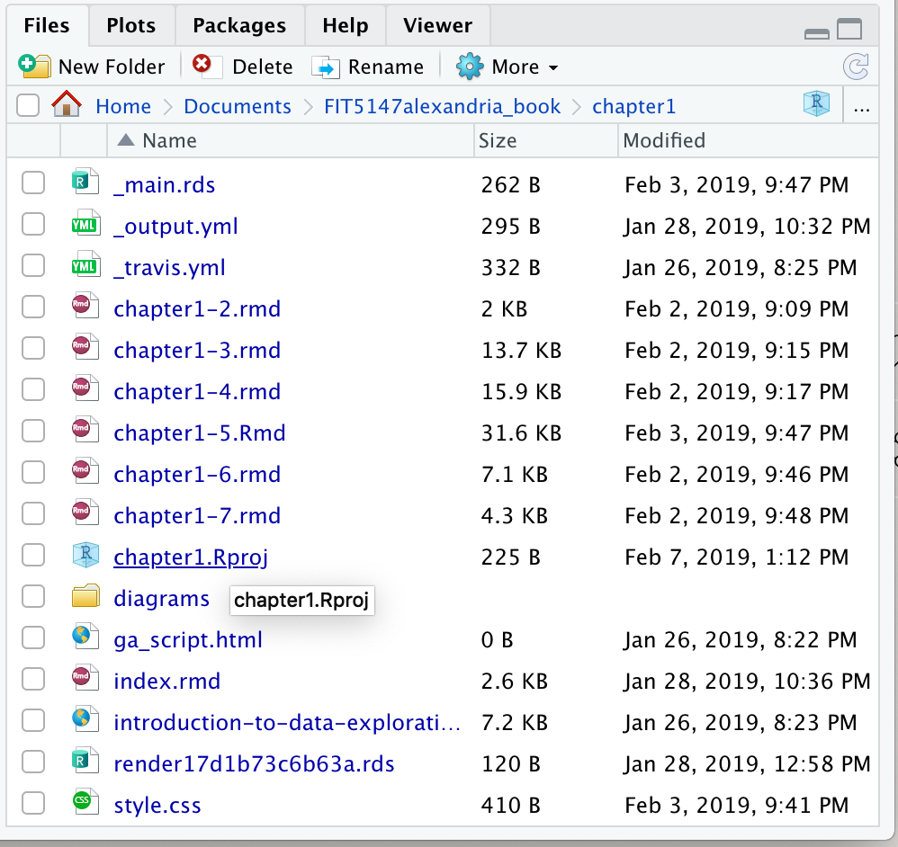
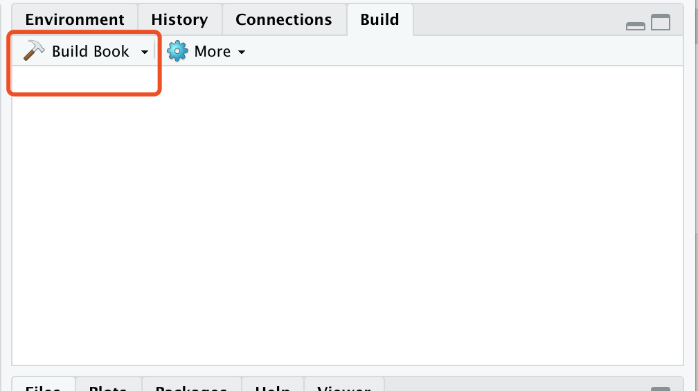
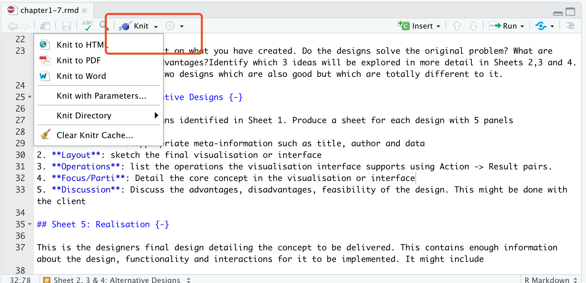

# Alexandria translation


# Table of contents
* [General info](#general-info)
* [Technologies](#technologies)
* [Additional references](#additional-references)


# General info

This repository contains the source of 6 chapters of FIT5147 reading materials.

Each files contains `.yml` files to , `style.css` file to customise the style, 

If there exists an Rmd file named `index.Rmd`, it will always be treated as the first file when merging all Rmd files.


The book is built using [bookdown](https://github.com/rstudio/bookdown).

The R packages used in this book are introduced in [Technologies](#technologies)

***


# Technologies

## Prerequisites

First install [R Studio preview](https://www.rstudio.com/products/rstudio/download/preview/) version to run Rmarkdown file.

Then open up the R Studio and install rmarkdown and bookdown if you haven’t already:

```{}
install.packages("rmarkdown")

install.packages("bookdown")
```

The details of getting start with a bookdown book can be found in [How to Start a Bookdown Book](http://seankross.com/2016/11/17/How-to-Start-a-Bookdown-Book.html)


## how it works

1. Open the repository of selected chapter in RStudio by clicking the`.Rproj` in each folder. 


2. Set up the current file as working directory.

3. Open the R Markdown file `index.Rmd` and click the button `Build Book` on the `Build` tab in workspace window.


4. If you want to add or change the R Markdown files, hit the `Knit` button again to preview the updated book.


***


# Additional references

* [R Markdown cheatsheet](http://www.utstat.toronto.edu/reid/sta2201s/rmarkdown-reference.pdf)
* [Mathematics in R Markdown](https://www.calvin.edu/~rpruim/courses/s341/S17/from-class/MathinRmd.html)


***

